# 第一章：TypeScript 类型系统入门

> 🎯 本章目标：了解 TypeScript 类型系统的本质，熟悉 type-challenges 仓库结构，并完成第一个类型挑战——Hello World。

---

## 目录

- [1.1 什么是 TypeScript 类型系统](#11-什么是-typescript-类型系统)
- [1.2 为什么要学习类型体操](#12-为什么要学习类型体操)
- [1.3 TypeScript 类型系统是图灵完备的](#13-typescript-类型系统是图灵完备的)
- [1.4 type-challenges 仓库介绍](#14-type-challenges-仓库介绍)
- [1.5 挑战结构说明](#15-挑战结构说明)
- [1.6 测试工具介绍](#16-测试工具介绍)
- [1.7 第一个挑战：Hello World](#17-第一个挑战hello-world)

---

## 1.1 什么是 TypeScript 类型系统

### 类型是一种约束系统（Constraint System）

如果你刚接触 TypeScript，可能会把类型简单理解为"给变量加个标签"。但实际上，TypeScript 的类型系统远不止于此——它是一套**编译时的约束与推导系统**。

```typescript
// 类型就是一种约束（Constraint）
// 它告诉编译器："这个值只能是什么形状"

let name: string = "Alice";  // ✅ 满足约束
let name: string = 42;       // ❌ 违反约束，编译器报错
```

### 运行时（Runtime）与编译时（Compile-time）的区别

理解这两个阶段的区别，是学习类型体操的第一步：

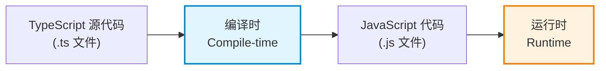

| 阶段 | 英文 | 做什么 | 类型存在吗？ |
|------|------|--------|-------------|
| **编译时** | Compile-time | TypeScript 编译器（`tsc`）检查代码 | ✅ 存在，并被检查 |
| **运行时** | Runtime | JavaScript 引擎执行代码 | ❌ 已被完全擦除 |

```typescript
// 编译时：TypeScript 检查类型约束
function greet(name: string): string {
    return `Hello, ${name}!`;
}

greet(42); // ❌ 编译时报错：类型 'number' 不能赋给类型 'string'

// 运行时：类型信息已经消失，只剩下 JavaScript
// 编译后的代码长这样：
function greet(name) {
    return `Hello, ${name}!`;
}
```

> 💡 **关键理解**：类型体操（Type Gymnastics / Type-level Programming）就是在**编译时**这个阶段进行"编程"。我们写的类型代码不会在运行时执行，它们只在编译器检查阶段发挥作用。

### 值的世界与类型的世界

TypeScript 中有两个平行的"世界"——**值的世界（Value Level）**和**类型的世界（Type Level）**：

```typescript
// ============ 值的世界 ============
// 用 const / let / function 定义
const message = "hello";
function add(a: number, b: number) { return a + b; }

// ============ 类型的世界 ============
// 用 type / interface 定义
type Message = string;
type Add<A extends number, B extends number> = /* 某种计算 */;
```

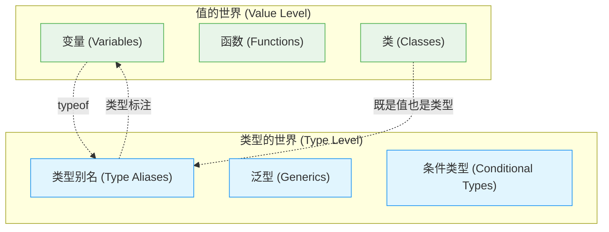

类型体操就是在**类型的世界**里进行编程——用泛型作为"函数"，用条件类型作为"分支"，用递归实现"循环"。

---

## 1.2 为什么要学习类型体操

你可能会想："我只要写好业务代码，类型能用就行，为什么要学这些高级类型技巧？"

### 实际收益

#### 1. 写出更精确的类型定义

```typescript
// ❌ 不精确：几乎没有约束
function get(obj: any, key: string): any { /* ... */ }

// ✅ 精确：编译器能推断出返回值的类型
function get<T, K extends keyof T>(obj: T, key: K): T[K] {
    return obj[key];
}

const user = { name: "Alice", age: 30 };
const name = get(user, "name");  // 类型被推断为 string
const age = get(user, "age");    // 类型被推断为 number
get(user, "email");              // ❌ 编译时报错：不存在 "email" 属性
```

#### 2. 读懂开源库的类型定义

许多流行的库（如 Vue、React、Zod、tRPC）大量使用了高级类型技巧。学习类型体操能帮助你：
- 看懂 `.d.ts` 类型声明文件
- 理解泛型推导链路
- 在出现类型错误时快速定位问题

#### 3. 深入理解 TypeScript 编译器的行为

类型体操会让你对以下概念有更深刻的理解：
- 协变（Covariance）与逆变（Contravariance）
- 分布式条件类型（Distributive Conditional Types）
- 类型收窄（Type Narrowing）
- 类型推断（Type Inference）

#### 4. 提升逻辑思维和编程能力

类型体操本质上是一种**函数式编程（Functional Programming）**练习，它会训练你：
- 用递归替代循环
- 用模式匹配（Pattern Matching）处理问题
- 用不可变数据（Immutable Data）思考

### 学习路径总览

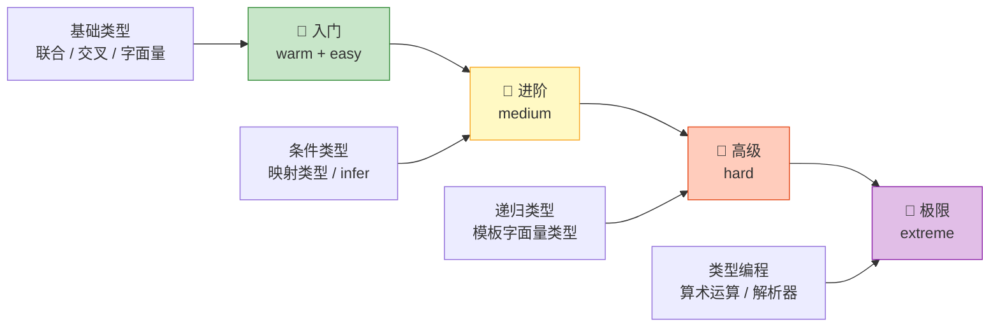

---

## 1.3 TypeScript 类型系统是图灵完备的

### 什么是图灵完备（Turing Complete）？

一个系统如果能**模拟任意图灵机（Turing Machine）**的计算过程，就称为"图灵完备"的。通俗地说，一个图灵完备的系统理论上可以完成**任何可计算的任务**。

TypeScript 的类型系统是图灵完备的，这意味着你可以在**纯类型层面**实现：

| 编程概念 | 值层面（JavaScript） | 类型层面（TypeScript 类型） |
|---------|---------------------|-----------------------------|
| 变量 | `let x = 1` | `type X = 1` |
| 函数 | `function f(x) {}` | `type F<X> = ...` |
| 条件分支 | `if (x) {} else {}` | `X extends Y ? A : B` |
| 循环/递归 | `while / for / 递归函数` | 递归类型（Recursive Types） |
| 数据结构 | 数组、对象 | 元组（Tuple）、对象类型 |

### 类型层面的"编程"示例

```typescript
// 用类型实现 "字符串反转"
type Reverse<S extends string> =
    S extends `${infer First}${infer Rest}`
        ? `${Reverse<Rest>}${First}`
        : S;

// 类型层面的计算（不会在运行时执行）
type Result = Reverse<"hello">;
//   ^? type Result = "olleh"
```

```typescript
// 用类型实现 "数组长度计数"
type Length<T extends readonly any[]> = T["length"];

type Len = Length<[1, 2, 3]>;
//   ^? type Len = 3
```

> ⚠️ **注意**：虽然类型系统是图灵完备的，但它设计的初衷是**描述数据形状和约束**，而不是做通用计算。类型体操更多是一种**思维训练**和**工具掌握**，实际项目中应追求类型的可读性和实用性。

---

## 1.4 type-challenges 仓库介绍

[type-challenges](https://github.com/type-challenges/type-challenges) 是由 [Anthony Fu](https://github.com/antfu) 创建的 TypeScript 类型挑战集合，包含 **190+ 道挑战题**，覆盖从入门到极限的各个难度。

### 难度分布

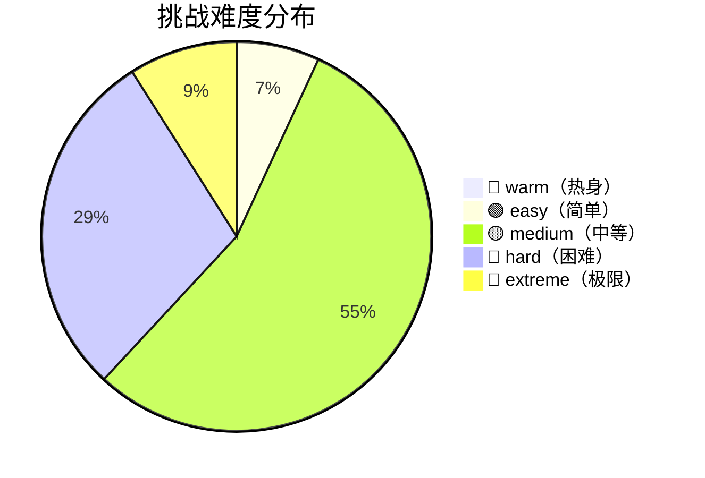

### 项目结构

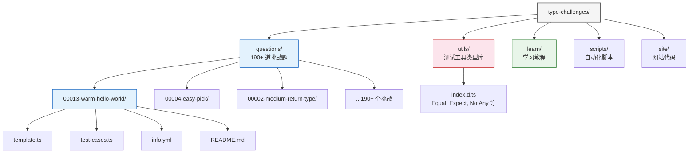

### 挑战命名规则

每个挑战目录的命名格式为：

```
{编号(5位)}-{难度}-{名称}
```

例如：
- `00013-warm-hello-world` → 编号 13，warm 难度，Hello World 题目
- `00004-easy-pick` → 编号 4，easy 难度，实现 `Pick`
- `00002-medium-return-type` → 编号 2，medium 难度，获取函数返回值类型

---

## 1.5 挑战结构说明

每个挑战都是一个自包含的目录，包含以下核心文件：

### 文件一览

```
00013-warm-hello-world/
├── template.ts       ← 你需要修改的文件（答题区域）
├── test-cases.ts     ← 测试用例（不要修改）
├── info.yml          ← 挑战元信息
└── README.md         ← 题目说明（含多语言翻译）
```

### template.ts —— 答题模板

这是你唯一需要修改的文件。它包含一个或多个待实现的类型定义：

```typescript
// 示例：Hello World 挑战的 template.ts
type HelloWorld = any // expected to be a string
```

你的任务是将 `any` 替换为正确的类型，使得 `test-cases.ts` 中的类型检查全部通过。

### test-cases.ts —— 测试用例

这个文件定义了一系列**类型断言（Type Assertions）**，用来验证你的类型定义是否正确：

```typescript
// 示例：Hello World 挑战的 test-cases.ts
import type { Equal, Expect, NotAny } from '@type-challenges/utils'

type cases = [
  Expect<NotAny<HelloWorld>>,       // HelloWorld 不能是 any
  Expect<Equal<HelloWorld, string>>, // HelloWorld 必须等于 string
]
```

> 💡 **工作原理**：如果你的类型定义不正确，`tsc`（TypeScript 编译器）在编译 `test-cases.ts` 时会报错。通过编译 = 挑战通过！

### info.yml —— 挑战元信息

```yaml
title: Hello World           # 挑战标题
author:
  name: Anthony Fu            # 作者
  email: hi@antfu.me
  github: antfu
difficulty: warm              # 难度级别
```

### 挑战的工作流程

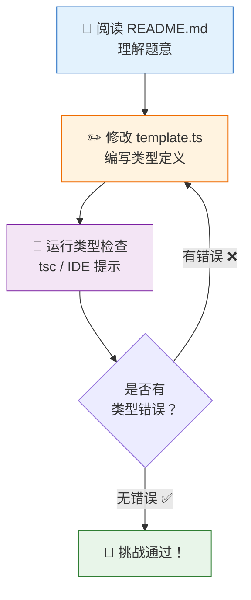

---

## 1.6 测试工具介绍

`@type-challenges/utils` 是本仓库提供的类型测试工具库，定义在 `utils/index.d.ts` 中。它提供了一系列**类型级别的断言工具**，用于验证你的答案是否正确。

### 核心工具类型

#### `Expect<T extends true>` —— 期望为 true

```typescript
// 定义：只接受 true 类型，传入 false 会报编译错误
export type Expect<T extends true> = T;

// 用法示例
type Test1 = Expect<true>;    // ✅ 编译通过
type Test2 = Expect<false>;   // ❌ 编译报错：'false' 不能赋给 'true'
```

`Expect` 是所有测试的入口。它利用了 TypeScript 的**泛型约束（Generic Constraints）**：`T extends true` 要求传入的类型参数 `T` 必须是 `true`。

#### `Equal<X, Y>` —— 判断两个类型是否完全相等

```typescript
// 定义
export type Equal<X, Y> =
    (<T>() => T extends X ? 1 : 2) extends
    (<T>() => T extends Y ? 1 : 2) ? true : false;
```

这是整个测试系统中**最核心也最精妙**的类型。让我们逐步解析它的工作原理：

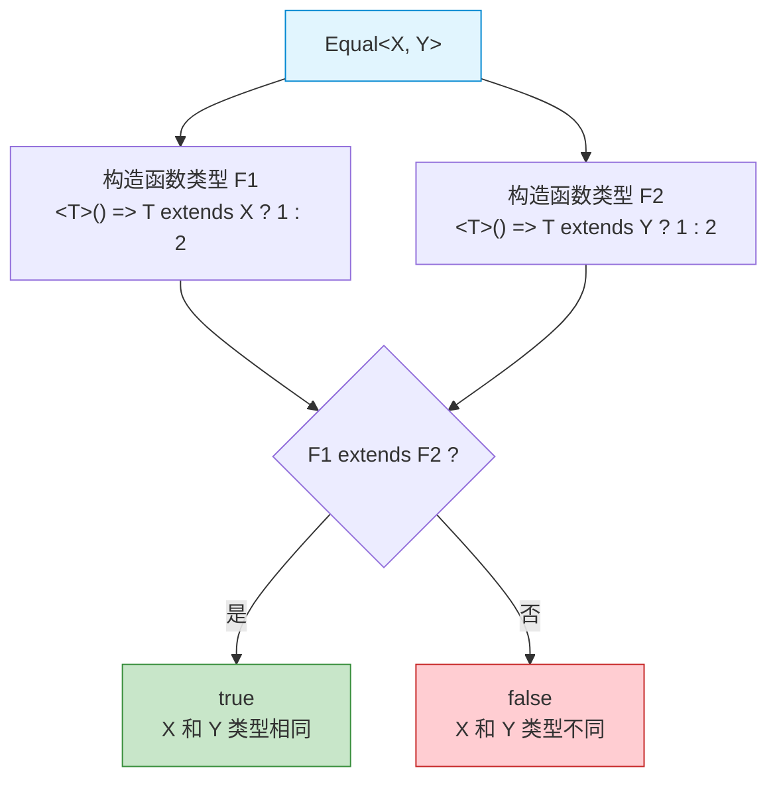

**为什么不能用 `X extends Y ? Y extends X ? true : false : false`？**

```typescript
// 这个"简单版本"有缺陷
type SimpleEqual<X, Y> = X extends Y ? (Y extends X ? true : false) : false;

// 反例：
type Test = SimpleEqual<1 | 2, 1 | 2>; // 得到 boolean（即 true | false），而不是 true！
// 因为联合类型会触发分布式条件类型（Distributive Conditional Types）
```

`Equal` 通过比较**两个函数类型的兼容性**来判断类型相等性，巧妙地绕过了分布式条件类型的问题。这利用了 TypeScript 编译器内部对函数类型的**严格一致性检查**。

> 📝 如果现在看不懂 `Equal` 的实现也没关系，后续章节会深入讲解条件类型和函数类型兼容性。目前只需要知道：`Equal<X, Y>` 在 X 和 Y **完全相同**时返回 `true`，否则返回 `false`。

#### `NotAny<T>` —— 判断类型不是 any

```typescript
// 定义
export type IsAny<T> = 0 extends (1 & T) ? true : false;
export type NotAny<T> = true extends IsAny<T> ? false : true;
```

`any` 在 TypeScript 中是一个特殊类型——它与**任何类型**都兼容。`IsAny` 利用了 `any` 的这个特性：

```typescript
// 原理：1 & T 在正常情况下不可能被 0 extends
// 但当 T 是 any 时，1 & any = any，而 0 extends any 为 true
type Check1 = 0 extends (1 & string) ? true : false;  // false（正常情况）
type Check2 = 0 extends (1 & any) ? true : false;     // true（any 的特殊行为）
```

#### 其他工具类型

| 工具类型 | 作用 | 示例 |
|---------|------|------|
| `ExpectTrue<T>` | 等同于 `Expect`，期望 `T` 为 `true` | `ExpectTrue<true>` |
| `ExpectFalse<T>` | 期望 `T` 为 `false` | `ExpectFalse<false>` |
| `NotEqual<X, Y>` | 期望两个类型**不相等** | `NotEqual<string, number>` → `true` |
| `Alike<X, Y>` | 判断两个类型在**展平后**是否相等 | `Alike<{a: 1} & {b: 2}, {a: 1; b: 2}>` → `true` |
| `ExpectExtends<V, E>` | 期望 `E extends V` 成立 | `ExpectExtends<number, 1>` → `true` |
| `Debug<T>` | 展平交叉类型，便于调试 | `Debug<{a: 1} & {b: 2}>` → `{a: 1; b: 2}` |

### 测试验证流程

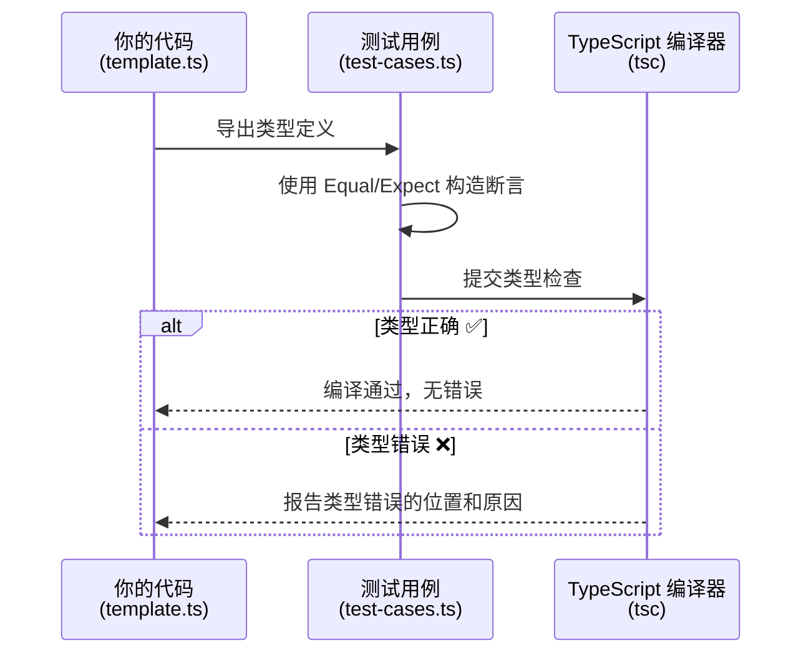

---

## 1.7 第一个挑战：Hello World

现在让我们来完成第一个类型挑战！

### 📖 题目描述

> **Hello World**
>
> 在 Type Challenges 中，我们使用类型系统来做断言。
>
> 在这个挑战中，你需要修改 `HelloWorld` 类型，使其成为 `string` 类型。

### 📄 查看模板文件

打开 `questions/00013-warm-hello-world/template.ts`：

```typescript
type HelloWorld = any // expected to be a string
```

目前 `HelloWorld` 被定义为 `any`——这是一个需要被替换的占位符。

### 🧪 查看测试用例

打开 `questions/00013-warm-hello-world/test-cases.ts`：

```typescript
import type { Equal, Expect, NotAny } from '@type-challenges/utils'

type cases = [
  Expect<NotAny<HelloWorld>>,        // 测试 1：HelloWorld 不能是 any
  Expect<Equal<HelloWorld, string>>,  // 测试 2：HelloWorld 必须等于 string
]
```

让我们逐个分析这两个测试：

#### 测试 1：`Expect<NotAny<HelloWorld>>`

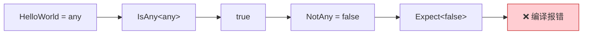

当 `HelloWorld = any` 时：
1. `IsAny<any>` → `true`
2. `NotAny<any>` = `true extends true ? false : true` → `false`
3. `Expect<false>` → ❌ 编译报错（因为 `false` 不满足 `T extends true`）

#### 测试 2：`Expect<Equal<HelloWorld, string>>`

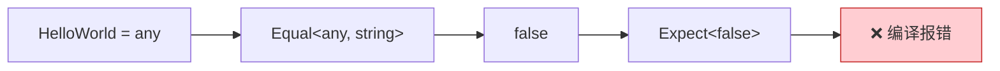

当 `HelloWorld = any` 时：
1. `Equal<any, string>` → `false`（`any` 和 `string` 不是同一个类型）
2. `Expect<false>` → ❌ 编译报错

### ✏️ 编写答案

分析完测试用例后，答案非常清晰——将 `any` 改为 `string`：

```typescript
// ✅ 正确答案
type HelloWorld = string
```

### ✅ 验证答案

让我们验证修改后两个测试都能通过：

#### 测试 1 验证：`Expect<NotAny<HelloWorld>>`

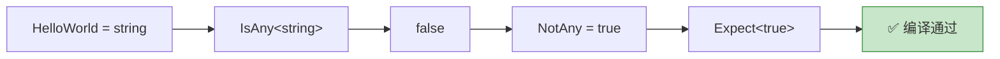

当 `HelloWorld = string` 时：
1. `IsAny<string>` → `0 extends (1 & string)` → `0 extends 1` → `false`
2. `NotAny<string>` = `true extends false ? false : true` → `true`
3. `Expect<true>` → ✅ 编译通过

#### 测试 2 验证：`Expect<Equal<HelloWorld, string>>`

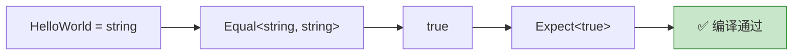

当 `HelloWorld = string` 时：
1. `Equal<string, string>` → `true`（两个类型完全相同）
2. `Expect<true>` → ✅ 编译通过

### 🎉 恭喜！

你已经完成了第一个类型挑战！虽然这道题非常简单，但通过它你已经理解了：

- ✅ 类型挑战的**工作流程**：阅读题目 → 修改 template.ts → 通过类型检查
- ✅ 测试工具的**运作原理**：`Expect` + `Equal` + `NotAny` 如何组合使用
- ✅ 类型检查的**验证机制**：编译通过 = 答案正确

### 本地运行验证（可选）

如果你想在本地验证答案，可以按以下步骤操作：

```bash
# 1. 克隆仓库
git clone https://github.com/type-challenges/type-challenges.git
cd type-challenges

# 2. 安装依赖
pnpm install

# 3. 用 TypeScript 编译器检查（无错误输出表示通过）
npx tsc --noEmit questions/00013-warm-hello-world/template.ts \
                   questions/00013-warm-hello-world/test-cases.ts

# 或者直接在 IDE（如 VS Code）中打开文件，
# 编辑器会实时显示类型错误
```

---

## 本章小结

| 概念 | 说明 |
|------|------|
| **类型系统** | TypeScript 的类型是编译时的约束系统，编译后会被完全擦除 |
| **类型体操** | 在类型层面进行编程，用泛型、条件类型、递归等实现类型推导 |
| **图灵完备** | TypeScript 类型系统理论上能完成任何计算，但应追求可读性 |
| **挑战结构** | 每个挑战包含 template.ts（答题）、test-cases.ts（测试）、info.yml（元信息） |
| **测试工具** | `Expect`、`Equal`、`NotAny` 等类型在编译时验证答案正确性 |
| **Hello World** | 将 `type HelloWorld = any` 改为 `type HelloWorld = string` |

---

## 导航

[← 返回目录](./README.md) | [下一章：基础类型详解 →](./02-basic-types.md)
