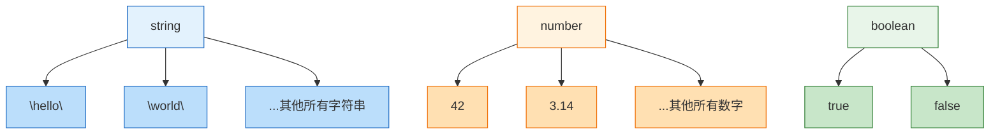
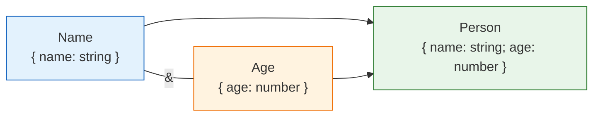
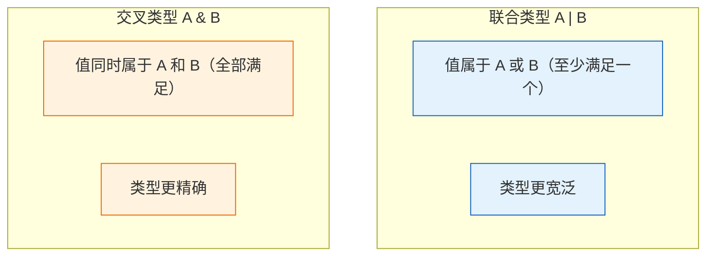
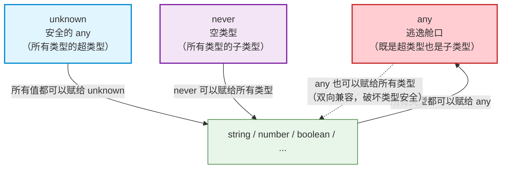
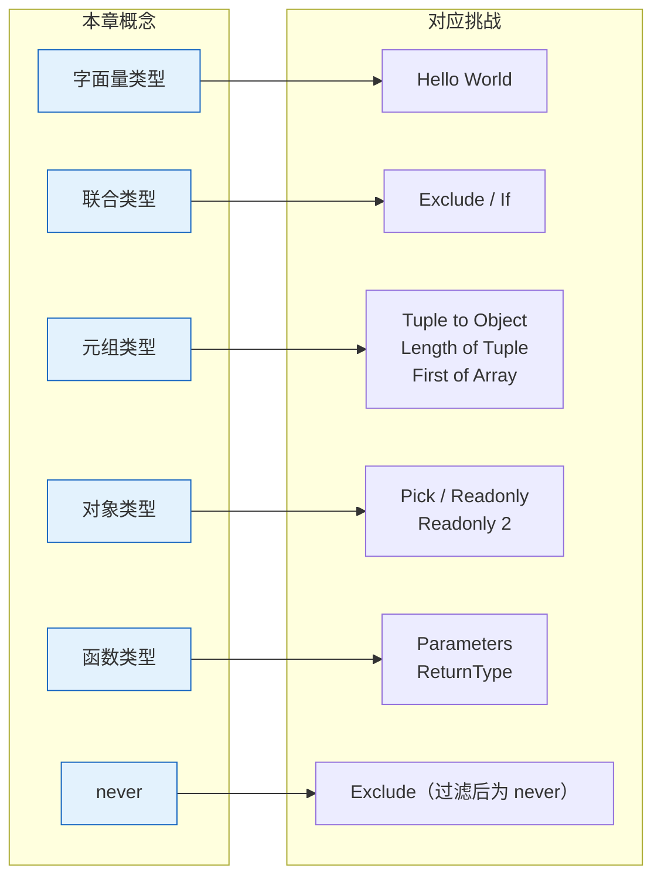

# 第二章：基础类型详解

> 🎯 本章目标：掌握 TypeScript 中所有基础类型的用法和特性，理解类型之间的层级关系，为后续的类型体操打下坚实基础。

---

## 目录

- [2.1 原始类型（Primitive Types）](#21-原始类型primitive-types)
- [2.2 字面量类型（Literal Types）](#22-字面量类型literal-types)
- [2.3 联合类型（Union Types）](#23-联合类型union-types)
- [2.4 交叉类型（Intersection Types）](#24-交叉类型intersection-types)
- [2.5 元组类型（Tuple Types）](#25-元组类型tuple-types)
- [2.6 数组类型（Array Types）](#26-数组类型array-types)
- [2.7 对象类型（Object Types）](#27-对象类型object-types)
- [2.8 函数类型（Function Types）](#28-函数类型function-types)
- [2.9 特殊类型深入：any vs unknown vs never](#29-特殊类型深入any-vs-unknown-vs-never)
- [2.10 类型层级图（Type Hierarchy）](#210-类型层级图type-hierarchy)
- [2.11 与挑战的关系](#211-与挑战的关系)

---

## 2.1 原始类型（Primitive Types）

TypeScript 提供了一系列**原始类型（Primitive Types）**，它们是构建所有复杂类型的基础砖块。

### 常用原始类型一览

| 类型 | 说明 | 示例值 |
|------|------|--------|
| `string` | 字符串 | `"hello"`, `'world'` |
| `number` | 数字（整数和浮点数） | `42`, `3.14` |
| `boolean` | 布尔值 | `true`, `false` |
| `null` | 空值 | `null` |
| `undefined` | 未定义 | `undefined` |
| `symbol` | 唯一标识符 | `Symbol("id")` |
| `bigint` | 大整数 | `100n` |

```typescript
// 基本类型标注
let name: string = "Alice";
let age: number = 30;
let isActive: boolean = true;
let nothing: null = null;
let notDefined: undefined = undefined;
let id: symbol = Symbol("id");
let bigNumber: bigint = 9007199254740991n;
```

### 特殊类型

除了上述"数据"类型，TypeScript 还提供了几个特殊的类型：

#### `void` —— 无返回值

`void` 表示函数没有返回值（或返回 `undefined`）。它在类型体操中常用于表示"什么都不返回"。

```typescript
// 常见用法：标注没有返回值的函数
function log(message: string): void {
    console.log(message);
    // 没有 return 语句，或者 return undefined
}

// void 只能被赋值为 undefined（在严格模式下）
let v: void = undefined;
```

#### `never` —— 永远不会发生的类型

`never` 是 TypeScript 类型系统中的**底层类型（Bottom Type）**，表示"永远不会出现的值"。它是所有类型的子类型。

```typescript
// 场景 1：永远抛出异常的函数
function throwError(message: string): never {
    throw new Error(message);
}

// 场景 2：永远不会结束的函数
function infiniteLoop(): never {
    while (true) {
        // 永远在循环
    }
}

// 场景 3：穷举检查（Exhaustive Check）
type Shape = "circle" | "square";

function getArea(shape: Shape): number {
    switch (shape) {
        case "circle":
            return Math.PI * 10 * 10;
        case "square":
            return 10 * 10;
        default:
            // 如果 Shape 新增了值但忘记处理，这里会报编译错误
            const _exhaustive: never = shape;
            return _exhaustive;
    }
}
```

#### `unknown` —— 安全的顶层类型

`unknown` 是 TypeScript 3.0 引入的类型，表示"未知类型"。它是所有类型的**超类型（Supertype）**，但在使用前必须进行类型检查。

```typescript
let value: unknown = "hello";

// ❌ 不能直接使用 unknown 类型的值
// value.toUpperCase(); // 编译报错

// ✅ 必须先进行类型检查（类型收窄）
if (typeof value === "string") {
    value.toUpperCase(); // 此时编译器知道 value 是 string
}
```

#### `any` —— 逃逸舱口（Escape Hatch）

`any` 是一个特殊的类型，它既是所有类型的超类型，也是所有类型的子类型。使用 `any` 相当于告诉编译器"不要检查这个值"。

```typescript
let anything: any = 42;
anything = "hello";    // ✅ 不报错
anything = true;       // ✅ 不报错
anything.foo.bar.baz;  // ✅ 不报错（但运行时可能崩溃！）

// ⚠️ any 会"传染"——与 any 交互的类型也会变成 any
let num: number = anything; // ✅ 不报错（失去类型安全）
```

> ⚠️ **最佳实践**：在实际项目中应尽量避免使用 `any`，优先使用 `unknown` 来表示未知类型。在类型体操中，`any` 常作为初始占位符出现在 `template.ts` 里，等待你替换为正确的类型。

---

## 2.2 字面量类型（Literal Types）

**字面量类型（Literal Types）**是比基础类型更"精确"的类型——它不仅约束了值的种类，还约束了值的**具体内容**。

### 字符串字面量类型（String Literal Types）

```typescript
// 普通 string 类型：可以是任意字符串
let color: string = "anything goes";

// 字面量类型：只能是特定的字符串
let direction: "up" | "down" | "left" | "right" = "up";
direction = "down";    // ✅
// direction = "north"; // ❌ 编译报错：不能将 "north" 赋给 "up" | "down" | "left" | "right"
```

### 数字字面量类型（Numeric Literal Types）

```typescript
// 骰子点数只能是 1-6
type DiceValue = 1 | 2 | 3 | 4 | 5 | 6;

let roll: DiceValue = 3;  // ✅
// let roll: DiceValue = 7;  // ❌ 编译报错
```

### 布尔字面量类型（Boolean Literal Types）

```typescript
// boolean 实际上是 true | false 的联合类型
type IsEnabled = true;
type IsDisabled = false;

let flag: true = true;
// flag = false; // ❌ 编译报错
```

### 字面量类型与 const

TypeScript 会根据变量声明方式自动推断字面量类型：

```typescript
// let 声明：推断为宽泛的基础类型
let greeting = "hello";
//  ^? let greeting: string

// const 声明：推断为精确的字面量类型
const farewell = "goodbye";
//    ^? const farewell: "goodbye"

// as const 断言：将整个值推断为最精确的字面量类型
const config = {
    host: "localhost",
    port: 3000,
} as const;
// ^? const config: { readonly host: "localhost"; readonly port: 3000 }
```

### 模板字面量类型预览（Template Literal Types）

TypeScript 4.1 引入了**模板字面量类型（Template Literal Types）**，允许你在类型层面进行字符串拼接：

```typescript
type Greeting = `Hello, ${"world" | "TypeScript"}`;
// ^? type Greeting = "Hello, world" | "Hello, TypeScript"

type HttpMethod = "GET" | "POST";
type ApiPath = "/users" | "/posts";
type Endpoint = `${HttpMethod} ${ApiPath}`;
// ^? type Endpoint = "GET /users" | "GET /posts" | "POST /users" | "POST /posts"
```

> 📝 模板字面量类型将在[第六章](./06-template-literal-types.md)中详细讲解，这里先了解其基本概念。

### 字面量类型与基础类型的关系



每个字面量类型都是对应基础类型的**子类型（Subtype）**。`"hello"` 可以赋给 `string`，但反过来不行。

---

## 2.3 联合类型（Union Types）

**联合类型（Union Types）**用 `|` 运算符把多个类型组合在一起，表示"这些类型中的任意一个"。

### 基础用法

```typescript
// 一个值可以是 string 或 number
type StringOrNumber = string | number;

let value: StringOrNumber;
value = "hello";  // ✅
value = 42;       // ✅
// value = true;  // ❌ boolean 不在联合类型中

// 常见用法：函数参数接受多种类型
function format(input: string | number): string {
    if (typeof input === "string") {
        return input.toUpperCase();
    }
    return input.toFixed(2);
}
```

### 字面量联合类型

联合类型最常与字面量类型搭配使用，构成一组有限的可选值：

```typescript
// 类似于其他语言的枚举（enum）
type Status = "pending" | "active" | "inactive";
type HttpCode = 200 | 301 | 404 | 500;

function handleStatus(status: Status): string {
    switch (status) {
        case "pending": return "等待中";
        case "active": return "已激活";
        case "inactive": return "已停用";
    }
}
```

### 联合类型的类型收窄（Type Narrowing）

使用联合类型时，TypeScript 需要知道当前值具体是哪个类型，这就需要**类型收窄（Type Narrowing）**：

```typescript
function process(value: string | number | boolean) {
    // ❌ 不能直接调用 string 的方法，因为 value 可能不是 string
    // value.toUpperCase();

    // ✅ 使用 typeof 进行类型收窄
    if (typeof value === "string") {
        // 这个分支里 value 被收窄为 string
        console.log(value.toUpperCase());
    } else if (typeof value === "number") {
        // 这个分支里 value 被收窄为 number
        console.log(value.toFixed(2));
    } else {
        // 这个分支里 value 被收窄为 boolean
        console.log(value ? "是" : "否");
    }
}
```

### 分布式行为预览（Distributive Behavior）

联合类型在条件类型中具有特殊的**分布式行为（Distributive Behavior）**——条件类型会"分发"到联合的每个成员上：

```typescript
// 当 T 是联合类型时，条件类型会分布到每个成员
type ToArray<T> = T extends any ? T[] : never;

type Result = ToArray<string | number>;
// 等价于：ToArray<string> | ToArray<number>
// 结果为：string[] | number[]
// 注意：不是 (string | number)[]
```

> 📝 分布式条件类型将在[第四章](./04-conditional-types.md)中深入讲解。

---

## 2.4 交叉类型（Intersection Types）

**交叉类型（Intersection Types）**用 `&` 运算符将多个类型合并为一个类型，新类型**同时拥有**所有类型的特性。

### 合并对象类型

交叉类型最常用于合并多个对象类型：

```typescript
type Name = { name: string };
type Age = { age: number };

// 交叉类型：同时拥有 name 和 age
type Person = Name & Age;

const person: Person = {
    name: "Alice",  // 来自 Name
    age: 30,        // 来自 Age
};
```



### 属性冲突时会产生 never

当交叉的两个类型有**不兼容的同名属性**时，该属性的类型会变成 `never`：

```typescript
type A = { value: string };
type B = { value: number };

type C = A & B;
// C 的 value 属性类型是 string & number = never
// 这意味着不可能创建一个合法的 C 类型值

// const c: C = { value: ??? }; // 没有值能同时是 string 和 number
```

### 原始类型的交叉

对于原始类型，不兼容的交叉直接产生 `never`：

```typescript
type Impossible = string & number; // never
// 不存在一个值既是 string 又是 number

type StillString = string & unknown; // string
// unknown 是顶层类型，交叉后保留另一方

type AlwaysNever = string & never; // never
// never 是底层类型，交叉后任何类型都变成 never
```

### 联合类型 vs 交叉类型



简单记忆：
- **`|` 联合** → "或"（OR）→ 类型**变宽**
- **`&` 交叉** → "且"（AND）→ 类型**变窄**

---

## 2.5 元组类型（Tuple Types）

**元组类型（Tuple Types）**是一种**固定长度、每个位置有确定类型**的数组。它在类型体操中使用频率极高。

### 基础元组

```typescript
// 普通数组：长度不限，所有元素同类型
let arr: number[] = [1, 2, 3, 4, 5];

// 元组：长度固定，每个位置有特定类型
let tuple: [string, number, boolean] = ["Alice", 30, true];

// 通过索引访问元组元素，类型会被精确推断
let name = tuple[0];  // string
let age = tuple[1];   // number
let flag = tuple[2];  // boolean
```

### 只读元组（Readonly Tuples）

使用 `readonly` 修饰符可以创建不可变元组：

```typescript
// 只读元组：不能修改元素
const point: readonly [number, number] = [10, 20];
// point[0] = 30; // ❌ 编译报错：无法为 readonly 属性赋值

// as const 也会创建只读元组
const rgb = [255, 128, 0] as const;
// ^? const rgb: readonly [255, 128, 0]
// 注意：不仅是 readonly，每个元素还被推断为字面量类型
```

### 带标签的元组（Labeled Tuples）

TypeScript 4.0 引入了**带标签的元组（Labeled Tuples）**，可以为每个位置添加名称标签以提高可读性：

```typescript
type UserRecord = [name: string, age: number, email: string];

// 标签不影响类型行为，但能提供更好的开发体验
function createUser(...args: UserRecord): void {
    const [name, age, email] = args;
    console.log(`${name}, ${age}, ${email}`);
}
```

### 元组在类型体操中的重要性

元组在类型体操中扮演着关键角色——它相当于类型层面的"数组"数据结构：

```typescript
// 获取元组长度
type Length<T extends readonly any[]> = T["length"];
type Len = Length<[1, 2, 3]>;
// ^? type Len = 3

// 获取元组的第一个元素
type First<T extends readonly any[]> =
    T extends [infer F, ...any[]] ? F : never;
type F = First<[string, number, boolean]>;
// ^? type F = string

// 获取元组的最后一个元素
type Last<T extends readonly any[]> =
    T extends [...any[], infer L] ? L : never;
type L = Last<[string, number, boolean]>;
// ^? type L = boolean
```

---

## 2.6 数组类型（Array Types）

### 两种写法

TypeScript 提供了两种等价的数组类型写法：

```typescript
// 写法一：T[]（简洁，更常用）
let numbers: number[] = [1, 2, 3];
let strings: string[] = ["a", "b", "c"];

// 写法二：Array<T>（泛型语法）
let numbers2: Array<number> = [1, 2, 3];
let strings2: Array<string> = ["a", "b", "c"];

// 两者完全等价，选择一种保持一致即可
```

### 只读数组（Readonly Arrays）

```typescript
// 只读数组不能进行修改操作（push、pop、splice 等）
const items: readonly number[] = [1, 2, 3];
// items.push(4); // ❌ 编译报错：readonly 数组没有 push 方法

// 等价的泛型写法
const items2: ReadonlyArray<number> = [1, 2, 3];
```

### 数组类型 vs 元组类型

```typescript
// 数组类型：长度不固定，元素类型统一
type NumberArray = number[];
// length 的类型是 number（不确定具体多少）

// 元组类型：长度固定，元素类型可以不同
type Triple = [number, string, boolean];
// length 的类型是 3（精确的字面量类型）

// 类型体操中更常用元组，因为它的长度信息更精确
type ArrLen = number[]["length"];         // number（不精确）
type TupleLen = [1, 2, 3]["length"];     // 3（精确）
```

---

## 2.7 对象类型（Object Types）

### interface vs type

TypeScript 提供了两种定义对象类型的方式：`interface` 和 `type`。

```typescript
// 方式一：interface（接口）
interface User {
    name: string;
    age: number;
}

// 方式二：type（类型别名）
type UserType = {
    name: string;
    age: number;
};

// 大多数场景下两者可以互换使用
const user1: User = { name: "Alice", age: 30 };
const user2: UserType = { name: "Bob", age: 25 };
```

**主要区别：**

| 特性 | `interface` | `type` |
|------|-------------|--------|
| 声明合并（Declaration Merging） | ✅ 支持 | ❌ 不支持 |
| 继承语法 | `extends` | `&`（交叉类型） |
| 联合类型 | ❌ 不支持 | ✅ 支持 |
| 映射类型 | ❌ 不支持 | ✅ 支持 |
| 类型体操 | 较少使用 | **主要使用** |

```typescript
// interface 支持声明合并（同名 interface 会自动合并）
interface Config {
    host: string;
}
interface Config {
    port: number;
}
// Config 变成 { host: string; port: number }

// type 不支持声明合并
// type Config = { host: string };
// type Config = { port: number }; // ❌ 重复定义错误
```

> 💡 在类型体操中，我们几乎总是使用 `type`，因为它更灵活，支持联合类型、映射类型、条件类型等高级特性。

### 可选属性（Optional Properties）

使用 `?` 标记一个属性为可选：

```typescript
interface User {
    name: string;
    age: number;
    email?: string;  // 可选属性，类型为 string | undefined
}

const user1: User = { name: "Alice", age: 30 };           // ✅ email 可以不提供
const user2: User = { name: "Bob", age: 25, email: "b@x" }; // ✅ 也可以提供
```

### 只读属性（Readonly Properties）

使用 `readonly` 修饰符使属性不可修改：

```typescript
interface Point {
    readonly x: number;
    readonly y: number;
}

const point: Point = { x: 10, y: 20 };
// point.x = 30; // ❌ 编译报错：不能给 readonly 属性赋值
```

### 索引签名（Index Signatures）

当你不确定对象有哪些属性名，但知道属性值的类型时，可以使用索引签名：

```typescript
// 字符串索引签名：属性名为 string，属性值为 number
interface NumberMap {
    [key: string]: number;
}
const scores: NumberMap = { math: 95, english: 88, science: 92 };

// 数字索引签名：属性名为 number，属性值为 string
interface StringArray {
    [index: number]: string;
}
const fruits: StringArray = ["apple", "banana", "cherry"];

// 混合使用：确定属性 + 索引签名
interface Config {
    name: string;                    // 确定属性
    [key: string]: string | number;  // 索引签名（必须兼容确定属性的类型）
}
```

---

## 2.8 函数类型（Function Types）

### 参数类型与返回值类型

```typescript
// 函数声明
function add(a: number, b: number): number {
    return a + b;
}

// 箭头函数
const multiply = (a: number, b: number): number => a * b;

// 函数类型表达式
type MathFn = (a: number, b: number) => number;
const subtract: MathFn = (a, b) => a - b;  // 参数类型从 MathFn 自动推断
```

### 可选参数和默认参数

```typescript
// 可选参数：用 ? 标记
function greet(name: string, greeting?: string): string {
    return `${greeting ?? "Hello"}, ${name}!`;
}

greet("Alice");           // "Hello, Alice!"
greet("Alice", "Hi");     // "Hi, Alice!"

// 默认参数：TypeScript 自动推断类型
function createUser(name: string, age: number = 18) {
    return { name, age };
}
```

### 函数重载（Overloads）

函数重载允许一个函数根据不同的参数类型返回不同的类型：

```typescript
// 重载签名（声明多种调用方式）
function parse(input: string): number;
function parse(input: number): string;

// 实现签名（实际的函数体）
function parse(input: string | number): string | number {
    if (typeof input === "string") {
        return parseInt(input, 10);
    }
    return input.toString();
}

const num = parse("42");    // 返回类型被推断为 number
const str = parse(42);      // 返回类型被推断为 string
```

### typeof 获取值的类型

`typeof` 运算符可以从一个值反推出它的类型，实现从**值的世界**到**类型的世界**的桥接：

```typescript
const config = {
    host: "localhost",
    port: 3000,
    debug: true,
};

// 用 typeof 获取值的类型
type Config = typeof config;
// ^? type Config = { host: string; port: number; debug: boolean }

// 搭配 as const 获取更精确的类型
const colors = ["red", "green", "blue"] as const;
type Colors = typeof colors;
// ^? type Colors = readonly ["red", "green", "blue"]

// 获取函数的类型
function fetchUser(id: number) {
    return { name: "Alice", age: 30 };
}
type FetchUserFn = typeof fetchUser;
// ^? type FetchUserFn = (id: number) => { name: string; age: number }
```

---

## 2.9 特殊类型深入：any vs unknown vs never

这三个类型是 TypeScript 类型系统中最特殊也最重要的类型。理解它们的关系，是掌握类型体操的关键。

### 对比总览



### 详细对比

| 特性 | `any` | `unknown` | `never` |
|------|-------|-----------|---------|
| **含义** | 逃逸舱口（关闭类型检查） | 未知类型（安全的顶层类型） | 不可能的类型（空类型） |
| **赋值给其他类型** | ✅ 任何类型 | ❌ 必须先收窄 | ✅ 任何类型 |
| **其他类型赋值给它** | ✅ 任何类型 | ✅ 任何类型 | ❌ 只有 `never` |
| **类型安全** | ❌ 不安全 | ✅ 安全 | ✅ 安全 |
| **使用建议** | 尽量避免 | 推荐替代 any | 穷举检查/类型运算 |

### any —— 逃逸舱口

`any` 同时是所有类型的**超类型（Supertype）**和**子类型（Subtype）**，这使得它在类型层级中处于一个矛盾的特殊地位：

```typescript
// any 可以赋给任何类型（像子类型一样）
let a: any = "hello";
let n: number = a;     // ✅ 不报错（危险！a 实际上是 string）
let s: string = a;     // ✅ 不报错

// 任何类型也可以赋给 any（像超类型一样）
let x: number = 42;
let y: any = x;        // ✅ 不报错

// any 的"传染性"：与 any 交互后类型检查失效
let obj: any = {};
obj.foo.bar.baz;        // ✅ 不报错（但运行时会崩溃）
```

### unknown —— 安全的 any

`unknown` 是真正的顶层类型（Top Type），任何值都可以赋给 `unknown`，但使用 `unknown` 前**必须**进行类型检查：

```typescript
// 任何值都可以赋给 unknown
let value: unknown;
value = 42;         // ✅
value = "hello";    // ✅
value = true;       // ✅

// 但不能直接使用 unknown 类型的值
// let n: number = value;  // ❌ 编译报错
// value.toUpperCase();    // ❌ 编译报错

// 必须先进行类型检查
if (typeof value === "number") {
    let n: number = value;  // ✅ 此处 value 被收窄为 number
}

// unknown 与联合/交叉的行为
type U1 = unknown | string;   // unknown（unknown 吸收联合）
type U2 = unknown & string;   // string（unknown 在交叉中是恒等元素）
```

### never —— 空类型

`never` 是底层类型（Bottom Type），表示不包含任何值的类型。它是所有类型的子类型：

```typescript
// never 可以赋给任何类型
declare const n: never;
let a: string = n;   // ✅（虽然实际不可能执行到这里）
let b: number = n;   // ✅

// 但没有类型可以赋给 never（除了 never 自身）
// let x: never = 42;      // ❌
// let y: never = "hello";  // ❌

// never 与联合/交叉的行为
type N1 = never | string;   // string（never 在联合中被吸收）
type N2 = never & string;   // never（never 吸收交叉）
```

### 类型运算中的行为

```typescript
// 在条件类型中，never 作为联合类型时会导致"跳过"
type Filter<T> = T extends string ? T : never;

type Result = Filter<"a" | 1 | "b" | 2>;
// 分布展开：Filter<"a"> | Filter<1> | Filter<"b"> | Filter<2>
// 结果：      "a"        | never    | "b"         | never
// 合并：      "a" | "b"  （never 被联合类型吸收）
```

---

## 2.10 类型层级图（Type Hierarchy）

TypeScript 的类型系统有一个清晰的层级结构。理解这个层级关系对于理解类型兼容性和类型体操至关重要。

### 完整类型层级

```mermaid
graph TD
    ANY["any<br/>(特殊：既是顶层也是底层)"]

    UNKNOWN["unknown<br/>(真正的顶层类型)"]

    UNKNOWN --> STRING["string"]
    UNKNOWN --> NUMBER["number"]
    UNKNOWN --> BOOLEAN["boolean"]
    UNKNOWN --> SYMBOL["symbol"]
    UNKNOWN --> BIGINT["bigint"]
    UNKNOWN --> OBJECT["object"]
    UNKNOWN --> VOID["void"]

    STRING --> SL["字面量<br/>\"hello\" / \"world\""]
    NUMBER --> NL["字面量<br/>42 / 3.14"]
    BOOLEAN --> BL["true / false"]

    OBJECT --> ARRAY["Array"]
    OBJECT --> FUNC["Function"]
    OBJECT --> OBJ_LIT["{...}<br/>对象字面量"]

    VOID --> UNDEF["undefined"]
    UNKNOWN --> NULL_TYPE["null"]

    SL --> NEVER["never<br/>(底层类型)"]
    NL --> NEVER
    BL --> NEVER
    UNDEF --> NEVER
    NULL_TYPE --> NEVER
    ARRAY --> NEVER
    FUNC --> NEVER
    OBJ_LIT --> NEVER

    ANY -.->|"双向兼容"| UNKNOWN
    ANY -.->|"双向兼容"| STRING
    ANY -.->|"双向兼容"| NEVER

    style ANY fill:#ffcdd2,stroke:#c62828,stroke-width:2px
    style UNKNOWN fill:#e1f5fe,stroke:#0288d1,stroke-width:2px
    style NEVER fill:#f3e5f5,stroke:#7b1fa2,stroke-width:2px
    style STRING fill:#e8f5e9,stroke:#2e7d32
    style NUMBER fill:#e8f5e9,stroke:#2e7d32
    style BOOLEAN fill:#e8f5e9,stroke:#2e7d32
    style SYMBOL fill:#e8f5e9,stroke:#2e7d32
    style BIGINT fill:#e8f5e9,stroke:#2e7d32
    style VOID fill:#fff3e0,stroke:#ef6c00
    style OBJECT fill:#fff3e0,stroke:#ef6c00
    style NULL_TYPE fill:#fff3e0,stroke:#ef6c00
    style UNDEF fill:#fff3e0,stroke:#ef6c00
```

### 层级规则详解

```typescript
// ==========================================
// 规则 1：子类型可以赋给超类型（向上兼容）
// ==========================================
let s: string = "hello";     // "hello"（字面量） → string（基础类型）
let u: unknown = s;          // string → unknown（顶层类型）

// ==========================================
// 规则 2：never 是所有类型的子类型
// ==========================================
declare const nev: never;
let a: string = nev;     // ✅ never → string
let b: number = nev;     // ✅ never → number
let c: unknown = nev;    // ✅ never → unknown

// ==========================================
// 规则 3：所有类型都是 unknown 的子类型
// ==========================================
let uk: unknown;
uk = "hello";   // ✅ string → unknown
uk = 42;        // ✅ number → unknown
uk = true;      // ✅ boolean → unknown
uk = null;      // ✅ null → unknown

// ==========================================
// 规则 4：any 打破了正常的层级关系
// ==========================================
let an: any;
let num: number = an;   // ✅ any → number（any 作为子类型）
an = num;               // ✅ number → any（any 作为超类型）
// 这就是为什么 any 是"不安全的"——它绕过了类型检查

// ==========================================
// 规则 5：extends 关键字检查子类型关系
// ==========================================
type IsString<T> = T extends string ? true : false;

type Test1 = IsString<"hello">;  // true  —— "hello" 是 string 的子类型
type Test2 = IsString<string>;   // true  —— string 是 string 的子类型（自身）
type Test3 = IsString<number>;   // false —— number 不是 string 的子类型
type Test4 = IsString<never>;    // never —— never 作为联合类型分布后为空
```

---

## 2.11 与挑战的关系

本章介绍的基础类型是所有类型挑战的基石。以下是各概念与具体挑战的对应关系：

### 直接相关的挑战

| 挑战 | 难度 | 涉及概念 |
|------|------|----------|
| [Hello World](../questions/00013-warm-hello-world/) | 🌱 warm | 基础类型标注 |
| [Pick](../questions/00004-easy-pick/) | 🟢 easy | 对象类型、`keyof` |
| [Readonly](../questions/00007-easy-readonly/) | 🟢 easy | `readonly` 属性 |
| [Tuple to Object](../questions/00011-easy-tuple-to-object/) | 🟢 easy | 元组类型、索引签名 |
| [First of Array](../questions/00014-easy-first/) | 🟢 easy | 元组、条件类型、`infer` |
| [Length of Tuple](../questions/00018-easy-tuple-length/) | 🟢 easy | 元组的 `length` 属性 |
| [Exclude](../questions/00043-easy-exclude/) | 🟢 easy | 联合类型、分布式条件类型 |
| [Parameters](../questions/03312-easy-parameters/) | 🟢 easy | 函数类型、`infer` |
| [Includes](../questions/00898-easy-includes/) | 🟢 easy | 元组遍历、`Equal` 判断 |
| [Readonly 2](../questions/00008-medium-readonly-2/) | 🟡 medium | 交叉类型、对象类型操作 |
| [Tuple to Union](../questions/00010-medium-tuple-to-union/) | 🟡 medium | 元组 → 联合类型转换 |
| [Last of Array](../questions/00015-medium-last/) | 🟡 medium | 元组的 `...` 展开与 `infer` |

### 概念映射



### 实战提示

掌握本章内容后，你应该能够：

1. ✅ 区分 `any`、`unknown`、`never` 的用途和行为差异
2. ✅ 理解字面量类型与基础类型的子类型关系
3. ✅ 使用联合类型和交叉类型组合复杂类型
4. ✅ 利用元组的 `length` 属性和索引访问进行类型计算
5. ✅ 用 `typeof` 从值反推类型
6. ✅ 理解类型层级图，判断 `extends` 条件的结果

---

## 本章小结

| 概念 | 说明 |
|------|------|
| **原始类型** | `string`、`number`、`boolean`、`null`、`undefined`、`symbol`、`bigint` 是基础数据类型 |
| **特殊类型** | `void`（无返回值）、`never`（不可能的值）、`unknown`（安全的未知类型）、`any`（关闭类型检查） |
| **字面量类型** | 比基础类型更精确，约束值的具体内容（如 `"hello"`、`42`、`true`） |
| **联合类型** | `A \| B` 表示"A 或 B"，类型变宽；在条件类型中有分布式行为 |
| **交叉类型** | `A & B` 表示"A 且 B"，类型变窄；不兼容属性产生 `never` |
| **元组类型** | 固定长度的数组，每个位置有确定类型；类型体操中的核心数据结构 |
| **数组类型** | `T[]` 或 `Array<T>`，长度不固定；`readonly` 数组不可修改 |
| **对象类型** | `interface` 和 `type` 两种定义方式；类型体操中主要使用 `type` |
| **函数类型** | 包含参数类型和返回值类型；支持重载和 `typeof` 反推 |
| **类型层级** | `unknown` → 基础类型 → 字面量类型 → `never`；`any` 是特殊的逃逸舱口 |

---

## 导航

[← 上一章：TypeScript 类型系统简介](./01-introduction.md) | [下一章：泛型编程 →](./03-generics.md) | [← 返回目录](./README.md)
