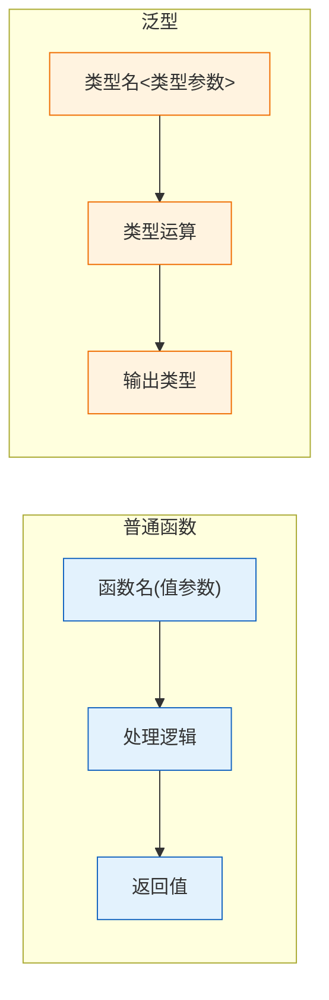
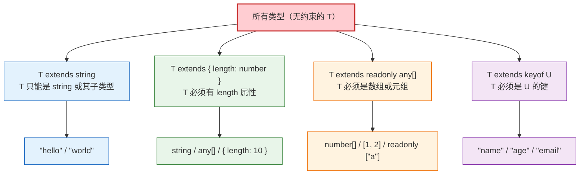
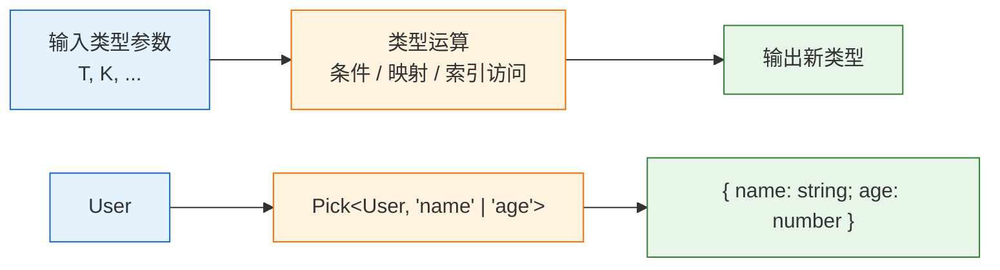
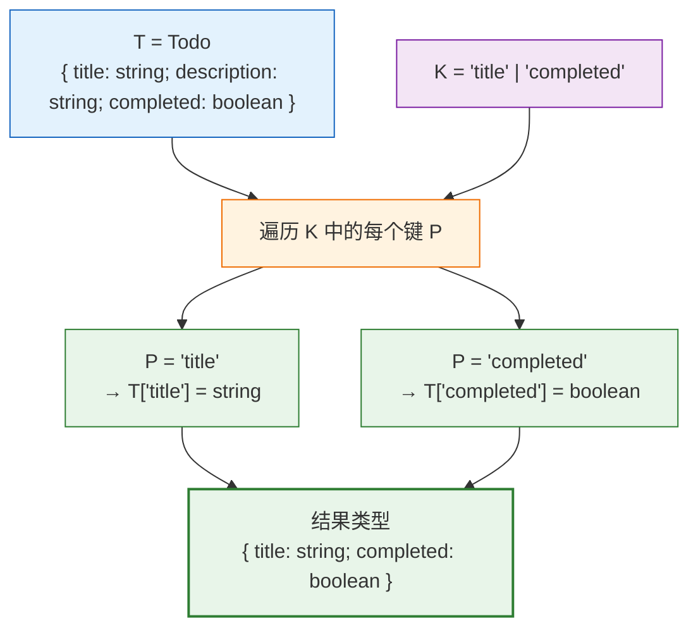

# 第三章：泛型编程

> 🎯 本章目标：理解泛型（Generics）的核心思想——类型参数化，掌握泛型函数、泛型约束、默认类型参数等基础用法，并通过 Pick 和 Readonly 两个经典挑战学会创建自己的工具类型。

---

## 目录

- [3.1 什么是泛型（Generics）](#31-什么是泛型generics)
- [3.2 泛型函数（Generic Functions）](#32-泛型函数generic-functions)
- [3.3 泛型接口和类型别名（Generic Interfaces & Type Aliases）](#33-泛型接口和类型别名generic-interfaces--type-aliases)
- [3.4 泛型约束（Generic Constraints）](#34-泛型约束generic-constraints)
- [3.5 默认类型参数（Default Type Parameters）](#35-默认类型参数default-type-parameters)
- [3.6 多个类型参数（Multiple Type Parameters）](#36-多个类型参数multiple-type-parameters)
- [3.7 泛型工具类型入门（Building Utility Types）](#37-泛型工具类型入门building-utility-types)
- [3.8 挑战实战：Pick（#4）](#38-挑战实战pick4)
- [3.9 挑战实战：Readonly（#7）](#39-挑战实战readonly7)
- [3.10 相关挑战](#310-相关挑战)

---

## 3.1 什么是泛型（Generics）

### 从"函数"类比理解泛型

在 JavaScript 中，**函数**让我们把"值"参数化——同一段逻辑可以处理不同的输入值：

```typescript
// 普通函数：把"值"参数化
function echo(value: string): string {
    return value;
}

echo("hello");  // "hello"
echo("world");  // "world"
```

但问题来了：如果我们想让 `echo` 也能处理 `number`、`boolean` 等类型，该怎么办？

```typescript
// ❌ 方案一：用 any —— 丢失了类型信息
function echo(value: any): any {
    return value;
}
const result = echo("hello");
// ^? const result: any  ← 类型信息丢失了！

// ❌ 方案二：写多个重载 —— 无法穷举所有类型
function echo(value: string): string;
function echo(value: number): number;
// ... 还有 boolean、对象、数组……写不完
```

**泛型（Generics）** 就是解决方案——它让我们把"类型"也参数化：

```typescript
// ✅ 泛型：把"类型"参数化
function echo<T>(value: T): T {
    return value;
}

const str = echo("hello");   // T = string → 返回 string
// ^? const str: "hello"
const num = echo(42);         // T = number → 返回 number
// ^? const num: 42
```

### 核心类比



简单来说：

| | 普通函数 | 泛型 |
|---|---|---|
| **参数** | 值（value） | 类型（type） |
| **传入** | `fn(42)` | `Type<number>` |
| **处理** | 运行时执行代码逻辑 | 编译时进行类型运算 |
| **产出** | 返回一个值 | 生成一个新类型 |

> 💡 **核心思想：** 泛型就是"类型的函数"。普通函数接收值参数、返回值；泛型接收类型参数、返回类型。理解了这一点，后面的所有内容都会变得很自然。

---

## 3.2 泛型函数（Generic Functions）

### 基本语法

在函数名后添加 `<T>` 声明一个类型参数 `T`，然后就可以在参数类型、返回值类型中使用它：

```typescript
// 声明类型参数 T，在参数和返回值中引用
function identity<T>(value: T): T {
    return value;
}

// 显式指定类型参数
const a = identity<string>("hello");
// ^? const a: string

// 让 TypeScript 自动推断（更常见）
const b = identity(42);
// ^? const b: 42
```

### 类型推断（Type Inference）

TypeScript 的类型推断非常强大，大多数情况下不需要显式传入类型参数：

```typescript
function firstElement<T>(arr: T[]): T | undefined {
    return arr[0];
}

// TypeScript 会根据传入的参数推断 T 的类型
const s = firstElement(["a", "b", "c"]);
// ^? const s: string | undefined

const n = firstElement([1, 2, 3]);
// ^? const n: number | undefined

// 空数组时，T 被推断为 never
const empty = firstElement([]);
// ^? const empty: never | undefined
```

### 箭头函数中的泛型

```typescript
// 箭头函数的泛型语法
const identity = <T>(value: T): T => value;

// 在 .tsx 文件中，<T> 可能被误解析为 JSX 标签
// 可以用 extends 避免歧义
const identity = <T extends unknown>(value: T): T => value;
```

### 泛型函数 vs 函数重载

```typescript
// ❌ 函数重载：每种情况都要手写一遍，且无法穷举
function wrap(value: string): { value: string };
function wrap(value: number): { value: number };
function wrap(value: boolean): { value: boolean };
function wrap(value: any): { value: any } {
    return { value };
}

// ✅ 泛型：一个声明覆盖所有类型
function wrap<T>(value: T): { value: T } {
    return { value };
}

const r1 = wrap("hello");    // { value: string }
const r2 = wrap(42);         // { value: number }
const r3 = wrap(true);       // { value: boolean }
```

---

## 3.3 泛型接口和类型别名（Generic Interfaces & Type Aliases）

泛型不仅可以用于函数，还可以用于 `interface` 和 `type`，让它们也能"接收类型参数"。

### 泛型接口（Generic Interface）

```typescript
// 泛型接口：一个"盒子"可以装任意类型的东西
interface Box<T> {
    content: T;
}

const stringBox: Box<string> = { content: "hello" };
const numberBox: Box<number> = { content: 42 };
const boolBox: Box<boolean> = { content: true };

// 嵌套使用
const nestedBox: Box<Box<string>> = {
    content: { content: "deep" }
};
```

### 泛型类型别名（Generic Type Alias）

```typescript
// 用 type 定义泛型类型（类型体操中更常见）
type Container<T> = {
    value: T;
    isEmpty: boolean;
};

// 泛型元组
type Pair<A, B> = [A, B];
const pair: Pair<string, number> = ["Alice", 30];

// 泛型联合类型
type Result<T, E> = { ok: true; value: T } | { ok: false; error: E };

const success: Result<number, string> = { ok: true, value: 42 };
const failure: Result<number, string> = { ok: false, error: "not found" };
```

### interface vs type 的泛型对比

```typescript
// interface 支持继承（extends）
interface Animal<T> {
    name: string;
    trait: T;
}
interface Dog extends Animal<string> {
    breed: string;
}

// type 更灵活，支持联合、交叉、条件等高级运算
type Nullable<T> = T | null;
type NonNull<T> = T extends null | undefined ? never : T;
```

> 💡 在类型体操中，我们几乎总是使用 `type` 来定义泛型工具类型，因为它支持条件类型、映射类型等高级特性，而 `interface` 不支持。

---

## 3.4 泛型约束（Generic Constraints）

默认情况下，类型参数 `T` 可以是**任何类型**。但有时候我们需要限制 `T` 的范围——这就是**泛型约束（Generic Constraints）**。

### 使用 `extends` 约束类型参数

`extends` 关键字在泛型中表示"约束"——`T extends X` 意味着 `T` 必须是 `X` 的子类型：

```typescript
// T 可以是任何类型 → 不能调用 .length
function getLength<T>(value: T): number {
    // return value.length; // ❌ 错误：T 上不存在 length
    return 0;
}

// 用 extends 约束 T 必须有 length 属性
function getLength<T extends { length: number }>(value: T): number {
    return value.length; // ✅ 现在可以安全访问 .length
}

getLength("hello");      // ✅ string 有 length
getLength([1, 2, 3]);    // ✅ 数组有 length
getLength({ length: 5 }); // ✅ 对象有 length 属性
// getLength(42);         // ❌ number 没有 length 属性
```

### 泛型约束关系图



### 常见约束模式

#### 约束为特定类型：`T extends string`

```typescript
// T 只能是 string 或 string 的字面量子类型
type Uppercase<T extends string> = intrinsic;

type A = Uppercase<"hello">;   // "HELLO"
// type B = Uppercase<42>;     // ❌ number 不满足 string 约束
```

#### 约束为对象的键：`T extends keyof U`

```typescript
// T 必须是 U 的键之一
function getProperty<U, T extends keyof U>(obj: U, key: T): U[T] {
    return obj[key];
}

const user = { name: "Alice", age: 30 };

const name = getProperty(user, "name");   // ✅ 返回 string
const age = getProperty(user, "age");     // ✅ 返回 number
// getProperty(user, "email");            // ❌ "email" 不是 user 的键
```

> 💡 `keyof` 运算符获取一个类型的所有键，返回一个联合类型。例如 `keyof { name: string; age: number }` 的结果是 `"name" | "age"`。

#### 约束为数组/元组：`T extends readonly any[]`

```typescript
// T 必须是数组或元组类型
type First<T extends readonly any[]> =
    T extends [infer F, ...any[]] ? F : never;

type A = First<[string, number]>;   // string
type B = First<[42, "hello"]>;      // 42
// type C = First<string>;          // ❌ string 不满足数组约束
```

> 📝 `readonly any[]` 比 `any[]` 更宽泛——它同时接受可变数组和只读数组（`readonly` 元组）。在类型体操中推荐使用 `readonly any[]` 作为数组约束。

---

## 3.5 默认类型参数（Default Type Parameters）

就像函数参数可以有默认值一样，类型参数也可以有默认类型：

```typescript
// 给类型参数设置默认值
type Container<T = string> = {
    value: T;
};

// 不传类型参数时使用默认值
const a: Container = { value: "hello" };         // T = string
const b: Container<number> = { value: 42 };      // T = number

// 多个参数时，有默认值的参数必须在后面
type Response<T, E = Error> = {
    data: T;
    error: E | null;
};

const res1: Response<string> = { data: "ok", error: null };          // E = Error
const res2: Response<string, string> = { data: "ok", error: null };  // E = string
```

### 默认类型参数与约束的组合

```typescript
// 可以同时使用约束和默认值
type NumberContainer<T extends number = 0> = {
    value: T;
};

const a: NumberContainer = { value: 0 };       // T = 0（默认字面量类型）
const b: NumberContainer<42> = { value: 42 };  // T = 42
// const c: NumberContainer<"hi"> = ...;        // ❌ string 不满足 number 约束
```

### TypeScript 内置工具类型中的默认参数

```typescript
// Record 的第二个参数有默认值吗？让我们看看内置定义
// type Record<K extends keyof any, T> = { [P in K]: T };
// 实际上 Record 没有默认值，两个参数都必须传入

// 但你可以创建带默认值的简化版本
type Dict<T = string> = Record<string, T>;

const names: Dict = { a: "Alice", b: "Bob" };         // T = string
const scores: Dict<number> = { math: 95, eng: 88 };   // T = number
```

---

## 3.6 多个类型参数（Multiple Type Parameters）

泛型可以接受多个类型参数，就像函数可以接受多个参数一样：

```typescript
// 两个类型参数
type Pair<A, B> = {
    first: A;
    second: B;
};

const pair: Pair<string, number> = { first: "Alice", second: 30 };

// 三个类型参数
type Triple<A, B, C> = {
    first: A;
    second: B;
    third: C;
};

// 键值对
type Entry<K, V> = {
    key: K;
    value: V;
};
const entry: Entry<string, number> = { key: "age", value: 30 };
```

### 类型参数之间的依赖关系

类型参数之间可以相互引用和约束：

```typescript
// K 依赖于 T：K 必须是 T 的键
type Pick<T, K extends keyof T> = {
    [P in K]: T[P];
};

// V 依赖于 T 和 K：V 是 T[K] 的类型
function setProperty<T, K extends keyof T>(obj: T, key: K, value: T[K]): void {
    obj[key] = value;
}

const user = { name: "Alice", age: 30 };
setProperty(user, "name", "Bob");     // ✅ "Bob" 是 string
setProperty(user, "age", 25);         // ✅ 25 是 number
// setProperty(user, "age", "old");   // ❌ "old" 不是 number
```

### 类型参数命名约定

常见的类型参数命名：

| 参数名 | 含义 | 使用场景 |
|--------|------|----------|
| `T` | Type | 通用类型参数 |
| `K` | Key | 对象的键类型 |
| `V` | Value | 对象的值类型 |
| `E` | Element / Error | 数组元素类型或错误类型 |
| `P` | Property | 映射类型中的属性 |
| `R` | Return | 返回值类型 |
| `U` | 第二个通用类型 | 需要两个类型参数时 |

> 💡 虽然约定使用单字母，但在复杂场景中也可以使用有描述性的名称，如 `TInput`、`TOutput`、`TKey`，以提高可读性。

---

## 3.7 泛型工具类型入门（Building Utility Types）

"工具类型（Utility Type）"就是一个接收类型参数、经过类型运算后输出新类型的泛型类型。TypeScript 内置了许多工具类型（如 `Partial<T>`、`Required<T>`、`Pick<T, K>`），而类型体操的核心就是**自己实现**这些工具类型。

### 泛型工具类型的工作流程



### 创建你的第一个工具类型

```typescript
// 工具类型 1：把类型包进数组
type ToArray<T> = T[];
type NumArr = ToArray<number>;   // number[]
type StrArr = ToArray<string>;   // string[]

// 工具类型 2：把类型变为可空
type Nullable<T> = T | null;
type NullableString = Nullable<string>;  // string | null

// 工具类型 3：提取 Promise 中的值类型
type UnwrapPromise<T> = T extends Promise<infer U> ? U : T;
type A = UnwrapPromise<Promise<string>>;  // string
type B = UnwrapPromise<number>;           // number（不是 Promise，原样返回）
```

### 工具类型的三大运算

在类型体操中，创建工具类型主要依赖三种运算：

| 运算 | 语法 | 说明 | 章节 |
|------|------|------|------|
| **映射类型（Mapped Types）** | `{ [P in K]: T }` | 遍历键集合，构造对象类型 | 本章预览，[第五章](./05-mapped-types.md)详解 |
| **条件类型（Conditional Types）** | `T extends U ? X : Y` | 类型层面的 if-else | [第四章](./04-conditional-types.md)详解 |
| **索引访问类型（Indexed Access）** | `T[K]` | 通过键访问对象类型的属性类型 | 本章 |

> 📝 本章会通过 Pick 和 Readonly 两个实战挑战，预览映射类型和索引访问类型的基本用法。它们将在后续章节中深入展开。

---

## 3.8 挑战实战：Pick（#4）

### 挑战描述

> 不使用内置的 `Pick<T, K>` 工具类型，自己实现一个 `MyPick`，从类型 `T` 中选取指定的属性 `K`，构造一个新类型。

```typescript
// 期望行为
interface Todo {
    title: string;
    description: string;
    completed: boolean;
}

type TodoPreview = MyPick<Todo, "title" | "completed">;
// 等价于：
// type TodoPreview = {
//     title: string;
//     completed: boolean;
// }
```

### 解题思路

我们需要做的事情：
1. **接收**一个对象类型 `T` 和一组键 `K`
2. **遍历** `K` 中的每一个键
3. **提取**每个键在 `T` 中对应的值类型
4. **构造**一个只包含这些键值对的新对象类型

### Pick 工作原理图解



### 答案与逐行解析

```typescript
type MyPick<T, K extends keyof T> = {
    [P in K]: T[P]
}
```

让我们拆解每一个部分：

#### 部分 1：`K extends keyof T` —— 约束 K 必须是 T 的键

```typescript
// keyof T 获取 T 的所有键的联合类型
type TodoKeys = keyof Todo;
// ^? type TodoKeys = "title" | "description" | "completed"

// K extends keyof T 表示：K 必须是 TodoKeys 的子集
// ✅ K = "title"                    → 合法
// ✅ K = "title" | "completed"      → 合法
// ❌ K = "title" | "author"         → 非法，"author" 不在 TodoKeys 中
```

> 💡 这个约束保证了我们只能选取 `T` 中**真正存在**的属性，传入不存在的属性会在编译时就报错。

#### 部分 2：`[P in K]` —— 遍历 K 中的每个键（映射类型）

```typescript
// [P in K] 是映射类型（Mapped Types）的语法
// 它遍历联合类型 K 中的每一个成员，逐个创建属性

// 当 K = "title" | "completed" 时：
// [P in "title" | "completed"]
// 展开为：
// P = "title"     → 创建属性 title
// P = "completed" → 创建属性 completed
```

> 📝 映射类型就像是**类型层面的 for 循环**：`for (P in K) { 创建属性 P }`。这个概念会在[第五章](./05-mapped-types.md)中深入探讨。

#### 部分 3：`T[P]` —— 索引访问类型

```typescript
// T[P] 通过键 P 访问类型 T 中对应属性的类型
// 就像 JavaScript 中用 obj[key] 访问对象属性一样

type Title = Todo["title"];
// ^? type Title = string

type Completed = Todo["completed"];
// ^? type Completed = boolean

// 所以 [P in K]: T[P] 的意思是：
// 对于 K 中的每个键 P，保留它在 T 中的原始类型
```

### 完整推导过程

```typescript
type MyPick<Todo, "title" | "completed">

// 第一步：检查约束
// "title" | "completed" extends keyof Todo？
// "title" | "completed" extends "title" | "description" | "completed"？
// ✅ 满足约束

// 第二步：展开映射类型
// {
//     [P in "title" | "completed"]: Todo[P]
// }

// 第三步：逐个展开
// {
//     title: Todo["title"];         → title: string
//     completed: Todo["completed"]; → completed: boolean
// }

// 最终结果
// { title: string; completed: boolean }
```

---

## 3.9 挑战实战：Readonly（#7）

### 挑战描述

> 不使用内置的 `Readonly<T>` 工具类型，自己实现一个 `MyReadonly`，将 `T` 中所有属性变为只读（`readonly`）。

```typescript
interface Todo {
    title: string;
    description: string;
    completed: boolean;
}

type ReadonlyTodo = MyReadonly<Todo>;
// 等价于：
// type ReadonlyTodo = {
//     readonly title: string;
//     readonly description: string;
//     readonly completed: boolean;
// }

const todo: ReadonlyTodo = {
    title: "Learn TypeScript",
    description: "Study type challenges",
    completed: false,
};

// todo.completed = true; // ❌ 编译报错：不能给 readonly 属性赋值
```

### 答案与逐行解析

```typescript
type MyReadonly<T> = {
    readonly [P in keyof T]: T[P]
}
```

让我们拆解每一部分：

| 部分 | 含义 |
|------|------|
| `keyof T` | 获取 `T` 的所有键的联合类型 |
| `[P in keyof T]` | 遍历 `T` 的所有键 |
| `readonly` | 给每个属性添加 `readonly` 修饰符 |
| `T[P]` | 保持原属性的类型不变 |

### 完整推导过程

```typescript
type MyReadonly<Todo>

// 第一步：keyof Todo = "title" | "description" | "completed"

// 第二步：展开映射类型
// {
//     readonly [P in "title" | "description" | "completed"]: Todo[P]
// }

// 第三步：逐个展开
// {
//     readonly title: Todo["title"];               → readonly title: string
//     readonly description: Todo["description"];   → readonly description: string
//     readonly completed: Todo["completed"];        → readonly completed: boolean
// }

// 最终结果
// {
//     readonly title: string;
//     readonly description: string;
//     readonly completed: boolean;
// }
```

### Pick vs Readonly 对比

```typescript
// Pick：选取部分属性（改变属性集合）
type MyPick<T, K extends keyof T> = {
    [P in K]: T[P]          // 遍历 K（部分键）
}

// Readonly：修改所有属性的修饰符（改变属性特征）
type MyReadonly<T> = {
    readonly [P in keyof T]: T[P]  // 遍历 keyof T（所有键）+ 添加 readonly
}

// 两者都使用映射类型 [P in ...]: T[P]
// 区别在于：
// - Pick 改变了"遍历哪些键"
// - Readonly 改变了"属性的修饰符"
```

> 💡 映射类型的强大之处在于：通过改变遍历范围或添加修饰符，可以产生各种不同的类型变换效果。这是类型体操中最常用的技巧之一。

---

## 3.10 相关挑战

掌握本章泛型知识后，你可以尝试以下挑战：

| 挑战 | 难度 | 关键知识点 |
|------|------|------------|
| [Pick](../questions/00004-easy-pick/) (#4) | 🟢 easy | 泛型约束、`keyof`、映射类型、索引访问 |
| [Readonly](../questions/00007-easy-readonly/) (#7) | 🟢 easy | 映射类型、`readonly` 修饰符 |
| [Tuple to Object](../questions/00011-easy-tuple-to-object/) (#11) | 🟢 easy | 泛型约束 `T extends readonly any[]`、映射类型 |
| [First of Array](../questions/00014-easy-first/) (#14) | 🟢 easy | 泛型约束、条件类型、`infer` |
| [Parameters](../questions/03312-easy-parameters/) (#3312) | 🟢 easy | 泛型约束、条件类型、`infer`、函数类型 |

### 挑战提示

- **Tuple to Object (#11)**：遍历元组的元素作为键和值，提示：`T[number]` 可以获取元组所有元素的联合类型
- **First of Array (#14)**：获取数组的第一个元素类型，提示：可以用条件类型 + `infer` 推断，或直接用索引访问 `T[0]`（需要处理空数组情况）
- **Parameters (#3312)**：提取函数的参数类型，提示：`T extends (...args: infer P) => any ? P : never`

---

## 本章小结

| 概念 | 说明 |
|------|------|
| **泛型** | "类型的函数"——接收类型参数，经过类型运算，产出新类型 |
| **泛型函数** | 在函数中使用 `<T>` 声明类型参数，支持自动类型推断 |
| **泛型接口/类型别名** | `interface Box<T>` / `type Container<T>`，让数据结构支持多种类型 |
| **泛型约束** | `T extends X` 限制类型参数范围，保证类型安全 |
| **默认类型参数** | `T = string` 给类型参数设置默认值，使用时可省略 |
| **多个类型参数** | `<T, K, V>` 支持多参数，参数间可以互相约束 |
| **映射类型（预览）** | `[P in K]: T[P]` 遍历键集合构造新对象类型 |
| **索引访问类型** | `T[K]` 通过键获取对象属性的类型 |
| **keyof** | `keyof T` 获取类型 `T` 所有键的联合类型 |

---

## 导航

[← 上一章：基础类型详解](./02-basic-types.md) | [下一章：条件类型 →](./04-conditional-types.md) | [← 返回目录](./README.md)
