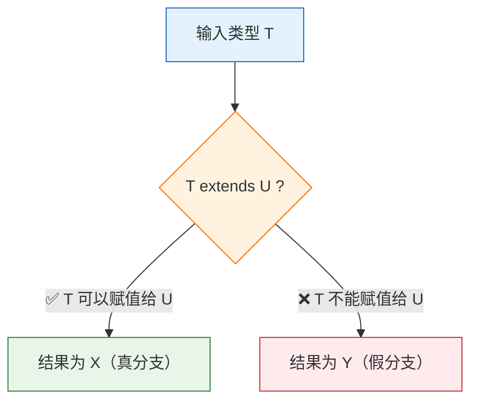
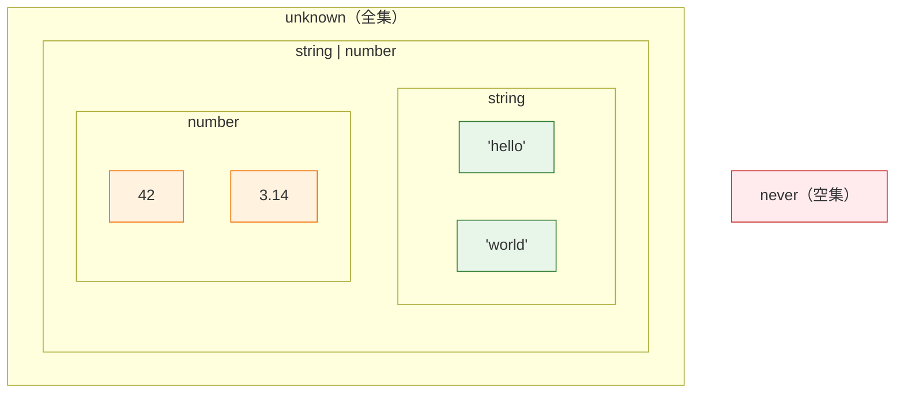
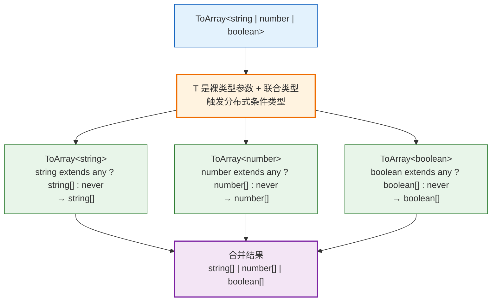
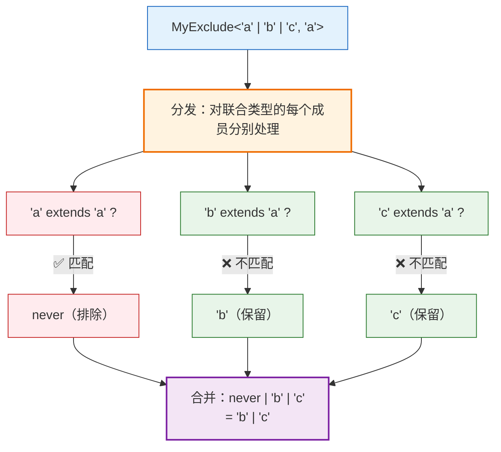
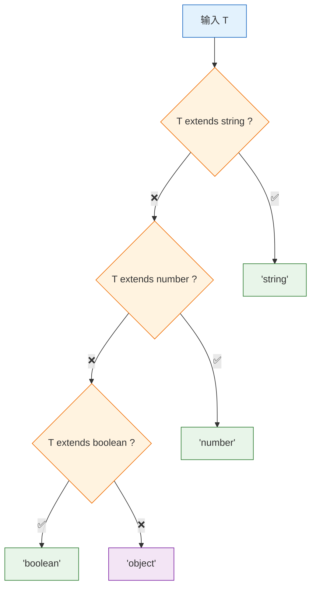

# 第四章：条件类型

> 🎯 本章目标：掌握条件类型（Conditional Types）的语法和核心机制，深入理解分布式条件类型（Distributive Conditional Types）这一关键概念，并通过 Exclude 和 If 两个经典挑战学会在实际中运用条件类型。

---

## 目录

- [4.1 条件类型基础（Conditional Types Basics）](#41-条件类型基础conditional-types-basics)
- [4.2 extends 的含义——"可赋值给"而非"继承"](#42-extends-的含义可赋值给而非继承)
- [4.3 分布式条件类型（Distributive Conditional Types）](#43-分布式条件类型distributive-conditional-types)
- [4.4 挑战实战：Exclude（#43）](#44-挑战实战exclude43)
- [4.5 挑战实战：If（#268）](#45-挑战实战if268)
- [4.6 条件类型嵌套（Nested Conditional Types）](#46-条件类型嵌套nested-conditional-types)
- [4.7 条件类型与 never](#47-条件类型与-never)
- [4.8 相关挑战](#48-相关挑战)

---

## 4.1 条件类型基础（Conditional Types Basics）

### 类型层面的三元表达式

在 JavaScript 中，三元运算符让我们根据条件选择不同的值：

```typescript
// JavaScript 值层面的三元表达式
const result = condition ? valueA : valueB;
```

TypeScript 的条件类型做的事情完全类似——只不过它操作的是**类型**而非值：

```typescript
// TypeScript 类型层面的条件类型
type Result = Condition extends Check ? TypeA : TypeB;
```

### 基本语法

条件类型的语法是 `T extends U ? X : Y`，含义是：

> **如果类型 `T` 可以赋值给类型 `U`，则结果为 `X`，否则结果为 `Y`。**

```typescript
// 基本示例：判断类型是否为 string
type IsString<T> = T extends string ? true : false;

type A = IsString<"hello">;   // true
type B = IsString<42>;         // false
type C = IsString<string>;     // true
```

### 条件类型执行流程



### 更多基本示例

```typescript
// 判断类型是否为数组
type IsArray<T> = T extends any[] ? true : false;

type D = IsArray<string[]>;    // true
type E = IsArray<number>;      // false
type F = IsArray<[1, 2, 3]>;   // true（元组也是数组）

// 根据条件返回不同的类型
type Wrap<T> = T extends string
    ? { text: T }
    : T extends number
    ? { value: T }
    : { data: T };

type W1 = Wrap<"hello">;   // { text: "hello" }
type W2 = Wrap<42>;         // { value: 42 }
type W3 = Wrap<boolean>;    // { data: boolean }
```

### 值层面 vs 类型层面对照

| | 值层面（JavaScript） | 类型层面（TypeScript） |
|---|---|---|
| **语法** | `cond ? a : b` | `T extends U ? X : Y` |
| **运行时机** | 运行时 | 编译时 |
| **条件判断** | 判断值是否为真 | 判断类型是否可赋值 |
| **返回** | 一个值 | 一个类型 |
| **嵌套** | `a ? b : c ? d : e` | `T extends A ? X : T extends B ? Y : Z` |

> 💡 **关键理解：** 条件类型本质上就是"类型层面的 if-else"。你可以把它想象成一个函数：接收类型参数，根据条件选择不同的返回类型。

---

## 4.2 extends 的含义——"可赋值给"而非"继承"

### extends 在不同场景中的含义

在 TypeScript 中，`extends` 关键字出现在多个场景中，含义各不相同：

```typescript
// 场景一：类继承 —— "继承"
class Dog extends Animal { }

// 场景二：接口继承 —— "扩展"
interface Square extends Shape { }

// 场景三：泛型约束 —— "必须满足"
function fn<T extends { length: number }>(arg: T) { }

// 场景四：条件类型 —— "可赋值给"
type Result = T extends U ? X : Y;
```

在条件类型中，`extends` 的准确含义是 **"可赋值给"（assignable to）**，而不是"继承自"。

### 理解"可赋值给"

`A extends B` 意味着：**类型 A 的值可以安全地赋给类型 B 的变量**。换言之，A 是 B 的子类型（subtype）。

```typescript
// "hello" extends string → ✅
// 字面量 "hello" 可以赋给 string 类型的变量
let s: string = "hello";   // ✅ 合法

// string extends "hello" → ❌
// string 类型的值不一定能赋给字面量 "hello" 类型的变量
let h: "hello" = "world" as string;  // ❌ 不安全

// { a: 1, b: 2 } extends { a: number } → ✅
// 拥有更多属性的对象可以赋给要求更少属性的类型
let obj: { a: number } = { a: 1, b: 2 };  // ✅ 结构兼容
```

### 常见的 extends 判断

| 表达式 | 结果 | 解释 |
|--------|------|------|
| `"hello" extends string` | ✅ true | 字面量是基础类型的子类型 |
| `string extends "hello"` | ❌ false | 基础类型不是字面量的子类型 |
| `42 extends number` | ✅ true | 数字字面量是 number 的子类型 |
| `string extends string \| number` | ✅ true | string 是联合类型的成员 |
| `string \| number extends string` | ❌ false | 联合类型不能赋给单一类型 |
| `never extends string` | ✅ true | never 是所有类型的子类型 |
| `string extends unknown` | ✅ true | 所有类型都是 unknown 的子类型 |
| `any extends string` | ⚠️ 特殊 | any 同时满足真假分支 |

### 类型兼容性的直觉

可以用集合来理解：如果类型 A 对应的值的集合是类型 B 对应的值的集合的**子集**，那么 `A extends B` 为 true。



```typescript
// 子集 → 超集 = extends 成立
type T1 = "hello" extends string ? "✅" : "❌";          // "✅"（子集 → 超集）
type T2 = string extends string | number ? "✅" : "❌";  // "✅"（子集 → 超集）
type T3 = string | number extends string ? "✅" : "❌";  // "❌"（超集 → 子集，不成立）
type T4 = never extends string ? "✅" : "❌";             // "✅"（空集是任何集合的子集）
```

> 💡 **核心记忆：** `A extends B` → "A 是 B 的子类型" → "A 的值集合 ⊆ B 的值集合" → "A 可以赋值给 B"。

---

## 4.3 分布式条件类型（Distributive Conditional Types）

> ⚠️ **这是本章最重要的概念！** 分布式条件类型是理解许多工具类型（如 `Exclude`、`Extract`、`NonNullable`）的关键，也是类型体操中频繁出现的核心机制。

### 什么是分布式条件类型

当条件类型的**检查类型**（`extends` 左边）是一个**裸类型参数（naked type parameter）**，并且该类型参数被实例化为**联合类型**时，条件类型会**自动分发（distribute）** 到联合类型的每个成员上。

这句话很抽象，让我们用一个例子来理解：

```typescript
type ToArray<T> = T extends any ? T[] : never;

// 当 T = string | number 时，会发生"分发"：
type Result = ToArray<string | number>;

// 等价于：
// ToArray<string> | ToArray<number>
// = (string extends any ? string[] : never) | (number extends any ? number[] : never)
// = string[] | number[]
```

**关键规则：** 当条件类型的 `extends` 左边是一个"裸"的泛型参数 `T`，而 `T` 是联合类型 `A | B | C` 时：

```
T extends U ? X : Y

// 会自动展开为：
(A extends U ? X : Y) | (B extends U ? X : Y) | (C extends U ? X : Y)
```

### 分布式展开的完整过程

让我们用一个具体的例子，完整展示分发的每一步：

```typescript
type ToArray<T> = T extends any ? T[] : never;

type Result = ToArray<string | number | boolean>;
```



### 分发 vs 不分发

分发产生的结果与不分发是**完全不同的**：

```typescript
// ✅ 分发（裸类型参数）
type ToArray<T> = T extends any ? T[] : never;
type Result1 = ToArray<string | number>;
// 分发: ToArray<string> | ToArray<number>
//     = string[] | number[]
// 结果: string[] | number[]  ← 联合类型的数组

// ✅ 不分发（包裹在方括号中）
type ToArrayNonDist<T> = [T] extends [any] ? T[] : never;
type Result2 = ToArrayNonDist<string | number>;
// 不分发: [string | number] extends [any] ? (string | number)[] : never
// 结果: (string | number)[]  ← 一个数组，元素是联合类型
```

**区别一目了然：**

| | 分发 | 不分发 |
|---|---|---|
| **语法** | `T extends ...` | `[T] extends [...]` |
| **输入** `string \| number` | 逐个处理每个成员 | 整体处理联合类型 |
| **`ToArray` 的结果** | `string[] \| number[]` | `(string \| number)[]` |
| **直觉** | "对联合类型的每个成员做操作" | "对联合类型整体做操作" |

### 什么是"裸"类型参数

分布式条件类型的触发条件是 `extends` 左边是"裸"的类型参数——即类型参数直接出现，没有被任何类型结构包裹：

```typescript
// ✅ 裸类型参数 → 会分发
type Dist1<T> = T extends any ? T[] : never;          // T 裸露
type Dist2<T> = T extends string ? "yes" : "no";      // T 裸露

// ❌ 非裸类型参数 → 不会分发
type NoDist1<T> = [T] extends [any] ? T[] : never;    // T 被 [] 包裹
type NoDist2<T> = { x: T } extends { x: any } ? T[] : never;  // T 被对象包裹
type NoDist3<T> = (T & {}) extends any ? T[] : never; // T 被交叉类型包裹（TS 4.8+）
```

### 阻止分发的方法

有时我们不希望条件类型分发，可以用方括号包裹来阻止：

```typescript
type IsNever<T> = T extends never ? true : false;
// ⚠️ 这个不能正确判断 never！（原因见 4.7 节）

type IsNever2<T> = [T] extends [never] ? true : false;
// ✅ 这个可以正确判断 never

type Test1 = IsNever<never>;   // never（错误！never 作为空联合分发后消失了）
type Test2 = IsNever2<never>;  // true（正确！阻止了分发）
```

### 分发的直觉理解

你可以把分布式条件类型想象成 JavaScript 中的 `Array.map`：

```typescript
// JavaScript 值层面
["string", "number", "boolean"].map(t => toArray(t));
// → [string[], number[], boolean[]]

// TypeScript 类型层面（分布式条件类型）
type ToArray<T> = T extends any ? T[] : never;
type Result = ToArray<string | number | boolean>;
// → string[] | number[] | boolean[]
```

联合类型就像一个数组，分布式条件类型就像是在这个"数组"上做 `map` 操作——对每个成员分别执行条件类型运算，最后把结果用 `|` 合并。

> 💡 **记忆口诀：** 裸参数 + 联合类型 = 自动 map。想要阻止，用 `[T]` 来 wrap。

---

## 4.4 挑战实战：Exclude（#43）

### 挑战描述

> 不使用内置的 `Exclude<T, U>` 工具类型，自己实现一个 `MyExclude`，从联合类型 `T` 中排除可以赋值给 `U` 的类型。

```typescript
// 期望行为
type Result = MyExclude<"a" | "b" | "c", "a">;
// 等价于 "b" | "c"

type Result2 = MyExclude<string | number | boolean, string>;
// 等价于 number | boolean
```

### 答案

```typescript
type MyExclude<T, U> = T extends U ? never : T;
```

短短一行代码！但要真正理解它，必须理解分布式条件类型。

### 逐步解析

让我们用 `MyExclude<"a" | "b" | "c", "a">` 完整走一遍过程：

**第一步：识别分发条件**

```typescript
type MyExclude<T, U> = T extends U ? never : T;
//                     ↑ T 是裸类型参数
//                     T = "a" | "b" | "c"（联合类型）
//                     → 触发分布式条件类型！
```

**第二步：展开分发**

```typescript
MyExclude<"a" | "b" | "c", "a">
// 自动展开为：
= MyExclude<"a", "a"> | MyExclude<"b", "a"> | MyExclude<"c", "a">
```

**第三步：逐个计算**

```typescript
// 成员 "a"：
"a" extends "a" ? never : "a"    // → never  ✅ "a" 匹配，排除

// 成员 "b"：
"b" extends "a" ? never : "b"    // → "b"    ❌ "b" 不匹配，保留

// 成员 "c"：
"c" extends "a" ? never : "c"    // → "c"    ❌ "c" 不匹配，保留
```

**第四步：合并结果**

```typescript
= never | "b" | "c"
= "b" | "c"    // never 在联合类型中自动消失
```

### Exclude 工作原理图解



### 更复杂的 Exclude 示例

```typescript
// 排除多个类型
type T1 = MyExclude<"a" | "b" | "c" | "d", "a" | "c">;
// 分发展开：
//   "a" extends "a" | "c" ? never : "a" → never（"a" 是 "a"|"c" 的子类型）
//   "b" extends "a" | "c" ? never : "b" → "b"
//   "c" extends "a" | "c" ? never : "c" → never（"c" 是 "a"|"c" 的子类型）
//   "d" extends "a" | "c" ? never : "d" → "d"
// 合并：never | "b" | never | "d" = "b" | "d"

// 排除基础类型
type T2 = MyExclude<string | number | boolean | undefined, string | undefined>;
// → number | boolean

// 结合其他工具类型
type NonNullable<T> = MyExclude<T, null | undefined>;
type T3 = NonNullable<string | null | undefined>;
// → string
```

> 💡 **核心领悟：** `Exclude` 之所以能工作，完全依赖分布式条件类型。如果没有分发机制，`T extends U ? never : T` 只能对类型整体做判断，而无法"过滤"联合类型中的各个成员。这就是为什么分布式条件类型如此重要！

---

## 4.5 挑战实战：If（#268）

### 挑战描述

> 实现一个工具类型 `If<C, T, F>`，根据条件类型 `C`（限制为 `boolean` 类型）来决定返回类型 `T` 还是类型 `F`。

```typescript
// 期望行为
type A = If<true, "a", "b">;    // "a"
type B = If<false, "a", "b">;   // "b"

// @ts-expect-error
type C = If<null, "a", "b">;    // C 不能是非 boolean 类型
```

### 答案

```typescript
type If<C extends boolean, T, F> = C extends true ? T : F;
```

### 逐行解析

```typescript
type If<
    C extends boolean,  // 泛型约束：C 必须是 boolean 类型（true | false）
    T,                  // 条件为真时返回的类型
    F                   // 条件为假时返回的类型
> = C extends true ? T : F;
//  ↑ 判断 C 是否可以赋值给 true
//    C = true  → 返回 T
//    C = false → false extends true ? → 不成立 → 返回 F
```

### 使用示例

```typescript
type A = If<true, "apple", "banana">;    // "apple"
type B = If<false, "apple", "banana">;   // "banana"
type C = If<boolean, "apple", "banana">; // "apple" | "banana"
//     ↑ boolean = true | false，分发后两个分支都有

// 约束保证了非 boolean 类型无法传入
// @ts-expect-error
type D = If<"yes", "apple", "banana">;   // 编译错误：'"yes"' 不满足 'boolean'
```

### 为什么用 `C extends true` 而不是 `C extends boolean`

```typescript
// ❌ 错误的实现
type IfWrong<C extends boolean, T, F> = C extends boolean ? T : F;

type Test = IfWrong<false, "a", "b">;
// false extends boolean → ✅ true
// 结果是 "a"  ← 错误！false 的时候应该返回 "b"

// ✅ 正确的实现
type IfCorrect<C extends boolean, T, F> = C extends true ? T : F;

type Test2 = IfCorrect<false, "a", "b">;
// false extends true → ❌ false
// 结果是 "b"  ← 正确！
```

> 💡 `C extends boolean` 的约束确保 `C` 只能是 `boolean` 类型（`true`、`false` 或 `boolean`），而条件判断 `C extends true` 则精确区分 `true` 和 `false`。约束和条件判断扮演不同的角色。

---

## 4.6 条件类型嵌套（Nested Conditional Types）

### 基本嵌套

条件类型可以嵌套使用，类似于 JavaScript 中的 `if-else if-else` 链：

```typescript
// JavaScript 中的多分支判断
function getTypeName(value) {
    if (typeof value === "string") return "string";
    else if (typeof value === "number") return "number";
    else if (typeof value === "boolean") return "boolean";
    else return "other";
}

// TypeScript 类型层面的等价物
type TypeName<T> =
    T extends string ? "string" :
    T extends number ? "number" :
    T extends boolean ? "boolean" :
    T extends undefined ? "undefined" :
    T extends Function ? "function" :
    "object";

type T1 = TypeName<"hello">;        // "string"
type T2 = TypeName<42>;             // "number"
type T3 = TypeName<true>;           // "boolean"
type T4 = TypeName<() => void>;     // "function"
type T5 = TypeName<{ a: 1 }>;       // "object"
```

### 嵌套条件类型的结构



### 实际应用示例

```typescript
// 根据不同类型包装成不同的容器
type SmartContainer<T> =
    T extends string ? { type: "text"; content: T } :
    T extends number ? { type: "numeric"; value: T } :
    T extends boolean ? { type: "flag"; enabled: T } :
    T extends any[] ? { type: "list"; items: T } :
    { type: "unknown"; data: T };

type C1 = SmartContainer<"hello">;
// { type: "text"; content: "hello" }

type C2 = SmartContainer<42>;
// { type: "numeric"; value: 42 }

type C3 = SmartContainer<string[]>;
// { type: "list"; items: string[] }
```

### 嵌套与分发的组合

嵌套条件类型与分布式条件类型可以组合使用：

```typescript
type TypeName<T> =
    T extends string ? "string" :
    T extends number ? "number" :
    "other";

// T 是裸类型参数 → 联合类型会分发
type Result = TypeName<string | number | boolean>;
// 分发展开：
//   TypeName<string>  → "string"
//   TypeName<number>  → "number"
//   TypeName<boolean> → "other"
// 合并：
// "string" | "number" | "other"
```

> 💡 **书写建议：** 嵌套条件类型时，建议每个分支换行并缩进，保持代码的可读性。类似于 JavaScript 中的 `if-else if-else` 代码风格。

---

## 4.7 条件类型与 never

`never` 类型在条件类型中有两种特殊行为，理解它们对于避免常见陷阱至关重要。

### 特殊行为一：never 在联合类型中自动消失

`never` 是 TypeScript 类型系统的"空集"。当 `never` 出现在联合类型中时，它会被自动移除：

```typescript
type T1 = string | never;           // string
type T2 = number | never | boolean; // number | boolean
type T3 = never | never;            // never
```

这就是 `Exclude` 能够工作的秘密——被排除的类型变成 `never`，而 `never` 在联合类型中自动消失，实现了"过滤"效果。

```typescript
type MyExclude<T, U> = T extends U ? never : T;
//                                    ↑ 被排除的成员变成 never
//                                         ↑ 保留的成员保持原样

type Result = MyExclude<"a" | "b" | "c", "a">;
// = never | "b" | "c"
// = "b" | "c"       ← never 自动消失！
```

### 特殊行为二：never 作为条件类型的输入

当 `never` 作为**裸类型参数**传入条件类型时，它的行为出人意料：

```typescript
type IsString<T> = T extends string ? true : false;

type Test = IsString<never>;  // never  ← 既不是 true 也不是 false！
```

**为什么是 `never` 而不是 `true`？**

原因在于：`never` 是**空联合类型**（zero-member union）。分布式条件类型会对联合类型的每个成员分别运算——如果联合类型没有成员，就没有任何运算被执行，结果就是 `never`。

```typescript
// 类比理解：
// 联合类型 = 数组
// string | number = ["string", "number"]
// never = []（空数组）

// map 操作空数组 → 结果还是空数组
[].map(x => doSomething(x));  // → []

// 条件类型遇到 never → 结果还是 never
type Result = IsString<never>;  // → never
```

### 正确判断 never 的方法

```typescript
// ❌ 错误：裸类型参数 + never → 直接返回 never，不走任何分支
type IsNever_Wrong<T> = T extends never ? true : false;
type Test1 = IsNever_Wrong<never>;  // never（不是 true！）

// ✅ 正确：用 [T] 包裹阻止分发
type IsNever<T> = [T] extends [never] ? true : false;
type Test2 = IsNever<never>;      // true ✅
type Test3 = IsNever<string>;     // false ✅
type Test4 = IsNever<undefined>;  // false ✅
```

### never 行为速查表

| 场景 | 表达式 | 结果 | 原因 |
|------|--------|------|------|
| never 在联合类型中 | `string \| never` | `string` | never 是空集，自动消失 |
| never 做条件类型裸输入 | `T extends string ? ... : ...`（T = never） | `never` | 空联合不分发任何成员 |
| never 做条件类型包裹输入 | `[T] extends [string] ? ... : ...`（T = never） | 走真分支 | 阻止分发，整体比较 |
| never extends never | `never extends never ? true : false` | `true` | 非泛型，直接求值 |

> ⚠️ **常见陷阱：** 很多初学者在写 `IsNever` 类型时会用 `T extends never ? true : false`，然后发现对 `never` 的判断结果不是 `true` 而是 `never`。记住：**never 不会触发分发，因为它是空联合类型**。用 `[T] extends [never]` 来正确判断。

---

## 4.8 相关挑战

掌握本章条件类型知识后，你可以尝试以下挑战：

| 挑战 | 难度 | 关键知识点 |
|------|------|------------|
| [Exclude](../questions/00043-easy-exclude/) (#43) | 🟢 easy | 分布式条件类型、`never` 过滤 |
| [If](../questions/00268-easy-if/) (#268) | 🟢 easy | 条件类型基础、泛型约束 |
| [Awaited](../questions/00189-easy-awaited/) (#189) | 🟢 easy | 条件类型、`infer` 关键字、递归条件类型 |
| [Parameters](../questions/03312-easy-parameters/) (#3312) | 🟢 easy | 条件类型、`infer` 关键字、函数类型 |

### 挑战提示

- **Exclude (#43)**：利用分布式条件类型——`T extends U ? never : T` 即可实现对联合类型的过滤
- **If (#268)**：条件判断用 `C extends true`，泛型约束用 `C extends boolean`
- **Awaited (#189)**：需要用 `infer` 推断 Promise 内部的类型（`T extends Promise<infer R> ? ... : ...`），并递归处理嵌套 Promise
- **Parameters (#3312)**：用条件类型 + `infer` 提取函数参数类型：`T extends (...args: infer P) => any ? P : never`

> 📝 `infer` 关键字将在[第七章](./07-infer.md)中深入讲解。在本章你只需要理解条件类型的分支选择和分发机制。

---

## 本章小结

| 概念 | 说明 |
|------|------|
| **条件类型** | `T extends U ? X : Y`——类型层面的三元表达式，根据类型关系选择分支 |
| **extends 含义** | 在条件类型中表示"可赋值给"，即子类型关系（A ⊆ B） |
| **分布式条件类型** | 裸类型参数 + 联合类型 → 自动分发到每个成员，相当于类型层面的 `map` |
| **阻止分发** | 用 `[T] extends [U]` 包裹类型参数，避免分发行为 |
| **Exclude 原理** | `T extends U ? never : T` + 分布式分发 → 过滤联合类型的成员 |
| **条件类型嵌套** | 多层 `extends ? :` 实现 if-else if-else 链式判断 |
| **never 与联合类型** | `never` 在联合类型中自动消失，可用于过滤 |
| **never 与分发** | `never` 作为裸类型参数输入条件类型，不触发任何分支，直接返回 `never` |
| **判断 never** | 用 `[T] extends [never]` 阻止分发来正确判断 |

---

## 导航

[← 上一章：泛型编程](./03-generics.md) | [下一章：映射类型 →](./05-mapped-types.md) | [← 返回目录](./README.md)
