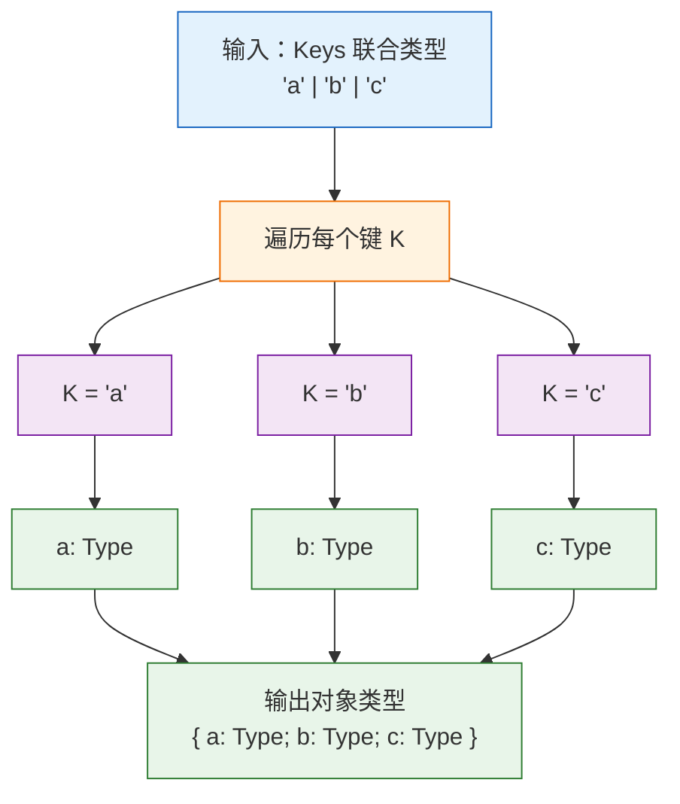
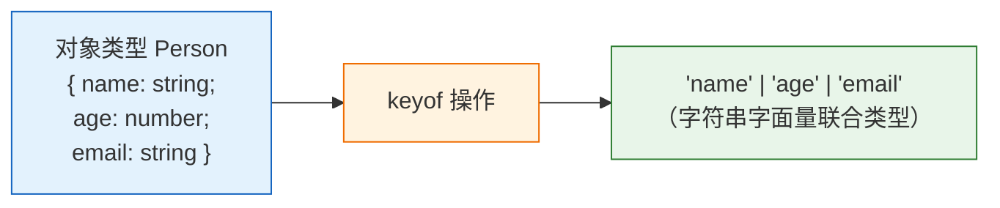
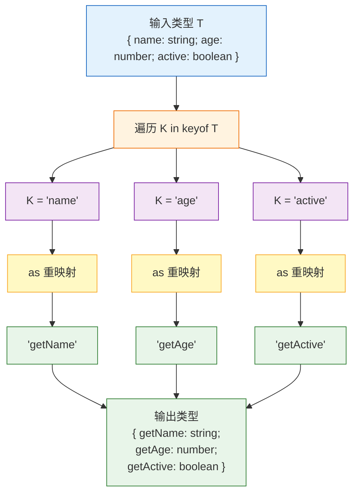
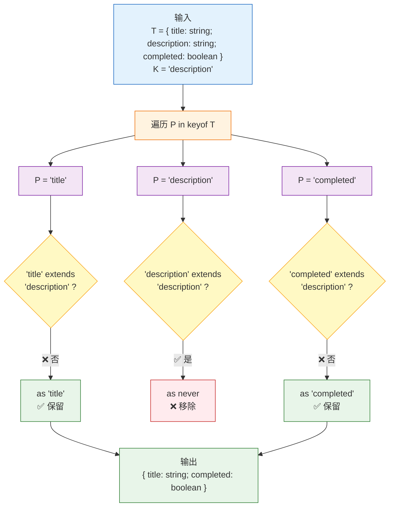

# 第五章：映射类型

> 🎯 本章目标：掌握映射类型（Mapped Types）的语法和核心机制，理解 `keyof` 操作符和索引访问类型，学会使用映射修饰符和键重映射，并通过 Readonly 2、Omit、Mutable 三个经典挑战进行实战演练。

---

## 目录

- [5.1 什么是映射类型（Mapped Types）](#51-什么是映射类型mapped-types)
- [5.2 keyof 操作符](#52-keyof-操作符)
- [5.3 索引访问类型（Indexed Access Types）](#53-索引访问类型indexed-access-types)
- [5.4 映射修饰符（Mapping Modifiers）](#54-映射修饰符mapping-modifiers)
- [5.5 键重映射（Key Remapping）](#55-键重映射key-remapping)
- [5.6 挑战实战：Readonly 2（#8）](#56-挑战实战readonly-28)
- [5.7 挑战实战：Omit（#3）](#57-挑战实战omit3)
- [5.8 挑战实战：Mutable（#2793）](#58-挑战实战mutable2793)
- [5.9 相关挑战](#59-相关挑战)

---

## 5.1 什么是映射类型（Mapped Types）

### 类型层面的 for...in 循环

在 JavaScript 中，我们经常使用 `for...in` 遍历对象的每一个键，并对其进行变换：

```typescript
// JavaScript 值层面的遍历
const original = { name: "Alice", age: 30 };
const result: Record<string, boolean> = {};

for (const key in original) {
  result[key] = true; // 把每个属性的值变成 boolean
}
// result → { name: true, age: true }
```

TypeScript 的映射类型做的事情完全类似——只不过它操作的是**类型**而非值：

```typescript
// TypeScript 类型层面的映射类型
type MakeBoolean<T> = {
  [K in keyof T]: boolean
};

type Result = MakeBoolean<{ name: string; age: number }>;
// { name: boolean; age: boolean }
```

### 基本语法

映射类型的核心语法是 `{ [K in Keys]: Type }`，含义是：

> **遍历 `Keys` 联合类型中的每一个成员 `K`，为其创建一个属性，属性值的类型为 `Type`。**

```typescript
// 最简单的映射类型
type SimpleMap = {
  [K in "a" | "b" | "c"]: number
};
// 等价于 { a: number; b: number; c: number }
```

语法拆解：

| 组成部分 | 含义 | 类比 |
|----------|------|------|
| `K` | 当前正在遍历的键 | `for (const key in obj)` 中的 `key` |
| `in` | 遍历关键字 | `for...in` 中的 `in` |
| `Keys` | 要遍历的键的联合类型 | 被遍历的对象 |
| `Type` | 每个属性对应的值类型 | 循环体中的操作 |

### 映射类型工作流程



### 映射类型 vs for...in 对照

```typescript
// ✅ JavaScript: for...in 遍历对象
for (const key in obj) {
  newObj[key] = transform(obj[key]);
}

// ✅ TypeScript: 映射类型遍历键
type Mapped<T> = {
  [K in keyof T]: Transform<T[K]>
};
```

> 💡 **核心类比**：映射类型就是类型层面的 `for...in` 循环。`K in keyof T` 就像 `for (const key in obj)`，`T[K]` 就像 `obj[key]`。

---

## 5.2 keyof 操作符

### 获取对象类型的所有键

`keyof` 操作符用于获取一个对象类型的所有键，返回一个**字符串字面量联合类型**：

```typescript
interface Person {
  name: string;
  age: number;
  email: string;
}

type PersonKeys = keyof Person;
// "name" | "age" | "email"
```

### keyof 操作图解



### keyof 的各种用法

```typescript
// 1. 普通对象类型
type Keys1 = keyof { a: number; b: string };  // "a" | "b"

// 2. 数组类型
type Keys2 = keyof string[];
// number | "length" | "push" | "pop" | ... (数组的所有方法和属性)

// 3. 元组类型
type Keys3 = keyof [string, number];
// number | "0" | "1" | "length" | ...

// 4. 原始类型
type Keys4 = keyof string;   // number | "length" | "charAt" | ...
type Keys5 = keyof number;   // "toString" | "toFixed" | ...

// 5. any 和 never
type Keys6 = keyof any;      // string | number | symbol
type Keys7 = keyof never;    // string | number | symbol
```

### keyof 与泛型结合

`keyof` 最常见的用法是在泛型中约束参数：

```typescript
// 确保 key 是 obj 中实际存在的键
function getProperty<T, K extends keyof T>(obj: T, key: K): T[K] {
  return obj[key];
}

const person = { name: "Alice", age: 30 };
getProperty(person, "name");  // ✅ 返回 string
getProperty(person, "age");   // ✅ 返回 number
// getProperty(person, "foo"); // ❌ 错误："foo" 不在 "name" | "age" 中
```

> 💡 `K extends keyof T` 是一个非常常用的约束模式，它确保 `K` 只能是 `T` 的合法键名之一。

---

## 5.3 索引访问类型（Indexed Access Types）

### 使用 T[K] 获取属性值类型

就像在 JavaScript 中用 `obj[key]` 获取属性值一样，在 TypeScript 中可以用 `T[K]` 获取属性对应的**类型**：

```typescript
interface Person {
  name: string;
  age: number;
  address: {
    city: string;
    zip: string;
  };
}

// 获取单个属性的类型
type NameType = Person["name"];     // string
type AgeType = Person["age"];       // number
type AddressType = Person["address"]; // { city: string; zip: string }

// 嵌套访问
type CityType = Person["address"]["city"]; // string
```

### 使用联合类型作为索引

当索引是联合类型时，结果也是联合类型：

```typescript
// 用联合类型同时获取多个属性的类型
type NameOrAge = Person["name" | "age"]; // string | number
```

### T[keyof T] 获取所有值类型的联合

一个非常有用的模式是 `T[keyof T]`——获取对象类型中**所有属性值**的联合类型：

```typescript
interface Person {
  name: string;
  age: number;
  active: boolean;
}

type PersonValues = Person[keyof Person];
// string | number | boolean

// 推导过程：
// keyof Person         → "name" | "age" | "active"
// Person[keyof Person] → Person["name" | "age" | "active"]
//                      → Person["name"] | Person["age"] | Person["active"]
//                      → string | number | boolean
```

### 数组元素类型访问

```typescript
// 用 number 作为索引获取数组元素类型
type ArrayElement = string[][number]; // string

// 实际场景：从数组常量中提取联合类型
const colors = ["red", "green", "blue"] as const;
type Color = (typeof colors)[number]; // "red" | "green" | "blue"
```

> 💡 `T[number]` 是获取数组/元组所有元素类型的联合类型的常用模式。

---

## 5.4 映射修饰符（Mapping Modifiers）

映射类型不仅能遍历键和改变值类型，还能改变属性的**修饰符**。TypeScript 支持两种修饰符：`readonly`（只读）和 `?`（可选）。

### 添加修饰符

```typescript
interface Todo {
  title: string;
  description: string;
  completed: boolean;
}

// 添加 readonly —— 所有属性变为只读
type ReadonlyTodo = {
  readonly [K in keyof Todo]: Todo[K]
};
// {
//   readonly title: string;
//   readonly description: string;
//   readonly completed: boolean;
// }

// 添加 ? —— 所有属性变为可选
type PartialTodo = {
  [K in keyof Todo]?: Todo[K]
};
// {
//   title?: string;
//   description?: string;
//   completed?: boolean;
// }

// 同时添加 readonly 和 ?
type ReadonlyPartialTodo = {
  readonly [K in keyof Todo]?: Todo[K]
};
// {
//   readonly title?: string;
//   readonly description?: string;
//   readonly completed?: boolean;
// }
```

### 移除修饰符

使用 `-` 前缀可以**移除**已有的修饰符：

```typescript
interface ReadonlyOptionalUser {
  readonly name?: string;
  readonly age?: number;
}

// 移除 readonly —— 变为可修改
type MutableUser = {
  -readonly [K in keyof ReadonlyOptionalUser]: ReadonlyOptionalUser[K]
};
// { name?: string; age?: number }

// 移除 ? —— 变为必填
type RequiredUser = {
  [K in keyof ReadonlyOptionalUser]-?: ReadonlyOptionalUser[K]
};
// { readonly name: string; readonly age: number }

// 同时移除 readonly 和 ?
type MutableRequiredUser = {
  -readonly [K in keyof ReadonlyOptionalUser]-?: ReadonlyOptionalUser[K]
};
// { name: string; age: number }
```

### 修饰符速查表

| 写法 | 效果 | 等价内置工具类型 |
|------|------|------------------|
| `readonly [K in keyof T]: T[K]` | 添加只读 | `Readonly<T>` |
| `[K in keyof T]?: T[K]` | 添加可选 | `Partial<T>` |
| `-readonly [K in keyof T]: T[K]` | 移除只读 | — |
| `[K in keyof T]-?: T[K]` | 移除可选 | `Required<T>` |
| `+readonly [K in keyof T]: T[K]` | 显式添加只读（等价不写 `+`） | `Readonly<T>` |
| `[K in keyof T]+?: T[K]` | 显式添加可选（等价不写 `+`） | `Partial<T>` |

> 💡 `+` 前缀是默认行为，通常省略不写。`-` 前缀是移除修饰符，这是需要显式写的。

---

## 5.5 键重映射（Key Remapping）

TypeScript 4.1 引入了 `as` 关键字，允许在映射类型中对键进行**重映射**——可以过滤键、重命名键，甚至生成全新的键。

### 基本语法

```typescript
type MappedWithRemap<T> = {
  [K in keyof T as NewKeyType]: T[K]
};
```

在 `as` 后面，你可以将原始键 `K` 变换成任何新的字符串字面量类型。

### 键重映射过程图解



### 过滤键——`as` + `never`

当 `as` 后的表达式返回 `never` 时，对应的键会被**移除**（过滤掉）：

```typescript
// 只保留值类型为 string 的属性
type OnlyStringValues<T> = {
  [K in keyof T as T[K] extends string ? K : never]: T[K]
};

interface Mixed {
  name: string;
  age: number;
  email: string;
  active: boolean;
}

type StringProps = OnlyStringValues<Mixed>;
// { name: string; email: string }
```

过滤的原理：

```typescript
// 遍历过程（以 Mixed 为例）：
// K = "name"    → T[K] = string  → string extends string ? "name" : never → "name"   ✅ 保留
// K = "age"     → T[K] = number  → number extends string ? "age" : never  → never    ❌ 过滤
// K = "email"   → T[K] = string  → string extends string ? "email" : never → "email" ✅ 保留
// K = "active"  → T[K] = boolean → boolean extends string ? ... : never   → never    ❌ 过滤
```

### 重命名键——`as` + 模板字面量

利用模板字面量类型可以对键进行重命名：

```typescript
// 给所有键加上 "get" 前缀，并首字母大写
type Getters<T> = {
  [K in keyof T as `get${Capitalize<string & K>}`]: () => T[K]
};

interface Person {
  name: string;
  age: number;
}

type PersonGetters = Getters<Person>;
// {
//   getName: () => string;
//   getAge: () => number;
// }
```

> 💡 `string & K` 用于确保 `K` 是 `string` 类型（`keyof T` 可能包含 `symbol` 或 `number`），`Capitalize` 是 TypeScript 内置的将首字母大写的工具类型。

### 更多键重映射示例

```typescript
// 1. 排除特定键
type OmitName<T> = {
  [K in keyof T as K extends "name" ? never : K]: T[K]
};

// 2. 给所有键加前缀
type Prefixed<T, Prefix extends string> = {
  [K in keyof T as `${Prefix}_${string & K}`]: T[K]
};

type PrefixedPerson = Prefixed<Person, "user">;
// { user_name: string; user_age: number }

// 3. 同时创建 getter 和 setter
type Accessors<T> = {
  [K in keyof T as `get${Capitalize<string & K>}`]: () => T[K]
} & {
  [K in keyof T as `set${Capitalize<string & K>}`]: (value: T[K]) => void
};
```

---

## 5.6 挑战实战：Readonly 2（#8）

> 📋 **题目**：实现 `MyReadonly2<T, K>`，将 `T` 中的属性 `K` 设为 `readonly`，其余属性保持不变。如果没有传入 `K`，则行为与普通 `Readonly<T>` 一致。

### 题目分析

```typescript
interface Todo {
  title: string;
  description: string;
  completed: boolean;
}

// 只将 title 和 description 设为 readonly
type Result = MyReadonly2<Todo, "title" | "description">;
// {
//   readonly title: string;
//   readonly description: string;
//   completed: boolean;
// }
```

### 解题思路

这道题需要将属性分成两组处理：

1. **在 `K` 中的属性**：添加 `readonly` 修饰符
2. **不在 `K` 中的属性**：保持原样

我们可以用**交叉类型**将两部分合并。

### 逐步推导

```typescript
// 第一步：处理需要 readonly 的部分
type ReadonlyPart<T, K extends keyof T> = {
  readonly [P in K]: T[P]
};

// 第二步：处理不需要 readonly 的部分
// Exclude<keyof T, K> 获取不在 K 中的键
type RestPart<T, K extends keyof T> = {
  [P in Exclude<keyof T, K>]: T[P]
};

// 第三步：合并
type MyReadonly2<T, K extends keyof T> = ReadonlyPart<T, K> & RestPart<T, K>;
```

### 完整答案

```typescript
// 合并写法
type MyReadonly2<T, K extends keyof T = keyof T> = {
  readonly [P in K]: T[P]
} & {
  [P in Exclude<keyof T, K>]: T[P]
};
```

> 💡 `K extends keyof T = keyof T` 中的 `= keyof T` 是泛型参数的默认值。当不传入 `K` 时，默认为 `keyof T`，即所有键都设为 `readonly`，与 `Readonly<T>` 行为一致。

### 验证

```typescript
interface Todo {
  title: string;
  description: string;
  completed: boolean;
}

// 部分 readonly
type A = MyReadonly2<Todo, "title" | "description">;
// {
//   readonly title: string;
//   readonly description: string;
//   completed: boolean;
// }

// 不传 K，全部 readonly
type B = MyReadonly2<Todo>;
// {
//   readonly title: string;
//   readonly description: string;
//   readonly completed: boolean;
// }
```

---

## 5.7 挑战实战：Omit（#3）

> 📋 **题目**：不使用内置的 `Omit<T, K>`，实现 `MyOmit<T, K>`，从类型 `T` 中排除键 `K` 对应的属性。

### 题目分析

```typescript
interface Todo {
  title: string;
  description: string;
  completed: boolean;
}

type Result = MyOmit<Todo, "description">;
// { title: string; completed: boolean }
```

### Omit 实现原理图解



### 解法一：使用 Pick + Exclude

利用已有的 `Pick` 和 `Exclude` 工具类型组合：

```typescript
// 思路：先用 Exclude 排除键，再用 Pick 选取剩余键
type MyOmit<T, K extends keyof T> = Pick<T, Exclude<keyof T, K>>;

// 推导过程（以 Omit<Todo, "description"> 为例）：
// Exclude<keyof Todo, "description">
// = Exclude<"title" | "description" | "completed", "description">
// = "title" | "completed"
//
// Pick<Todo, "title" | "completed">
// = { title: string; completed: boolean }
```

### 解法二：使用键重映射（推荐）

直接使用 `as` 键重映射过滤掉不需要的键——不依赖任何其他工具类型：

```typescript
type MyOmit<T, K extends keyof T> = {
  [P in keyof T as P extends K ? never : P]: T[P]
};
```

逐步理解：

```typescript
// 1. [P in keyof T]        —— 遍历 T 的所有键
// 2. as P extends K ?       —— 判断当前键 P 是否在要排除的键集合 K 中
//      never                —— 如果是，返回 never（过滤掉这个键）
//      : P                  —— 如果不是，保留原键名
// 3. T[P]                  —— 属性值类型保持不变
```

### 两种解法对比

| 解法 | 代码 | 优点 | 缺点 |
|------|------|------|------|
| Pick + Exclude | `Pick<T, Exclude<keyof T, K>>` | 简洁，利用已有工具 | 依赖其他内置类型 |
| 键重映射 | `[P in keyof T as P extends K ? never : P]: T[P]` | 独立实现，展示映射类型能力 | 语法稍长 |

> 💡 在类型挑战中，更推荐键重映射解法，因为它展示了你对映射类型的深入理解。

---

## 5.8 挑战实战：Mutable（#2793）

> 📋 **题目**：实现 `Mutable<T>`，将 `T` 中所有属性的 `readonly` 修饰符移除，使其变为可修改的。

### 题目分析

```typescript
interface ReadonlyTodo {
  readonly title: string;
  readonly description: string;
  readonly completed: boolean;
}

type MutableTodo = Mutable<ReadonlyTodo>;
// {
//   title: string;       // readonly 已移除
//   description: string; // readonly 已移除
//   completed: boolean;  // readonly 已移除
// }
```

### 解题思路

这道题非常直接——我们只需要在映射类型中使用 `-readonly` 修饰符移除 `readonly`：

```typescript
type Mutable<T> = {
  -readonly [K in keyof T]: T[K]
};
```

就是这么简单！关键在于 `-readonly` 这个语法。

### 验证

```typescript
interface Config {
  readonly host: string;
  readonly port: number;
  readonly debug: boolean;
}

type MutableConfig = Mutable<Config>;
// { host: string; port: number; debug: boolean }

// ✅ 现在可以修改了
const config: MutableConfig = { host: "localhost", port: 3000, debug: true };
config.host = "0.0.0.0";  // 没问题！

// ❌ 对比原始类型
const readonlyConfig: Config = { host: "localhost", port: 3000, debug: true };
// readonlyConfig.host = "0.0.0.0"; // Error: Cannot assign to 'host' because it is a read-only property
```

### 与 Readonly 的对比

`Mutable` 和 `Readonly` 是一对完全相反的操作：

```typescript
// Readonly：添加 readonly
type Readonly<T> = {
  readonly [K in keyof T]: T[K]       // 加上 readonly
};

// Mutable：移除 readonly
type Mutable<T> = {
  -readonly [K in keyof T]: T[K]      // 用 - 去掉 readonly
};
```

> 💡 类似地，`Partial`（添加 `?`）和 `Required`（移除 `?`）也是一对相反操作：
> - `Partial<T>` → `[K in keyof T]?: T[K]`
> - `Required<T>` → `[K in keyof T]-?: T[K]`

---

## 5.9 相关挑战

掌握本章映射类型知识后，你可以尝试以下挑战：

| 挑战 | 难度 | 关键知识点 |
|------|------|------------|
| [Readonly](../questions/00007-easy-readonly/) (#7) | 🟢 easy | 映射类型基础、`readonly` 修饰符 |
| [Readonly 2](../questions/00008-medium-readonly-2/) (#8) | 🟡 medium | 部分映射、交叉类型、泛型默认值 |
| [Omit](../questions/00003-medium-omit/) (#3) | 🟡 medium | 键重映射 `as`、条件类型过滤 |
| [Pick](../questions/00004-easy-pick/) (#4) | 🟢 easy | 映射类型基础、`K in Keys` 遍历 |
| [Mutable](../questions/02793-medium-mutable/) (#2793) | 🟡 medium | `-readonly` 移除修饰符 |
| [PickByType](../questions/02595-medium-pickbytype/) (#2595) | 🟡 medium | 键重映射、按值类型过滤 |
| [OmitByType](../questions/02852-medium-omitbytype/) (#2852) | 🟡 medium | 键重映射、按值类型排除 |
| [Append to Object](../questions/00527-medium-append-to-object/) (#527) | 🟡 medium | 映射类型、联合类型扩展键 |

### 挑战提示

- **Readonly (#7)**：最基础的映射类型——`{ readonly [K in keyof T]: T[K] }` 即可
- **Pick (#4)**：`{ [K in Keys]: T[K] }` —— `K` 不需要遍历 `keyof T`，直接遍历传入的键集合
- **PickByType (#2595)**：使用 `as T[K] extends ValueType ? K : never` 按值类型过滤
- **OmitByType (#2852)**：与 PickByType 相反，`as T[K] extends ValueType ? never : K`
- **Append to Object (#527)**：`[K in keyof T | NewKey]` —— 用联合类型扩展键的范围

---

## 本章小结

| 概念 | 说明 |
|------|------|
| **映射类型** | `{ [K in Keys]: Type }` —— 类型层面的 `for...in` 循环，遍历键生成新对象类型 |
| **keyof 操作符** | 获取对象类型的所有键的联合类型，如 `keyof Person` → `"name" | "age"` |
| **索引访问类型** | `T[K]` 获取属性值类型，`T[keyof T]` 获取所有值类型的联合 |
| **映射修饰符** | `readonly` / `?` 可以添加或移除（用 `-` 前缀），控制属性的只读/可选性 |
| **键重映射** | `as NewKeyType` 在映射过程中变换键名，`as never` 过滤键，`as \`prefix${K}\`` 重命名键 |
| **Readonly 2 原理** | 交叉类型分别处理需要 `readonly` 的键和其余键，泛型默认值处理可选参数 |
| **Omit 原理** | 用 `as P extends K ? never : P` 在映射过程中过滤掉不需要的键 |
| **Mutable 原理** | `-readonly` 移除所有属性的只读修饰符 |

---

## 导航

[← 上一章：条件类型](./04-conditional-types.md) | [下一章：模板字面量类型 →](./06-template-literal-types.md) | [← 返回目录](./README.md)
