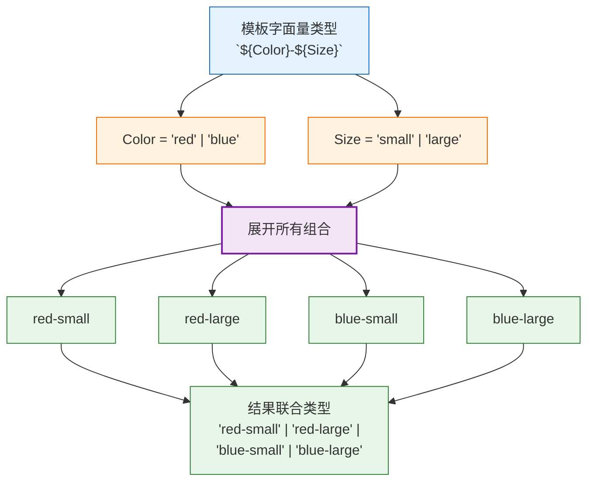
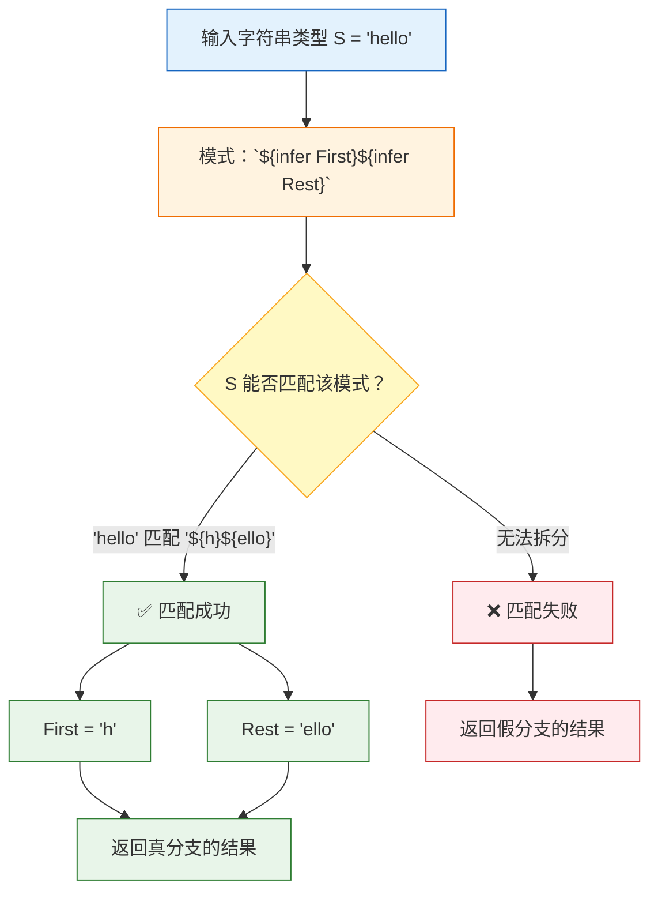

# 第六章：模板字面量类型

> 🎯 本章目标：掌握模板字面量类型（Template Literal Types）的语法和核心机制，理解字符串类型的联合分发，学会使用内置字符串操作类型，并通过 Capitalize、TrimLeft、Replace、KebabCase 四个经典挑战进行实战演练。

---

## 目录

- [6.1 模板字面量类型基础（Template Literal Types Basics）](#61-模板字面量类型基础template-literal-types-basics)
- [6.2 字符串类型的联合分发（Union Distribution in Template Literals）](#62-字符串类型的联合分发union-distribution-in-template-literals)
- [6.3 内置字符串操作类型（Intrinsic String Manipulation Types）](#63-内置字符串操作类型intrinsic-string-manipulation-types)
- [6.4 字符串模式匹配（String Pattern Matching）](#64-字符串模式匹配string-pattern-matching)
- [6.5 挑战实战：Capitalize（#110）](#65-挑战实战capitalize110)
- [6.6 挑战实战：TrimLeft（#106）](#66-挑战实战trimleft106)
- [6.7 挑战实战：Replace（#116）](#67-挑战实战replace116)
- [6.8 挑战实战：KebabCase（#612）](#68-挑战实战kebabcase612)
- [6.9 相关挑战](#69-相关挑战)

---

## 6.1 模板字面量类型基础（Template Literal Types Basics）

### 类型层面的模板字符串

在 JavaScript 中，模板字符串（Template Literals）让我们用 `` `${}` `` 语法在字符串中嵌入表达式：

```typescript
// JavaScript 值层面的模板字符串
const name = "Alice";
const greeting = `Hello, ${name}!`; // "Hello, Alice!"
```

TypeScript 的模板字面量类型做的事情完全类似——只不过它操作的是**类型**而非值：

```typescript
// TypeScript 类型层面的模板字面量类型
type Name = "Alice";
type Greeting = `Hello, ${Name}!`; // "Hello, Alice!"
```

### 基本语法

模板字面量类型的核心语法是 `` `${Type}` ``，含义是：

> **在字符串类型的特定位置嵌入其他类型，构造出新的字符串字面量类型。**

```typescript
// 最简单的模板字面量类型
type World = "world";
type HelloWorld = `hello ${World}`; // "hello world"

// 嵌入多个类型
type FirstName = "John";
type LastName = "Doe";
type FullName = `${FirstName} ${LastName}`; // "John Doe"
```

### 值层面 vs 类型层面对比

| JavaScript 值层面 | TypeScript 类型层面 |
|-------------------|---------------------|
| `` const s = `hello ${name}` `` | `` type S = `hello ${Name}` `` |
| 嵌入变量的值 | 嵌入类型 |
| 运行时求值 | 编译时求值 |
| 结果是具体字符串 | 结果是字符串字面量类型 |

### 可嵌入的类型

模板字面量类型中可以嵌入以下类型：

```typescript
// ✅ 字符串字面量类型
type T1 = `hello ${"world"}`;             // "hello world"

// ✅ 数字字面量类型
type T2 = `port: ${3000}`;                // "port: 3000"

// ✅ 布尔字面量类型
type T3 = `enabled: ${true}`;             // "enabled: true"

// ✅ bigint 字面量类型
type T4 = `big: ${100n}`;                 // "big: 100"

// ✅ null 和 undefined
type T5 = `value: ${null}`;               // "value: null"

// ✅ 宽泛的基础类型
type T6 = `id-${number}`;                 // `id-${number}` — 匹配 "id-1"、"id-42" 等
type T7 = `key-${string}`;                // `key-${string}` — 匹配任意以 "key-" 开头的字符串

// ❌ 不能嵌入 object、symbol 等类型
// type T8 = `value: ${object}`;           // Error!
```

> 💡 当嵌入宽泛类型如 `string` 或 `number` 时，结果不是一个具体的字面量类型，而是一个**模式类型**（Pattern Type），可以匹配所有符合模式的字符串。

### 模式类型的实际应用

```typescript
// 定义事件名称的模式
type EventName = `on${string}`;

// ✅ 匹配以 "on" 开头的任意字符串
const click: EventName = "onClick";       // ✅
const change: EventName = "onChange";     // ✅
// const name: EventName = "name";        // ❌ Error：不以 "on" 开头

// 定义 CSS 颜色变量的模式
type CSSVariable = `--${string}`;

const color: CSSVariable = "--primary-color";  // ✅
const spacing: CSSVariable = "--spacing-lg";   // ✅
// const invalid: CSSVariable = "color";       // ❌ Error
```

---

## 6.2 字符串类型的联合分发（Union Distribution in Template Literals）

### 联合类型自动展开

当模板字面量类型中嵌入的类型是**联合类型**时，TypeScript 会对每个联合成员分别展开，生成所有可能的字符串组合：

```typescript
type Color = "red" | "blue";
type Size = "small" | "large";

type Style = `${Color}-${Size}`;
// "red-small" | "red-large" | "blue-small" | "blue-large"
```

这就是模板字面量类型中的**分布式展开**——类比第四章中条件类型的分布式分发，但这里发生在字符串拼接中。

### 联合展开过程图解



### 展开的直觉理解

你可以把联合展开想象成嵌套的 `for` 循环——对每个插值位置上的联合成员进行**笛卡尔积**组合：

```typescript
// 类比 JavaScript 值层面的嵌套循环
const colors = ["red", "blue"];
const sizes = ["small", "large"];
const results: string[] = [];

for (const color of colors) {
  for (const size of sizes) {
    results.push(`${color}-${size}`);
  }
}
// results → ["red-small", "red-large", "blue-small", "blue-large"]

// TypeScript 类型层面的等价物
type Color = "red" | "blue";
type Size = "small" | "large";
type Style = `${Color}-${Size}`;
// "red-small" | "red-large" | "blue-small" | "blue-large"
```

### 多个联合类型的组合

展开过程会对**所有**插值位置的联合类型进行笛卡尔积，成员数量呈乘法增长：

```typescript
type Verb = "get" | "set";
type Noun = "Name" | "Age" | "Email";

type Method = `${Verb}${Noun}`;
// "getName" | "getAge" | "getEmail" | "setName" | "setAge" | "setEmail"
// 2 × 3 = 6 个成员

type Prefix = "user" | "admin";
type Action = "read" | "write";
type Resource = "file" | "db";

type Permission = `${Prefix}:${Action}:${Resource}`;
// 2 × 2 × 2 = 8 个成员
// "user:read:file" | "user:read:db" | "user:write:file" | ...
```

### 实际应用：生成事件类型

```typescript
// 实际开发中的一个常见模式：根据属性名生成事件名
interface Person {
  name: string;
  age: number;
}

// 将属性名转换为 onChange 风格的事件名
type PropEventName<T> = {
  [K in keyof T as `on${Capitalize<string & K>}Change`]: (newValue: T[K]) => void
};

type PersonEvents = PropEventName<Person>;
// {
//   onNameChange: (newValue: string) => void;
//   onAgeChange: (newValue: number) => void;
// }
```

> 💡 联合类型在模板字面量中的自动展开是一个极其强大的特性——它让我们能够从少量定义中自动生成大量类型安全的字符串类型组合。

---

## 6.3 内置字符串操作类型（Intrinsic String Manipulation Types）

TypeScript 提供了四个内置的字符串操作类型，它们由编译器直接实现（而非用 TypeScript 类型代码编写），用于在类型层面对字符串进行大小写变换：

### 四大内置类型

```typescript
// 1. Uppercase<S>：将所有字符转换为大写
type T1 = Uppercase<"hello">;           // "HELLO"
type T2 = Uppercase<"Hello World">;     // "HELLO WORLD"

// 2. Lowercase<S>：将所有字符转换为小写
type T3 = Lowercase<"HELLO">;           // "hello"
type T4 = Lowercase<"Hello World">;     // "hello world"

// 3. Capitalize<S>：将首字母转换为大写
type T5 = Capitalize<"hello">;          // "Hello"
type T6 = Capitalize<"hello world">;    // "Hello world"（只有首字母！）

// 4. Uncapitalize<S>：将首字母转换为小写
type T7 = Uncapitalize<"Hello">;        // "hello"
type T8 = Uncapitalize<"HTML">;         // "hTML"（只有首字母！）
```

### 速查表

| 内置类型 | 功能 | 输入 | 输出 | 类比 JavaScript |
|----------|------|------|------|-----------------|
| `Uppercase<S>` | 全部大写 | `"hello"` | `"HELLO"` | `str.toUpperCase()` |
| `Lowercase<S>` | 全部小写 | `"HELLO"` | `"hello"` | `str.toLowerCase()` |
| `Capitalize<S>` | 首字母大写 | `"hello"` | `"Hello"` | `str[0].toUpperCase() + str.slice(1)` |
| `Uncapitalize<S>` | 首字母小写 | `"Hello"` | `"hello"` | `str[0].toLowerCase() + str.slice(1)` |

### 与联合类型结合

内置字符串操作类型也会对联合类型进行分发：

```typescript
type Colors = "red" | "green" | "blue";

type UpperColors = Uppercase<Colors>;
// "RED" | "GREEN" | "BLUE"

type CapColors = Capitalize<Colors>;
// "Red" | "Green" | "Blue"

// 组合使用：生成 getter 方法名
type Getter<T extends string> = `get${Capitalize<T>}`;
type Getters = Getter<"name" | "age" | "email">;
// "getName" | "getAge" | "getEmail"
```

### 与模板字面量结合使用

```typescript
// CSS 属性名转换：camelCase → kebab-case 的辅助类型
type ToKebab<S extends string> = S extends `${infer F}${infer R}`
  ? R extends Uncapitalize<R>
    ? `${Lowercase<F>}${ToKebab<R>}`
    : `${Lowercase<F>}-${ToKebab<R>}`
  : S;

type T1 = ToKebab<"fontSize">;       // "font-size"
type T2 = ToKebab<"backgroundColor">; // "background-color"
```

> 💡 这四个内置类型是**编译器内部实现**的（Intrinsic），你无法用普通 TypeScript 代码实现它们的完整功能。它们是模板字面量类型生态系统的基石。

---

## 6.4 字符串模式匹配（String Pattern Matching）

### 结合 infer 进行字符串解析

模板字面量类型最强大的能力之一是与 `infer` 关键字结合，实现类型层面的**字符串解析**（String Parsing）：

```typescript
// 提取字符串的第一个字符
type GetFirst<S extends string> = S extends `${infer First}${infer Rest}` ? First : never;

type T1 = GetFirst<"hello">;  // "h"
type T2 = GetFirst<"abc">;    // "a"
type T3 = GetFirst<"">;       // never（空字符串不匹配模式）
```

### 字符串模式匹配工作原理



### 常用字符串解析模式

```typescript
// 1. 提取第一个字符和剩余部分
type Split<S extends string> = S extends `${infer Head}${infer Tail}`
  ? [Head, Tail]
  : never;

type T1 = Split<"hello">; // ["h", "ello"]

// 2. 按分隔符拆分
type Before<S extends string, Sep extends string> =
  S extends `${infer Left}${Sep}${infer Right}` ? Left : S;

type T2 = Before<"hello-world", "-">; // "hello"

// 3. 判断是否包含子串
type Includes<S extends string, Sub extends string> =
  S extends `${infer _L}${Sub}${infer _R}` ? true : false;

type T3 = Includes<"hello world", "world">; // true
type T4 = Includes<"hello world", "xyz">;   // false

// 4. 提取字符串末尾
type Last<S extends string> = S extends `${infer _}${infer Rest}`
  ? Rest extends "" ? S : Last<Rest>
  : never;

type T5 = Last<"hello">; // "o"
```

### infer 在字符串中的贪婪与惰性

在模板字面量的模式匹配中，`infer` 的匹配规则有一个重要特性：

```typescript
// 当存在多个 infer 时，第一个 infer 会尽可能少地匹配（惰性）
type T1 = "hello" extends `${infer A}${infer B}` ? [A, B] : never;
// A = "h", B = "ello" → ["h", "ello"]

// 当有明确的分隔符时，infer 按分隔符定位
type T2 = "a-b-c" extends `${infer A}-${infer B}` ? [A, B] : never;
// A = "a", B = "b-c" → ["a", "b-c"]（第一个 infer 惰性匹配到第一个 "-"）

// 多个分隔符
type T3 = "a.b.c" extends `${infer A}.${infer B}.${infer C}` ? [A, B, C] : never;
// ["a", "b", "c"]
```

> 📝 `infer` 关键字将在[第七章](./07-infer.md)中全面深入地讲解。本节只介绍它在字符串模式匹配中的基本用法。

---

## 6.5 挑战实战：Capitalize（#110）

> 📋 **题目**：实现 `MyCapitalize<S>`，将字符串类型 `S` 的首字母转换为大写。

### 题目分析

```typescript
// 期望行为
type T1 = MyCapitalize<"hello world">; // "Hello world"
type T2 = MyCapitalize<"foobar">;      // "Foobar"
type T3 = MyCapitalize<"">;            // ""
```

### 解题思路

1. 用模板字面量 + `infer` 将字符串拆成**首字母** `F` 和**剩余部分** `R`
2. 用内置的 `Uppercase` 将首字母转为大写
3. 用模板字面量拼接回去

### 逐步推导

```typescript
// 第一步：拆分字符串
// "hello" → F = "h", R = "ello"
type Step1<S extends string> = S extends `${infer F}${infer R}` ? [F, R] : never;

// 第二步：大写首字母并拼接
// F = "h" → Uppercase<"h"> = "H"
// 结果 → "H" + "ello" = "Hello"
type Step2<S extends string> = S extends `${infer F}${infer R}`
  ? `${Uppercase<F>}${R}`
  : S;
```

### 完整答案

```typescript
type MyCapitalize<S extends string> = S extends `${infer F}${infer R}`
  ? `${Uppercase<F>}${R}`
  : S;
```

### 验证

```typescript
type T1 = MyCapitalize<"hello">;       // "Hello"
type T2 = MyCapitalize<"hello world">; // "Hello world"
type T3 = MyCapitalize<"">;            // ""（空字符串不匹配模式，直接返回 S）
type T4 = MyCapitalize<"Hello">;       // "Hello"（已经是大写，不变）
type T5 = MyCapitalize<"123abc">;      // "123abc"（数字不受 Uppercase 影响）
```

### 为什么空字符串返回 S 而不是 never

```typescript
// 当 S = "" 时：
// "" extends `${infer F}${infer R}` → ❌ 匹配失败
// 进入假分支 → 返回 S，即 ""
//
// 这就是为什么假分支用 S 而不是 never：
// ✅ : S     — 空字符串返回空字符串（符合直觉）
// ❌ : never — 空字符串返回 never（不合理）
```

> 💡 `Capitalize` 虽然是 TypeScript 内置的工具类型，但我们用模板字面量 + `infer` + `Uppercase` 就能完全自己实现它。这充分展示了模板字面量类型的强大。

---

## 6.6 挑战实战：TrimLeft（#106）

> 📋 **题目**：实现 `TrimLeft<S>`，移除字符串类型 `S` 左侧的所有空白字符（空格、换行符、制表符）。

### 题目分析

```typescript
// 期望行为
type T1 = TrimLeft<"  hello">; // "hello"
type T2 = TrimLeft<"\n\t hello">; // "hello"（移除换行、制表符、空格）
type T3 = TrimLeft<"hello  ">;  // "hello  "（不处理右侧）
type T4 = TrimLeft<"   ">;     // ""
```

### 解题思路

类比 JavaScript 中的递归字符串处理——逐个剥去左侧的空白字符：

```typescript
// JavaScript 值层面的递归 trimLeft
function trimLeft(s: string): string {
  if (s[0] === " " || s[0] === "\n" || s[0] === "\t") {
    return trimLeft(s.slice(1)); // 剥掉一个空白字符，继续递归
  }
  return s;
}
```

### 逐步推导

```typescript
// 第一步：定义空白字符
type Whitespace = " " | "\n" | "\t";

// 第二步：尝试匹配左侧的空白字符
// "  hello" → 匹配 `${" "}${" hello"}` → R = " hello"
type TrimOne<S extends string> = S extends `${Whitespace}${infer R}` ? R : S;

// 第三步：递归地持续剥离
// " hello" → 匹配 → R = "hello"
// "hello" → 不匹配 → 返回 "hello"
type TrimLeft<S extends string> = S extends `${Whitespace}${infer R}` ? TrimLeft<R> : S;
```

### 完整答案

```typescript
type TrimLeft<S extends string> = S extends `${" " | "\n" | "\t"}${infer R}`
  ? TrimLeft<R>
  : S;
```

### 递归过程演示

```typescript
// TrimLeft<"  hello"> 的递归过程：

// 第1次递归：
// "  hello" extends `${" "}${infer R}` → ✅ R = " hello"
// → TrimLeft<" hello">

// 第2次递归：
// " hello" extends `${" "}${infer R}` → ✅ R = "hello"
// → TrimLeft<"hello">

// 第3次递归：
// "hello" extends `${" " | "\n" | "\t"}${infer R}` → ❌ 不匹配
// → 返回 "hello"

// 最终结果："hello"
```

### 验证

```typescript
type T1 = TrimLeft<"  hello">;       // "hello"
type T2 = TrimLeft<"\n\t hello">;    // "hello"
type T3 = TrimLeft<"hello  ">;       // "hello  "（不处理右侧）
type T4 = TrimLeft<"   ">;           // ""
type T5 = TrimLeft<"">;              // ""
type T6 = TrimLeft<" \n\t hello ">;  // "hello "
```

### 扩展：实现完整的 Trim（#108）

有了 `TrimLeft`，我们可以对称地实现 `TrimRight`，然后组合为 `Trim`：

```typescript
type TrimRight<S extends string> = S extends `${infer L}${" " | "\n" | "\t"}`
  ? TrimRight<L>
  : S;

type Trim<S extends string> = TrimRight<TrimLeft<S>>;

type T = Trim<"  hello world  ">; // "hello world"
```

> 💡 **递归模式**：TrimLeft 展示了模板字面量类型中最经典的递归模式——每次匹配处理一个字符，然后递归处理剩余部分，直到条件不再满足为止。

---

## 6.7 挑战实战：Replace（#116）

> 📋 **题目**：实现 `Replace<S, From, To>`，将字符串类型 `S` 中的第一个 `From` 子串替换为 `To`。

### 题目分析

```typescript
// 期望行为
type T1 = Replace<"hello world", "world", "TypeScript">;
// "hello TypeScript"

type T2 = Replace<"foobarbar", "bar", "baz">;
// "foobazbar"（只替换第一个）

type T3 = Replace<"hello", "", "world">;
// "hello"（From 为空字符串时不替换）
```

### 解题思路

1. 处理边界情况：`From` 为空字符串时直接返回 `S`
2. 用模板字面量模式匹配找到 `From` 的位置，同时推断出左侧 `L` 和右侧 `R`
3. 用模板字面量拼接 `L`、`To`、`R`

### 逐步推导

```typescript
// 第一步：先不考虑空字符串的情况
type ReplaceSimple<S extends string, From extends string, To extends string> =
  S extends `${infer L}${From}${infer R}`
    ? `${L}${To}${R}`
    : S;

// 测试：
type T = ReplaceSimple<"hello world", "world", "TS">;
// S = "hello world"
// 匹配 `${infer L}world${infer R}` → L = "hello ", R = ""
// 结果 = "hello " + "TS" + "" = "hello TS" ✅

// 第二步：处理 From 为空字符串的边界情况
// 当 From = "" 时，任何字符串都能匹配 `${infer L}${""}${infer R}`
// 所以需要特殊处理
```

### 完整答案

```typescript
type Replace<S extends string, From extends string, To extends string> =
  From extends ""
    ? S
    : S extends `${infer L}${From}${infer R}`
      ? `${L}${To}${R}`
      : S;
```

### 验证

```typescript
type T1 = Replace<"hello world", "world", "TS">;         // "hello TS"
type T2 = Replace<"foobarbar", "bar", "baz">;             // "foobazbar"
type T3 = Replace<"hello", "", "world">;                   // "hello"
type T4 = Replace<"hello", "xyz", "world">;                // "hello"（未找到 From）
type T5 = Replace<"types are fun", "fun", "awesome">;      // "types are awesome"
```

### 扩展：ReplaceAll（#119）

将 `Replace` 改为递归版本即可实现全部替换：

```typescript
type ReplaceAll<S extends string, From extends string, To extends string> =
  From extends ""
    ? S
    : S extends `${infer L}${From}${infer R}`
      ? `${L}${To}${ReplaceAll<R, From, To>}`  // 对右侧部分继续递归替换
      : S;

type T = ReplaceAll<"foobarbar", "bar", "baz">;
// 第1次：L = "foo", R = "bar" → "foo" + "baz" + ReplaceAll<"bar", "bar", "baz">
// 第2次：L = "", R = "" → "" + "baz" + ReplaceAll<"", "bar", "baz">
// 第3次："" 不匹配 → ""
// 结果："foobaz" + "baz" + "" = "foobazbaz"
```

> 💡 注意 `ReplaceAll` 的递归方向——替换完成后只对**右侧剩余部分** `R` 递归，而不是对整个结果递归，这避免了 `To` 中包含 `From` 时的无限递归。

---

## 6.8 挑战实战：KebabCase（#612）

> 📋 **题目**：实现 `KebabCase<S>`，将 camelCase 或 PascalCase 字符串转换为 kebab-case。

### 题目分析

```typescript
// 期望行为
type T1 = KebabCase<"FooBarBaz">;      // "foo-bar-baz"
type T2 = KebabCase<"fooBarBaz">;      // "foo-bar-baz"
type T3 = KebabCase<"foo">;            // "foo"
type T4 = KebabCase<"ABC">;            // "a-b-c"
type T5 = KebabCase<"">;              // ""
```

### 解题思路

核心思路：逐字符遍历，遇到大写字母就在前面插入 `-` 并转为小写。

关键判断：当前剩余部分 `R` 是否以大写字母开头——如果 `R` 不等于 `Uncapitalize<R>`，说明 `R` 以大写字母开头，需要插入分隔符。

### KebabCase 递归处理流程

```mermaid
graph TD
    INPUT["KebabCase&lt;'FooBar'&gt;"]
    SPLIT1{"拆分：F='F', R='ooBar'"}
    CHECK1{"R='ooBar' 等于<br/>Uncapitalize&lt;'ooBar'&gt;='ooBar' ?"}

    YES1["✅ 相等：不插入 '-'<br/>`f` + KebabCase&lt;'ooBar'&gt;"]
    SPLIT2{"拆分：F='o', R='oBar'"}
    CHECK2{"R='oBar' 等于<br/>Uncapitalize&lt;'oBar'&gt;='oBar' ?"}

    YES2["✅ 相等：不插入 '-'<br/>`o` + KebabCase&lt;'oBar'&gt;"]
    SPLIT3{"拆分：F='o', R='Bar'"}
    CHECK3{"R='Bar' 等于<br/>Uncapitalize&lt;'Bar'&gt;='bar' ?"}

    NO3["❌ 不等：插入 '-'<br/>`o-` + KebabCase&lt;'Bar'&gt;"]
    SPLIT4{"拆分：F='B', R='ar'"}
    CHECK4{"R='ar' 等于<br/>Uncapitalize&lt;'ar'&gt;='ar' ?"}

    YES4["✅ 相等：不插入 '-'<br/>`b` + KebabCase&lt;'ar'&gt;"]
    CONTINUE["...继续递归..."]
    RESULT["最终结果：'foo-bar'"]

    INPUT --> SPLIT1 --> CHECK1
    CHECK1 -->|"✅ 是"| YES1 --> SPLIT2 --> CHECK2
    CHECK2 -->|"✅ 是"| YES2 --> SPLIT3 --> CHECK3
    CHECK3 -->|"❌ 否"| NO3 --> SPLIT4 --> CHECK4
    CHECK4 -->|"✅ 是"| YES4 --> CONTINUE --> RESULT

    style INPUT fill:#e3f2fd,stroke:#1565c0
    style SPLIT1 fill:#f3e5f5,stroke:#7b1fa2
    style SPLIT2 fill:#f3e5f5,stroke:#7b1fa2
    style SPLIT3 fill:#f3e5f5,stroke:#7b1fa2
    style SPLIT4 fill:#f3e5f5,stroke:#7b1fa2
    style CHECK1 fill:#fff9c4,stroke:#f9a825
    style CHECK2 fill:#fff9c4,stroke:#f9a825
    style CHECK3 fill:#fff9c4,stroke:#f9a825
    style CHECK4 fill:#fff9c4,stroke:#f9a825
    style YES1 fill:#e8f5e9,stroke:#2e7d32
    style YES2 fill:#e8f5e9,stroke:#2e7d32
    style YES4 fill:#e8f5e9,stroke:#2e7d32
    style NO3 fill:#ffebee,stroke:#c62828
    style CONTINUE fill:#fff3e0,stroke:#ef6c00
    style RESULT fill:#e8f5e9,stroke:#2e7d32,stroke-width:2px
```



### 逐步推导

```typescript
// 第一步：理解核心判断逻辑
// 如何判断一个字符串是否以大写字母开头？
// → 比较 R 和 Uncapitalize<R> 是否相同
//
// "Bar" === Uncapitalize<"Bar">  →  "Bar" === "bar"  →  ❌ 不同 → 大写开头
// "oo"  === Uncapitalize<"oo">   →  "oo"  === "oo"   →  ✅ 相同 → 小写开头

// 第二步：构建递归逻辑
// 对于每个字符 F 和剩余部分 R：
// - 将 F 转为小写
// - 如果 R 以大写字母开头，在 F 和 R 之间插入 "-"
// - 递归处理 R

// 第三步：处理边界情况
// - 空字符串 → 直接返回
// - 单字符 → 转小写返回
```

### 完整答案

```typescript
type KebabCase<S extends string> = S extends `${infer F}${infer R}`
  ? R extends Uncapitalize<R>
    ? `${Lowercase<F>}${KebabCase<R>}`
    : `${Lowercase<F>}-${KebabCase<R>}`
  : S;
```

### 递归过程演示

```typescript
// KebabCase<"FooBar"> 的完整递归过程：

// KebabCase<"FooBar">
// F = "F", R = "ooBar"
// "ooBar" extends Uncapitalize<"ooBar"> ("ooBar") → ✅ 是
// → `${"f"}${KebabCase<"ooBar">}`

//   KebabCase<"ooBar">
//   F = "o", R = "oBar"
//   "oBar" extends Uncapitalize<"oBar"> ("oBar") → ✅ 是
//   → `${"o"}${KebabCase<"oBar">}`

//     KebabCase<"oBar">
//     F = "o", R = "Bar"
//     "Bar" extends Uncapitalize<"Bar"> ("bar") → ❌ 否（大写开头！）
//     → `${"o"}-${KebabCase<"Bar">}`

//       KebabCase<"Bar">
//       F = "B", R = "ar"
//       "ar" extends Uncapitalize<"ar"> ("ar") → ✅ 是
//       → `${"b"}${KebabCase<"ar">}`

//         KebabCase<"ar">
//         F = "a", R = "r"
//         "r" extends Uncapitalize<"r"> ("r") → ✅ 是
//         → `${"a"}${KebabCase<"r">}`

//           KebabCase<"r">
//           F = "r", R = ""
//           "" extends Uncapitalize<""> ("") → ✅ 是
//           → `${"r"}${KebabCase<"">}`

//             KebabCase<"">
//             "" extends `${infer F}${infer R}` → ❌ 不匹配
//             → ""

// 回溯拼接：
// "" → "r" → "ar" → "bar" → "o-bar" → "oo-bar" → "foo-bar"
```

### 验证

```typescript
type T1 = KebabCase<"FooBarBaz">;      // "foo-bar-baz"
type T2 = KebabCase<"fooBarBaz">;      // "foo-bar-baz"
type T3 = KebabCase<"foo">;            // "foo"
type T4 = KebabCase<"ABC">;            // "a-b-c"
type T5 = KebabCase<"">;              // ""
type T6 = KebabCase<"getElementById">; // "get-element-by-id"
```

### 核心技巧总结

```typescript
// 1. 逐字符递归：`${infer F}${infer R}` 每次取一个字符
// 2. 大写判断：R extends Uncapitalize<R> 检测下一个字符的大小写
// 3. 条件插入：根据判断结果决定是否在中间插入 "-"
// 4. 统一小写：所有字符都通过 Lowercase<F> 转为小写
```

> 💡 KebabCase 是模板字面量类型中综合难度较高的挑战——它同时使用了递归、`infer`、`Lowercase`、`Uncapitalize` 和条件类型。掌握它意味着你已经对模板字面量类型有了相当深入的理解。

---

## 6.9 相关挑战

掌握本章模板字面量类型知识后，你可以尝试以下挑战：

| 挑战 | 难度 | 关键知识点 |
|------|------|------------|
| [Capitalize](../questions/00110-medium-capitalize/) (#110) | 🟡 medium | 模板字面量 + `infer` 拆分首字符、`Uppercase` |
| [TrimLeft](../questions/00106-medium-trimleft/) (#106) | 🟡 medium | 模板字面量递归、空白字符联合类型匹配 |
| [Trim](../questions/00108-medium-trim/) (#108) | 🟡 medium | `TrimLeft` + `TrimRight` 组合 |
| [Replace](../questions/00116-medium-replace/) (#116) | 🟡 medium | 模板字面量模式匹配、左右子串推断 |
| [ReplaceAll](../questions/00119-medium-replaceall/) (#119) | 🟡 medium | `Replace` + 递归 |
| [KebabCase](../questions/00612-medium-kebabcase/) (#612) | 🟡 medium | 逐字符递归、`Uncapitalize` 大写检测、条件插入分隔符 |
| [CamelCase](../questions/00114-hard-camelcase/) (#114) | 🔴 hard | KebabCase 的逆操作、分隔符检测、递归大写转换 |
| [BEM style string](../questions/03326-medium-bem-style-string/) (#3326) | 🟡 medium | 模板字面量联合展开、BEM 命名规范 |
| [StartsWith](../questions/02688-medium-startswith/) (#2688) | 🟡 medium | 模板字面量 + `infer` 匹配前缀 |
| [EndsWith](../questions/02693-medium-endswith/) (#2693) | 🟡 medium | 模板字面量 + `infer` 匹配后缀 |

### 挑战提示

- **Trim (#108)**：先 `TrimLeft` 再 `TrimRight`，或者合并为一个同时处理左右两侧的递归类型
- **ReplaceAll (#119)**：在 `Replace` 的基础上，对替换后的右侧部分 `R` 继续递归替换
- **CamelCase (#114)**：与 KebabCase 相反，遇到 `-` 分隔符后将下一个字符大写
- **BEM style string (#3326)**：利用联合类型在模板字面量中的自动展开生成 `block__element--modifier` 形式
- **StartsWith (#2688)**：`S extends \`${Prefix}${infer _}\` ? true : false`
- **EndsWith (#2693)**：`S extends \`${infer _}${Suffix}\` ? true : false`

---

## 本章小结

| 概念 | 说明 |
|------|------|
| **模板字面量类型** | `` `hello ${Type}` `` —— 类型层面的模板字符串，在编译时构造新的字符串字面量类型 |
| **联合分发** | 模板中嵌入联合类型时自动展开为所有组合的笛卡尔积 |
| **内置字符串操作类型** | `Uppercase`、`Lowercase`、`Capitalize`、`Uncapitalize` —— 编译器内置的大小写变换 |
| **字符串模式匹配** | 模板字面量 + `infer` 实现类型层面的字符串解析，如提取、拆分、替换 |
| **Capitalize 原理** | 拆分首字符 `F` 和剩余 `R`，用 `Uppercase<F>` 转大写后拼接 |
| **TrimLeft 原理** | 递归匹配并剥离左侧空白字符，直到首字符不是空白 |
| **Replace 原理** | 用 `${infer L}${From}${infer R}` 定位子串，替换后拼接 `${L}${To}${R}` |
| **KebabCase 原理** | 逐字符递归，用 `Uncapitalize<R>` 检测大写字母，条件插入 `-` 分隔符 |

---

## 导航

[← 上一章：映射类型](./05-mapped-types.md) | [下一章：infer 关键字详解 →](./07-infer.md) | [← 返回目录](./README.md)
