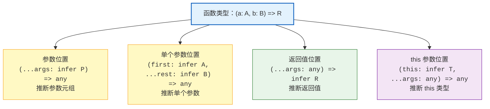
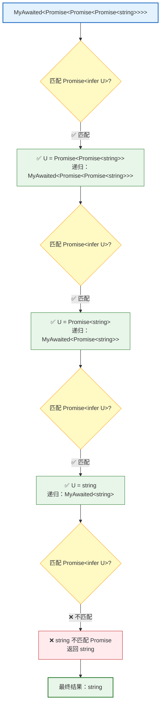

# 第七章：infer 关键字详解

> 🎯 本章目标：深入掌握 `infer` 关键字的原理和用法——理解它在条件类型中声明类型变量并让 TypeScript 自动推断的核心机制，学会在函数类型、数组/元组、字符串、Promise 等不同场景中运用 `infer` 进行模式匹配和类型提取，理解协变与逆变位置对 `infer` 推断结果的影响，并通过 Parameters、ReturnType、First of Array、Awaited 四个经典挑战进行实战演练。

---

## 目录

- [7.1 什么是 infer（What is infer）](#71-什么是-inferwhat-is-infer)
- [7.2 函数参数推断（Inferring Function Parameters）](#72-函数参数推断inferring-function-parameters)
- [7.3 函数返回值推断（Inferring Return Types）](#73-函数返回值推断inferring-return-types)
- [7.4 数组与元组推断（Array and Tuple Inference）](#74-数组与元组推断array-and-tuple-inference)
- [7.5 字符串推断（String Inference）](#75-字符串推断string-inference)
- [7.6 Promise 推断（Promise Inference）](#76-promise-推断promise-inference)
- [7.7 协变与逆变位置的 infer（Infer in Covariant and Contravariant Positions）](#77-协变与逆变位置的-inferinfer-in-covariant-and-contravariant-positions)
- [7.8 挑战实战：Parameters（#3312）](#78-挑战实战parameters3312)
- [7.9 挑战实战：ReturnType（#2）](#79-挑战实战returntype2)
- [7.10 挑战实战：First of Array（#14）](#710-挑战实战first-of-array14)
- [7.11 挑战实战：Awaited（#189）](#711-挑战实战awaited189)
- [7.12 相关挑战](#712-相关挑战)

---

## 7.1 什么是 infer（What is infer）

### 类型系统中的"变量声明"

在 JavaScript 中，我们用 `const` 或 `let` 声明变量，让运行时引擎保存一个值：

```typescript
// JavaScript 值层面：声明变量，保存值
const first = [1, 2, 3][0]; // first = 1
```

TypeScript 的 `infer` 做的事情完全类似——只不过它操作的是**类型**而非值：

```typescript
// TypeScript 类型层面：声明类型变量，让编译器自动推断
type First<T extends any[]> = T extends [infer F, ...any[]] ? F : never;

type A = First<[1, 2, 3]>; // 1
```

> 📌 **核心类比**：`infer` 就是类型系统中的"变量声明"——它在模式匹配的过程中声明一个占位符，让 TypeScript 编译器根据实际类型自动推断出该占位符的具体类型。

### 基本语法

`infer` 只能在条件类型（Conditional Types）的 `extends` 子句中使用，语法如下：

```typescript
type Example<T> = T extends SomePattern<infer U> ? UseU : Fallback;
//                                      ^^^^^^^
//                                      在这里声明类型变量 U
//                                      TypeScript 会尝试推断 U 的类型
```

关键规则：

- ✅ `infer` **只能**出现在 `extends` 子句中
- ✅ `infer` 声明的变量**只能**在 true 分支（`?` 后面）中使用
- ❌ `infer` **不能**在 false 分支（`:` 后面）中使用
- ❌ `infer` **不能**在条件类型之外使用

```typescript
// ✅ 正确：在 extends 中声明，在 true 分支中使用
type GetReturn<T> = T extends () => infer R ? R : never;

// ❌ 错误：不能在 false 分支中使用 infer 声明的变量
// type Wrong<T> = T extends () => infer R ? never : R;
// 虽然语法上 R 在 false 分支可见，但概念上——
// 如果模式不匹配，R 就没有被推断出来，使用它没有意义

// ❌ 错误：不能在条件类型之外使用 infer
// type Wrong<infer T> = T;
```

### infer 的工作原理

`infer` 的核心是**模式匹配**（Pattern Matching）。它的工作流程可以分为三步：


以一个具体例子来理解这三步：

```typescript
type GetElementType<T> = T extends Array<infer E> ? E : never;

// 使用示例：
type T = GetElementType<Array<string>>;
// ① 模式匹配：Array<string> 是否匹配 Array<infer E> 的模式？→ ✅ 匹配
// ② 提取推断：E = string
// ③ 使用结果：返回 true 分支 → E → string
```

### 值层面 vs 类型层面对比

| JavaScript 值层面 | TypeScript 类型层面（infer） |
|-------------------|-------------------------------|
| `const [first] = arr` | `T extends [infer F, ...any[]] ? F : never` |
| 解构赋值提取值 | 模式匹配提取类型 |
| 运行时执行 | 编译时执行 |
| 可在任何位置使用 | 只能在 `extends` 子句中使用 |

### 多个 infer 变量

一个条件类型中可以同时使用多个 `infer` 变量：

```typescript
// 同时推断函数的参数类型和返回值类型
type FuncInfo<T> = T extends (arg: infer A) => infer R
  ? { arg: A; return: R }
  : never;

type T = FuncInfo<(x: number) => string>;
// { arg: number; return: string }
```

---

## 7.2 函数参数推断（Inferring Function Parameters）

### 推断单个参数

```typescript
// 推断函数的第一个参数类型
type FirstArg<T> = T extends (first: infer A, ...args: any[]) => any ? A : never;

type T1 = FirstArg<(x: number, y: string) => void>;   // number
type T2 = FirstArg<(name: string) => boolean>;          // string
type T3 = FirstArg<() => void>;                         // unknown
```

### 推断所有参数（Parameters）

这就是 TypeScript 内置工具类型 `Parameters<T>` 的原理：

```typescript
// 推断函数的所有参数类型（得到元组）
type MyParameters<T extends (...args: any) => any> =
  T extends (...args: infer P) => any ? P : never;

type T1 = MyParameters<(a: number, b: string) => void>;
// [a: number, b: string]

type T2 = MyParameters<() => void>;
// []

type T3 = MyParameters<(x: boolean) => number>;
// [x: boolean]
```

### 函数类型中 infer 的各个位置

在一个函数类型 `(args) => return` 中，`infer` 可以出现在不同位置，分别推断不同部分：



```typescript
// 推断 this 参数
type GetThisType<T> = T extends (this: infer This, ...args: any[]) => any ? This : never;

function greet(this: { name: string }) {
  return `Hello, ${this.name}`;
}

type T = GetThisType<typeof greet>; // { name: string }
```

---

## 7.3 函数返回值推断（Inferring Return Types）

### 基本用法

这就是 TypeScript 内置工具类型 `ReturnType<T>` 的原理：

```typescript
// 推断函数的返回值类型
type MyReturnType<T extends (...args: any) => any> =
  T extends (...args: any) => infer R ? R : never;

type T1 = MyReturnType<() => string>;               // string
type T2 = MyReturnType<() => Promise<number>>;       // Promise<number>
type T3 = MyReturnType<(x: number) => boolean[]>;    // boolean[]
```

### 参数部分用 `any` 通配

注意在推断返回值时，参数部分写 `...args: any`，这是一种**通配**——我们不关心参数是什么，只关心返回值：

```typescript
// ✅ 用 any 通配参数
type ReturnOf<T> = T extends (...args: any) => infer R ? R : never;

// ❌ 用 never 会导致大部分函数不匹配
// type WrongReturn<T> = T extends (...args: never) => infer R ? R : never;
```

> 💡 **通配原则**：在 `infer` 模式匹配中，不关心的部分使用 `any` 来通配（对于参数部分特别如此，因为参数在逆变位置）。

### 处理重载函数

当函数有多个重载签名时，`infer` 只会匹配**最后一个**重载签名：

```typescript
declare function overloaded(x: string): string;
declare function overloaded(x: number): number;

type T = MyReturnType<typeof overloaded>; // number（匹配最后一个重载）
```

---

## 7.4 数组与元组推断（Array and Tuple Inference）

`infer` 与数组/元组的展开运算符（`...`）结合，可以灵活地提取元组中的各个部分。

### 提取首元素（First）

```typescript
type First<T extends any[]> = T extends [infer F, ...any[]] ? F : never;

type T1 = First<[1, 2, 3]>;        // 1
type T2 = First<["hello", 42]>;     // "hello"
type T3 = First<[]>;                // never（空数组不匹配）
```

### 提取尾元素（Last）

```typescript
type Last<T extends any[]> = T extends [...any[], infer L] ? L : never;

type T1 = Last<[1, 2, 3]>;         // 3
type T2 = Last<["hello"]>;          // "hello"
type T3 = Last<[]>;                 // never
```

### 提取剩余元素（Rest / Tail）

```typescript
type Rest<T extends any[]> = T extends [any, ...infer R] ? R : never;

type T1 = Rest<[1, 2, 3]>;         // [2, 3]
type T2 = Rest<["hello"]>;          // []
type T3 = Rest<[]>;                 // never
```

### 提取除最后一个以外的元素（Init / Pop）

```typescript
type Init<T extends any[]> = T extends [...infer I, any] ? I : never;

type T1 = Init<[1, 2, 3]>;         // [1, 2]
type T2 = Init<["hello"]>;          // []
type T3 = Init<[]>;                 // never
```

### 元组推断位置总结

```typescript
// 首元素
[infer F, ...any[]]        // F = 首元素

// 尾元素
[...any[], infer L]         // L = 尾元素

// 去掉首元素
[any, ...infer R]           // R = 剩余部分

// 去掉尾元素
[...infer I, any]           // I = 前面部分

// 首尾同时
[infer F, ...infer M, infer L]  // F = 首, M = 中间, L = 尾
```

> 💡 这些模式是解决 type-challenges 中大量数组/元组相关挑战的基础。熟练掌握它们相当于掌握了类型层面的"数组解构"。

### 推断数组元素类型

对于普通数组（非元组），可以推断其元素类型：

```typescript
type ElementOf<T> = T extends (infer E)[] ? E : never;
// 等价于
type ElementOf2<T> = T extends Array<infer E> ? E : never;

type T1 = ElementOf<string[]>;       // string
type T2 = ElementOf<number[]>;       // number
type T3 = ElementOf<(string | number)[]>; // string | number
```

---

## 7.5 字符串推断（String Inference）

`infer` 与模板字面量类型（Template Literal Types）结合，实现类型层面的字符串解析。

### 提取首字符

```typescript
type GetFirst<S extends string> = S extends `${infer F}${infer R}` ? F : never;

type T1 = GetFirst<"hello">;   // "h"
type T2 = GetFirst<"a">;       // "a"
type T3 = GetFirst<"">;        // never（空字符串不匹配）
```

### 提取剩余部分

```typescript
type GetRest<S extends string> = S extends `${infer F}${infer R}` ? R : never;

type T1 = GetRest<"hello">;    // "ello"
type T2 = GetRest<"a">;        // ""
type T3 = GetRest<"">;         // never
```

### 按分隔符拆分

```typescript
// 提取分隔符左右两侧
type Split<S extends string, Sep extends string> =
  S extends `${infer L}${Sep}${infer R}` ? [L, R] : never;

type T1 = Split<"hello-world", "-">;           // ["hello", "world"]
type T2 = Split<"foo.bar.baz", ".">;           // ["foo", "bar.baz"]（只匹配第一个）
```

### 判断字符串是否包含子串

```typescript
type Includes<S extends string, Sub extends string> =
  S extends `${infer _L}${Sub}${infer _R}` ? true : false;

type T1 = Includes<"hello world", "world">;    // true
type T2 = Includes<"hello world", "xyz">;      // false
```

### 字符串转联合类型

逐字符递归拆分字符串，将每个字符收集为联合类型：

```typescript
type StringToUnion<S extends string> =
  S extends `${infer F}${infer R}`
    ? F | StringToUnion<R>
    : never;

type T = StringToUnion<"hello">; // "h" | "e" | "l" | "o"
```

> 💡 注意结果中两个 `"l"` 被联合类型自动去重了。

---

## 7.6 Promise 推断（Promise Inference）

### 基本 Promise 解包

```typescript
type UnwrapPromise<T> = T extends Promise<infer U> ? U : T;

type T1 = UnwrapPromise<Promise<string>>;      // string
type T2 = UnwrapPromise<Promise<number[]>>;     // number[]
type T3 = UnwrapPromise<string>;                // string（非 Promise 原样返回）
```

### 递归解包嵌套 Promise（Awaited）

实际使用中，Promise 可能是嵌套的（`Promise<Promise<string>>`）。就像 JavaScript 中 `await` 会递归解包一样，我们需要递归地解包类型：

```typescript
type MyAwaited<T> = T extends Promise<infer U> ? MyAwaited<U> : T;

type T1 = MyAwaited<Promise<string>>;                     // string
type T2 = MyAwaited<Promise<Promise<number>>>;             // number
type T3 = MyAwaited<Promise<Promise<Promise<boolean>>>>;   // boolean
type T4 = MyAwaited<string>;                               // string
```

### Promise 递归解包过程



### PromiseLike 的处理

实际的 `Awaited` 实现还需要处理 `PromiseLike`（thenable 对象）：

```typescript
// TypeScript 内置 Awaited 的简化版
type MyAwaited<T> =
  T extends null | undefined
    ? T
    : T extends object & { then(onfulfilled: infer F, ...args: infer _): any }
      ? F extends (value: infer V, ...args: infer _) => any
        ? MyAwaited<V>
        : never
      : T;
```

> 💡 这个版本比简单递归更加健壮——它不仅处理 `Promise`，还处理任何实现了 `then` 方法的 thenable 对象。

---

## 7.7 协变与逆变位置的 infer（Infer in Covariant and Contravariant Positions）

当同一个 `infer` 变量在多个位置出现（或在特殊位置出现）时，TypeScript 的推断行为会受到**型变**（Variance）的影响。这是 `infer` 最微妙也最强大的特性之一。

### 协变位置：推断为联合类型（Union）

当 `infer` 出现在**协变位置**（Covariant Position）——如函数返回值、对象属性值——时，多个候选类型会被推断为**联合类型**：

```typescript
type Foo<T> = T extends { a: infer U; b: infer U } ? U : never;

type T1 = Foo<{ a: string; b: string }>;     // string
type T2 = Foo<{ a: string; b: number }>;     // string | number（联合类型！）
```

> 📌 **规则**：协变位置的同名 `infer` 变量的多个候选类型取**联合**（Union）。

### 逆变位置：推断为交叉类型（Intersection）

当 `infer` 出现在**逆变位置**（Contravariant Position）——如函数参数——时，多个候选类型会被推断为**交叉类型**：

```typescript
type Bar<T> = T extends {
  a: (x: infer U) => void;
  b: (x: infer U) => void;
} ? U : never;

type T1 = Bar<{ a: (x: string) => void; b: (x: string) => void }>;
// string

type T2 = Bar<{ a: (x: string) => void; b: (x: number) => void }>;
// string & number（交叉类型！→ 实际上是 never）
```

### 协变与逆变位置图解

```mermaid
graph TB
    subgraph COVARIANT["协变位置（Covariant）"]
        direction TB
        CO_DESC["同名 infer → 联合类型（Union）"]
        CO_EX1["返回值位置：() => infer U"]
        CO_EX2["属性值位置：{ x: infer U }"]
        CO_EX3["数组元素位置：Array&lt;infer U&gt;"]
        CO_RESULT["多个候选 → U₁ | U₂ | ..."]
    end

    subgraph CONTRAVARIANT["逆变位置（Contravariant）"]
        direction TB
        CONTRA_DESC["同名 infer → 交叉类型（Intersection）"]
        CONTRA_EX1["函数参数位置：(x: infer U) => void"]
        CONTRA_RESULT["多个候选 → U₁ & U₂ & ..."]
    end

    style COVARIANT fill:#e8f5e9,stroke:#2e7d32
    style CONTRAVARIANT fill:#ffebee,stroke:#c62828
    style CO_DESC fill:#c8e6c9,stroke:#2e7d32
    style CO_RESULT fill:#c8e6c9,stroke:#2e7d32,stroke-width:2px
    style CONTRA_DESC fill:#ffcdd2,stroke:#c62828
    style CONTRA_RESULT fill:#ffcdd2,stroke:#c62828,stroke-width:2px
```



### 利用逆变实现 Union to Intersection

这个特性有一个经典应用——将联合类型转换为交叉类型：

```typescript
type UnionToIntersection<U> =
  (U extends any ? (x: U) => void : never) extends (x: infer R) => void
    ? R
    : never;

type T1 = UnionToIntersection<{ a: 1 } | { b: 2 }>;
// { a: 1 } & { b: 2 }

type T2 = UnionToIntersection<string | number>;
// string & number → never
```

工作原理分步解析：

```typescript
// 输入：U = { a: 1 } | { b: 2 }

// 第一步：分布式条件类型展开
// (U extends any ? (x: U) => void : never)
// →  (x: { a: 1 }) => void | (x: { b: 2 }) => void

// 第二步：联合的函数类型匹配 (x: infer R) => void
// R 出现在函数参数位置（逆变位置）
// 两个候选：{ a: 1 } 和 { b: 2 }
// 逆变位置取交叉 → { a: 1 } & { b: 2 }
```

> 💡 `UnionToIntersection` 是 TypeScript 类型体操中的经典工具类型，理解它需要同时掌握分布式条件类型和 `infer` 的逆变行为。

---

## 7.8 挑战实战：Parameters（#3312）

> 📋 **题目**：实现内置的 `Parameters<T>` 工具类型，提取函数类型 `T` 的参数类型，返回一个元组类型。

### 题目分析

```typescript
// 期望行为
const foo = (arg1: string, arg2: number): void => {};

type T1 = MyParameters<typeof foo>;
// [arg1: string, arg2: number]

type T2 = MyParameters<() => void>;
// []

type T3 = MyParameters<(a: boolean) => string>;
// [a: boolean]
```

### 解题思路

1. 约束 `T` 必须是函数类型：`T extends (...args: any) => any`
2. 用 `infer P` 捕获参数部分：`...args: infer P`
3. 模式匹配成功返回 `P`，否则返回 `never`

### 逐步推导

```typescript
// 第一步：搭建条件类型骨架
type MyParameters<T extends (...args: any) => any> =
  T extends ? ? ? : ?;

// 第二步：在参数位置放 infer
// 函数的参数是一个 rest 参数 (...args)，类型为元组
// 我们用 infer P 捕获这个元组
type MyParameters<T extends (...args: any) => any> =
  T extends (...args: infer P) => any ? P : never;

// 第三步：验证
type Test = MyParameters<(a: string, b: number) => void>;
// T = (a: string, b: number) => void
// 匹配 (...args: infer P) => any？
// → ✅ P = [a: string, b: number]
// 结果：[a: string, b: number]
```

### 完整答案

```typescript
type MyParameters<T extends (...args: any) => any> =
  T extends (...args: infer P) => any ? P : never;
```

### 验证

```typescript
type T1 = MyParameters<(a: string, b: number) => void>;
// [a: string, b: number]

type T2 = MyParameters<() => void>;
// []

type T3 = MyParameters<(...args: string[]) => void>;
// string[]

type T4 = MyParameters<(a: number, b?: string) => boolean>;
// [a: number, b?: string | undefined]
```

---

## 7.9 挑战实战：ReturnType（#2）

> 📋 **题目**：实现内置的 `ReturnType<T>` 工具类型，提取函数类型 `T` 的返回值类型。

### 题目分析

```typescript
// 期望行为
type T1 = MyReturnType<() => string>;              // string
type T2 = MyReturnType<() => Promise<boolean>>;     // Promise<boolean>
type T3 = MyReturnType<(x: number) => number[]>;    // number[]
type T4 = MyReturnType<() => void>;                 // void
```

### 解题思路

与 `Parameters` 的思路完全对称——只是 `infer` 的位置从参数移到了返回值：

1. 约束 `T` 必须是函数类型
2. 用 `infer R` 捕获返回值部分
3. 参数部分用 `...args: any` 通配

### 逐步推导

```typescript
// 与 Parameters 对比：
// Parameters：T extends (...args: infer P) => any   ? P : never
//                                  ^^^^^    ^^^
//                                  推断位置   通配

// ReturnType：T extends (...args: any) => infer R   ? R : never
//                                 ^^^           ^^^^^
//                                 通配           推断位置
```

### 完整答案

```typescript
type MyReturnType<T extends (...args: any) => any> =
  T extends (...args: any) => infer R ? R : never;
```

### 验证

```typescript
type T1 = MyReturnType<() => string>;                // string
type T2 = MyReturnType<() => Promise<boolean>>;       // Promise<boolean>
type T3 = MyReturnType<(s: string) => void>;          // void
type T4 = MyReturnType<() => { x: number; y: number }>;
// { x: number; y: number }

// 边界情况
type T5 = MyReturnType<() => never>;                  // never
type T6 = MyReturnType<typeof Math.random>;           // number
```

### Parameters 与 ReturnType 对比

| 方面 | Parameters | ReturnType |
|------|-----------|------------|
| 推断位置 | 参数 `(...args: infer P)` | 返回值 `=> infer R` |
| 通配位置 | 返回值 `=> any` | 参数 `(...args: any)` |
| 结果类型 | 元组 | 任意类型 |
| 型变位置 | 逆变 | 协变 |

---

## 7.10 挑战实战：First of Array（#14）

> 📋 **题目**：实现 `First<T>`，获取数组类型 `T` 的第一个元素的类型。

### 题目分析

```typescript
// 期望行为
type T1 = First<[3, 2, 1]>;            // 3
type T2 = First<[() => 123, {a: string}]>; // () => 123
type T3 = First<[]>;                    // never
type T4 = First<[undefined]>;           // undefined
```

### 解题思路

有多种解法，这里展示使用 `infer` 的方法：

1. 用 `[infer F, ...any[]]` 匹配非空数组，`F` 即首元素类型
2. 空数组不匹配该模式，走 false 分支返回 `never`

### 多种解法对比

```typescript
// 解法一：infer（推荐 ✅）
type First<T extends any[]> = T extends [infer F, ...any[]] ? F : never;

// 解法二：索引访问 + 条件
type First2<T extends any[]> = T extends [] ? never : T[0];

// 解法三：T["length"] 判断
type First3<T extends any[]> = T["length"] extends 0 ? never : T[0];
```

### 逐步推导（infer 解法）

```typescript
// First<[3, 2, 1]>
// [3, 2, 1] extends [infer F, ...any[]]?
// → ✅ 匹配：F = 3
// → 返回 3

// First<[]>
// [] extends [infer F, ...any[]]?
// → ❌ 空数组没有首元素，不匹配
// → 返回 never
```

### 完整答案

```typescript
type First<T extends any[]> = T extends [infer F, ...any[]] ? F : never;
```

### 验证

```typescript
type T1 = First<[3, 2, 1]>;             // 3
type T2 = First<[() => 123, { a: string }]>; // () => 123
type T3 = First<[]>;                     // never
type T4 = First<[undefined]>;            // undefined
type T5 = First<[null, string, number]>; // null
```

---

## 7.11 挑战实战：Awaited（#189）

> 📋 **题目**：实现 `MyAwaited<T>`，如果 `T` 是一个 `Promise<V>`，则返回 `V`。如果 `V` 本身也是 Promise，则需要递归解包。

### 题目分析

```typescript
// 期望行为
type T1 = MyAwaited<Promise<string>>;                      // string
type T2 = MyAwaited<Promise<Promise<number>>>;              // number
type T3 = MyAwaited<Promise<Promise<Promise<boolean>>>>;    // boolean
```

### 解题思路

1. 用 `T extends Promise<infer U>` 匹配 Promise，推断内部类型 `U`
2. 递归调用 `MyAwaited<U>` 继续解包，直到 `U` 不再是 Promise
3. 非 Promise 类型直接返回

### 逐步推导

```typescript
// 第一步：处理单层 Promise
type SimpleAwaited<T> = T extends Promise<infer U> ? U : T;

// 测试：
type T1 = SimpleAwaited<Promise<string>>;            // string ✅
type T2 = SimpleAwaited<Promise<Promise<string>>>;   // Promise<string> ❌（只解了一层）

// 第二步：添加递归，解包任意层数
type MyAwaited<T> = T extends Promise<infer U> ? MyAwaited<U> : T;

// 测试：
type T3 = MyAwaited<Promise<Promise<string>>>;
// 第 1 次：T = Promise<Promise<string>>，U = Promise<string>，递归
// 第 2 次：T = Promise<string>，U = string，递归
// 第 3 次：T = string，不匹配 Promise → 返回 string ✅
```

### 完整答案

```typescript
type MyAwaited<T> = T extends Promise<infer U> ? MyAwaited<U> : T;
```

> 📌 为了通过挑战的所有测试用例，可能需要支持 `PromiseLike`：

```typescript
type MyAwaited<T extends PromiseLike<any>> =
  T extends PromiseLike<infer U>
    ? U extends PromiseLike<any>
      ? MyAwaited<U>
      : U
    : never;
```

### 验证

```typescript
type T1 = MyAwaited<Promise<string>>;                      // string
type T2 = MyAwaited<Promise<Promise<number>>>;              // number
type T3 = MyAwaited<Promise<Promise<Promise<boolean>>>>;    // boolean

// 边界情况
type T4 = MyAwaited<Promise<{ data: string }>>;
// { data: string }

type T5 = MyAwaited<Promise<Promise<Promise<Promise<42>>>>>;
// 42（字面量类型也能正确解包）
```

### 递归 vs 非递归

| 方面 | 非递归 | 递归 |
|------|--------|------|
| 实现 | `T extends Promise<infer U> ? U : T` | `T extends Promise<infer U> ? MyAwaited<U> : T` |
| 单层 Promise | ✅ | ✅ |
| 嵌套 Promise | ❌ 只解一层 | ✅ 解到底 |
| 类似 JavaScript | `—` | `await`（递归解包） |

---

## 7.12 相关挑战

掌握本章 `infer` 关键字后，你可以尝试以下挑战：

| 挑战 | 难度 | 关键知识点 |
|------|------|------------|
| [Parameters](../questions/03312-easy-parameters/) (#3312) | 🟢 easy | `infer` 推断函数参数元组 |
| [ReturnType](../questions/00002-medium-return-type/) (#2) | 🟡 medium | `infer` 推断函数返回值 |
| [First of Array](../questions/00014-easy-first/) (#14) | 🟢 easy | `infer` + 元组解构匹配首元素 |
| [Last of Array](../questions/00015-medium-last/) (#15) | 🟡 medium | `infer` + 元组匹配尾元素 |
| [Pop](../questions/00016-medium-pop/) (#16) | 🟡 medium | `infer` + 元组去尾元素 |
| [Awaited](../questions/00189-easy-awaited/) (#189) | 🟢 easy | `infer` + Promise 递归解包 |
| [Append Argument](../questions/00191-medium-append-argument/) (#191) | 🟡 medium | `infer` 推断参数和返回值后重组函数类型 |
| [Flatten](../questions/00459-medium-flatten/) (#459) | 🟡 medium | `infer` + 递归展开嵌套数组 |
| [String to Union](../questions/00531-medium-string-to-union/) (#531) | 🟡 medium | `infer` + 模板字面量逐字符递归 |
| [Length of String](../questions/00298-medium-length-of-string/) (#298) | 🟡 medium | `infer` + 字符串转元组后取 `length` |

### 挑战提示

- **Last of Array (#15)**：与 `First` 对称，使用 `[...any[], infer L]` 匹配尾元素
- **Pop (#16)**：使用 `[...infer I, any]` 去掉最后一个元素，返回 `I`
- **Append Argument (#191)**：先用 `infer` 提取参数 `P` 和返回值 `R`，然后构造 `(...args: [...P, NewArg]) => R`
- **Flatten (#459)**：递归处理数组，对每个元素判断是否为数组，是则继续 `Flatten`
- **String to Union (#531)**：`${infer F}${infer R}` 逐字符拆分，用 `F | StringToUnion<R>` 收集联合
- **Length of String (#298)**：字符串没有直接的 `length` 类型，需先转为元组（逐字符 push），再取 `T["length"]`

---

## 本章小结

| 概念 | 说明 |
|------|------|
| **infer 基础** | 在条件类型的 `extends` 子句中声明类型变量，让 TypeScript 自动推断 |
| **使用限制** | 只能在 `extends` 子句中声明，只能在 true 分支中使用 |
| **函数参数推断** | `(...args: infer P) => any` —— 提取参数元组，即 `Parameters<T>` |
| **函数返回值推断** | `(...args: any) => infer R` —— 提取返回值类型，即 `ReturnType<T>` |
| **元组推断** | `[infer F, ...any[]]`、`[...any[], infer L]` —— 类型层面的数组解构 |
| **字符串推断** | `` `${infer F}${infer R}` `` —— 结合模板字面量类型逐字符处理 |
| **Promise 推断** | `Promise<infer U>` + 递归 —— 实现任意深度的 Promise 解包 |
| **协变位置 infer** | 多个候选推断为**联合类型**（`U₁ \| U₂`） |
| **逆变位置 infer** | 多个候选推断为**交叉类型**（`U₁ & U₂`） |
| **核心思维** | `infer` = 类型层面的模式匹配 + 变量声明，是 TypeScript 类型体操最重要的工具之一 |

---

## 导航

[← 上一章：模板字面量类型](./06-template-literal-types.md) | [下一章：递归类型 →](./08-recursive-types.md) | [← 返回目录](./README.md)
