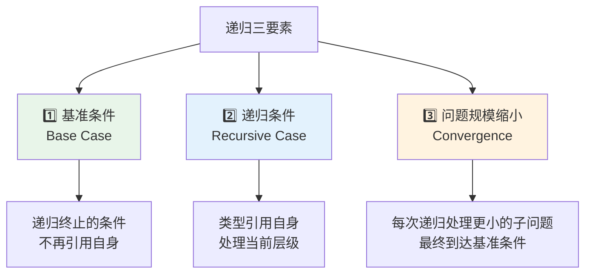
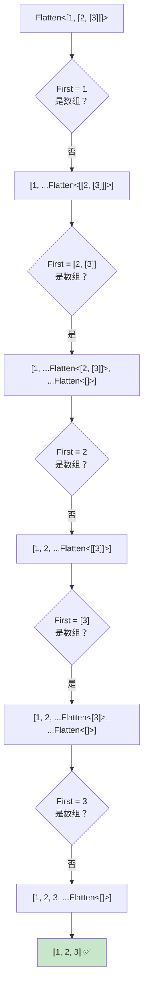
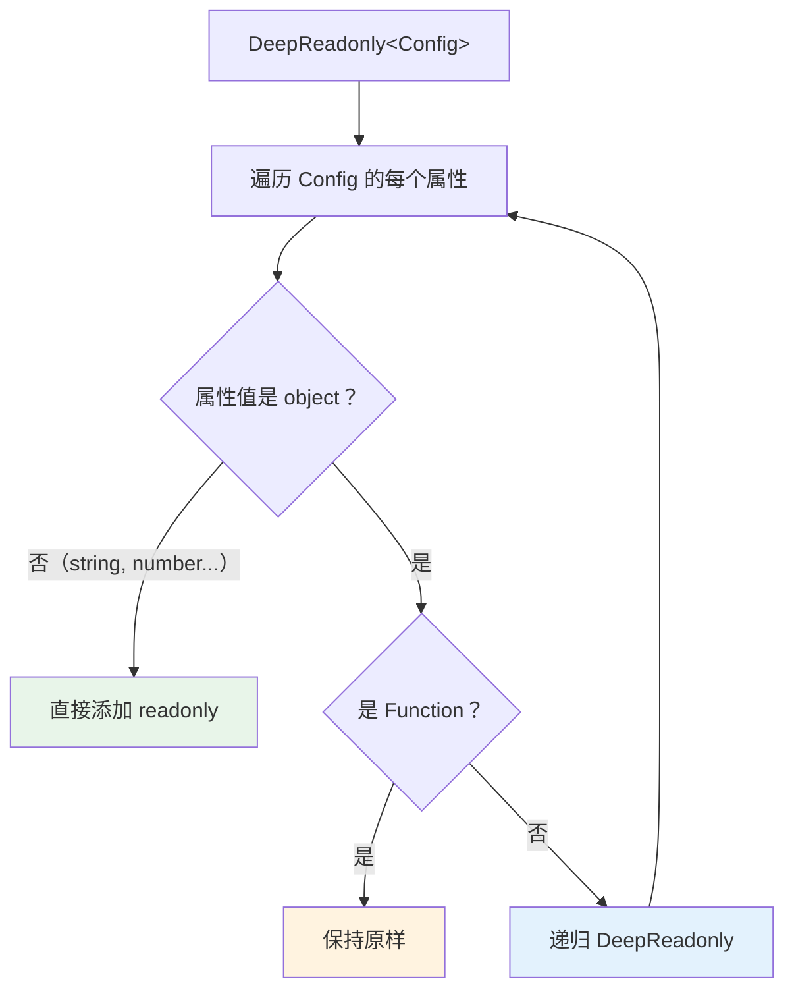
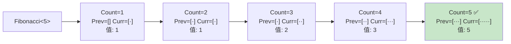
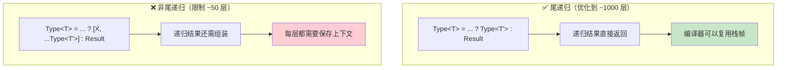
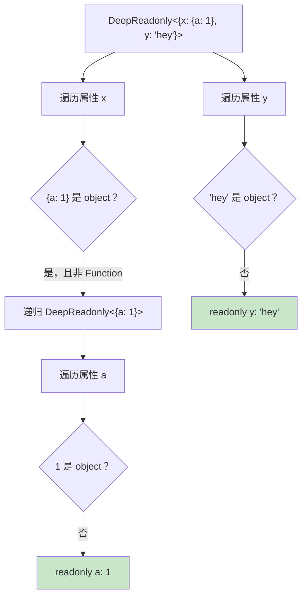

# 第八章：递归类型（Recursive Types）

> 🎯 **本章目标**：掌握 TypeScript 中递归类型的核心原理，学会用类型引用自身来处理任意深度的嵌套结构，理解递归基准条件与递归条件的设计方法，并能解决 Flatten、DeepReadonly、ReplaceAll 等经典挑战。

## 目录

- [8.1 什么是递归类型（What are Recursive Types）](#81-什么是递归类型what-are-recursive-types)
- [8.2 数组递归（Array Recursion）](#82-数组递归array-recursion)
- [8.3 字符串递归（String Recursion）](#83-字符串递归string-recursion)
- [8.4 对象递归（Object Recursion）](#84-对象递归object-recursion)
- [8.5 计数递归（Counting with Recursion）](#85-计数递归counting-with-recursion)
- [8.6 TypeScript 递归限制（Recursion Limits）](#86-typescript-递归限制recursion-limits)
- [8.7 实战挑战详解（Challenge Walkthroughs）](#87-实战挑战详解challenge-walkthroughs)
- [8.8 相关挑战（Related Challenges）](#88-相关挑战related-challenges)
- [本章小结](#本章小结)
- [导航](#导航)

---

## 8.1 什么是递归类型（What are Recursive Types）

### 从递归函数说起

在学习递归类型之前，让我们先回顾值层面的递归函数（Recursive Function）：

```typescript
// 值层面：递归函数
function flatten(arr: any[]): any[] {
  const result: any[] = [];
  for (const item of arr) {
    if (Array.isArray(item)) {
      result.push(...flatten(item)); // 调用自身
    } else {
      result.push(item);
    }
  }
  return result;
}

flatten([1, [2, [3, 4]], 5]); // [1, 2, 3, 4, 5]
```

递归函数的核心思想是：**函数在自身的定义中调用自身**。同样的思想可以迁移到类型层面。

### 递归类型：类型引用自身

**递归类型**（Recursive Type）就是在类型定义中引用自身的类型。它让我们能够处理任意深度的嵌套结构：

```typescript
// 类型层面：递归类型
type Flatten<T extends any[]> = T extends [infer First, ...infer Rest]
  ? First extends any[]
    ? [...Flatten<First>, ...Flatten<Rest>]  // 类型引用自身
    : [First, ...Flatten<Rest>]
  : []
```

📌 **类比对照**：

| 递归函数 | 递归类型 |
|---------|---------|
| 函数调用自身 `f(x)` | 类型引用自身 `Type<T>` |
| 参数传值 | 泛型参数传类型 |
| `return` 返回结果 | 条件类型的结果分支 |
| `if/else` 控制流 | `extends ? :` 条件类型 |
| 运行时执行 | 编译时求值 |

### 递归三要素

任何递归（无论是函数还是类型）都必须满足三个要素，否则会陷入无限递归：



用一个简单的例子来理解这三要素：

```typescript
// 将元组中所有元素转为字符串类型
type Stringify<T extends any[]> =
  T extends [infer First, ...infer Rest]   // 递归条件：元组非空
    ? [`${First & (string | number | boolean | bigint)}`, ...Stringify<Rest>]  // 处理当前 + 递归剩余
    : []                                    // 基准条件：空元组，终止递归

// 问题规模缩小：每次从 T 中取出一个元素，Rest 比 T 少一个元素

type T1 = Stringify<[1, 'hello', true]>  // ['1', 'hello', 'true']
type T2 = Stringify<[]>                   // []（直接命中基准条件）
```

### 递归类型的执行模型

递归类型在 **编译时** 由 TypeScript 编译器求值，而不是在运行时。可以把它想象成编译器在不断"展开"类型定义：

```typescript
// Stringify<[1, 'hello', true]> 的展开过程

// 第 1 步：First = 1, Rest = ['hello', true]
//   → ['1', ...Stringify<['hello', true]>]

// 第 2 步：First = 'hello', Rest = [true]
//   → ['1', 'hello', ...Stringify<[true]>]

// 第 3 步：First = true, Rest = []
//   → ['1', 'hello', 'true', ...Stringify<[]>]

// 第 4 步：命中基准条件 []
//   → ['1', 'hello', 'true']  ✅
```

---

## 8.2 数组递归（Array Recursion）

数组递归是最常见的递归类型模式。核心思路是**逐元素处理**：每次从数组中取出一个（或多个）元素进行处理，然后对剩余部分递归。

### 基本模式

```typescript
type ArrayRecursion<T extends any[]> =
  T extends [infer First, ...infer Rest]  // 解构：取出第一个元素
    ? /* 处理 First，然后递归 Rest */
    : /* 基准条件：空数组时的结果 */
```

### Flatten：展平嵌套数组

这是数组递归的经典案例——将任意层级的嵌套数组展平为一维数组：

```typescript
type Flatten<T extends any[]> = T extends [infer First, ...infer Rest]
  ? First extends any[]
    ? [...Flatten<First>, ...Flatten<Rest>]  // First 是数组 → 递归展平
    : [First, ...Flatten<Rest>]              // First 不是数组 → 保留，递归处理 Rest
  : []                                       // 基准条件：空数组

// 测试
type F1 = Flatten<[1, 2, 3]>                // [1, 2, 3]
type F2 = Flatten<[1, [2, 3], 4]>           // [1, 2, 3, 4]
type F3 = Flatten<[1, [2, [3, [4]]]]>       // [1, 2, 3, 4]
type F4 = Flatten<[]>                        // []
```



### Reverse：反转数组

```typescript
type Reverse<T extends any[]> = T extends [infer First, ...infer Rest]
  ? [...Reverse<Rest>, First]  // 把第一个元素放到最后
  : []

type R1 = Reverse<[1, 2, 3]>     // [3, 2, 1]
type R2 = Reverse<['a', 'b']>    // ['b', 'a']
type R3 = Reverse<[1]>           // [1]
```

### Includes：查找元素是否存在

```typescript
type IsEqual<A, B> =
  (<T>() => T extends A ? 1 : 2) extends (<T>() => T extends B ? 1 : 2)
    ? true
    : false

type Includes<T extends readonly any[], U> =
  T extends [infer First, ...infer Rest]
    ? IsEqual<First, U> extends true
      ? true                        // 找到了 → 返回 true
      : Includes<Rest, U>           // 没找到 → 继续在剩余元素中查找
    : false                         // 基准条件：遍历完毕，未找到

type I1 = Includes<[1, 2, 3], 2>       // true
type I2 = Includes<[1, 2, 3], 4>       // false
type I3 = Includes<[true, false], true> // true
```

### Last：获取数组最后一个元素

```typescript
type Last<T extends any[]> = T extends [...infer _Rest, infer L]
  ? L
  : never

// 也可以用递归方式实现
type LastRecursive<T extends any[]> = T extends [infer Only]
  ? Only                                    // 基准条件：只有一个元素
  : T extends [infer _First, ...infer Rest]
    ? LastRecursive<Rest>                    // 递归：跳过第一个
    : never

type L1 = Last<[1, 2, 3]>  // 3
type L2 = Last<['a']>      // 'a'
```

💡 **提示**：有些问题（如 `Last`）既可以用递归解决，也可以用模式匹配直接解决。选择更简洁的方式。

---

## 8.3 字符串递归（String Recursion）

TypeScript 的模板字面量类型（Template Literal Types）结合 `infer`，可以对字符串进行逐字符或逐段递归处理。

### 基本模式

```typescript
type StringRecursion<S extends string> =
  S extends `${infer First}${infer Rest}`  // 解构：取出第一个字符
    ? /* 处理 First，然后递归 Rest */
    : /* 基准条件：空字符串时的结果 */
```

### ReplaceAll：替换所有匹配

```typescript
type ReplaceAll<
  S extends string,
  From extends string,
  To extends string
> = From extends ''
  ? S                                          // 边界情况：From 为空字符串
  : S extends `${infer L}${From}${infer R}`
    ? `${L}${To}${ReplaceAll<R, From, To>}`    // 替换匹配部分，递归处理剩余
    : S                                        // 基准条件：无匹配，返回原字符串

type RA1 = ReplaceAll<'hello world', 'o', '0'>      // 'hell0 w0rld'
type RA2 = ReplaceAll<'foobarfoo', 'foo', 'baz'>    // 'bazbarbaz'
type RA3 = ReplaceAll<'abc', '', 'x'>                // 'abc'（边界保护）
```

📌 **注意**：`ReplaceAll` 只向右递归（处理 `R` 而不是整个替换后的字符串），这避免了无限递归的风险。例如将 `'a'` 替换为 `'aa'` 时，如果对整个结果递归，就会无限展开。

### TrimLeft：去除左侧空白

```typescript
type Whitespace = ' ' | '\n' | '\t'

type TrimLeft<S extends string> =
  S extends `${Whitespace}${infer Rest}`
    ? TrimLeft<Rest>     // 第一个字符是空白 → 去掉，继续
    : S                  // 基准条件：第一个字符不是空白

type TL1 = TrimLeft<'  hello'>     // 'hello'
type TL2 = TrimLeft<'\n\t hi'>     // 'hi'
type TL3 = TrimLeft<'world'>       // 'world'（无空白，直接返回）
```

### StringToUnion：字符串转联合类型

```typescript
type StringToUnion<S extends string> =
  S extends `${infer First}${infer Rest}`
    ? First | StringToUnion<Rest>   // 当前字符 | 递归剩余
    : never                         // 基准条件：空字符串 → never

type SU1 = StringToUnion<'hello'>  // 'h' | 'e' | 'l' | 'o'
type SU2 = StringToUnion<''>       // never
```

### LengthOfString：计算字符串长度

字符串没有 `length` 属性可直接使用，但可以通过递归将字符串转为元组，再取元组长度：

```typescript
type LengthOfString<
  S extends string,
  Acc extends any[] = []
> = S extends `${infer _First}${infer Rest}`
  ? LengthOfString<Rest, [...Acc, any]>  // 每处理一个字符，累加器增加一个元素
  : Acc['length']                         // 基准条件：返回累加器长度

type LS1 = LengthOfString<'hello'>  // 5
type LS2 = LengthOfString<''>       // 0
type LS3 = LengthOfString<'hi'>     // 2
```

💡 **提示**：这里用了**累加器模式**（Accumulator Pattern）——通过额外的泛型参数来累积中间结果。这是递归类型中非常重要的技巧，我们在 [8.5 计数递归](#85-计数递归counting-with-recursion) 中会深入讨论。

---

## 8.4 对象递归（Object Recursion）

对象递归用于深层遍历和转换嵌套对象结构。与数组递归不同，对象递归通常结合**映射类型**（Mapped Types）实现。

### 基本模式

```typescript
type ObjectRecursion<T> = {
  [K in keyof T]: T[K] extends object   // 判断属性值是否为对象
    ? ObjectRecursion<T[K]>              // 是 → 递归处理
    : /* 非对象的处理逻辑 */
}
```

### DeepReadonly：深层只读

将对象的所有属性（包括嵌套属性）设为 `readonly`：

```typescript
type DeepReadonly<T> = {
  readonly [K in keyof T]: T[K] extends object
    ? T[K] extends Function
      ? T[K]                   // 函数类型不递归（保持原样）
      : DeepReadonly<T[K]>     // 非函数对象 → 递归
    : T[K]                     // 基础类型 → 直接返回
}
```



```typescript
interface Config {
  host: string
  port: number
  db: {
    name: string
    connection: {
      timeout: number
      retries: number
    }
  }
  callback: () => void
}

type ReadonlyConfig = DeepReadonly<Config>
// 等价于：
// {
//   readonly host: string
//   readonly port: number
//   readonly db: {
//     readonly name: string
//     readonly connection: {
//       readonly timeout: number
//       readonly retries: number
//     }
//   }
//   readonly callback: () => void  ← 函数保持不变
// }
```

📌 **为什么函数需要特殊处理？** 因为 `Function` 也满足 `extends object`，但我们通常不需要对函数的属性加 `readonly`。如果不排除函数，TypeScript 会尝试递归函数的属性（如 `call`、`apply`），导致不符合预期的结果。

### DeepPartial：深层可选

```typescript
type DeepPartial<T> = {
  [K in keyof T]?: T[K] extends object
    ? T[K] extends Function
      ? T[K]
      : DeepPartial<T[K]>
    : T[K]
}

// 使用示例：深层配置合并
type PartialConfig = DeepPartial<Config>
// {
//   host?: string
//   port?: number
//   db?: {
//     name?: string
//     connection?: {
//       timeout?: number
//       retries?: number
//     }
//   }
//   callback?: () => void
// }
```

### DeepRequired：深层必填

```typescript
type DeepRequired<T> = {
  [K in keyof T]-?: T[K] extends object
    ? T[K] extends Function
      ? T[K]
      : DeepRequired<T[K]>
    : T[K]
}
```

### 对象递归的注意事项

⚠️ **处理数组属性**：在对象递归中，数组也满足 `extends object`，但通常不应该将数组当作对象递归处理：

```typescript
// ❌ 有问题的版本：数组会被错误处理
type DeepReadonlyBad<T> = {
  readonly [K in keyof T]: T[K] extends object
    ? DeepReadonlyBad<T[K]>
    : T[K]
}

// ✅ 改进版本：显式处理数组
type DeepReadonlyBetter<T> = T extends any[]
  ? readonly [...{ [K in keyof T]: DeepReadonlyBetter<T[K]> }]
  : T extends object
    ? T extends Function
      ? T
      : { readonly [K in keyof T]: DeepReadonlyBetter<T[K]> }
    : T
```

---

## 8.5 计数递归（Counting with Recursion）

TypeScript 的类型系统没有内置的数字运算能力。但我们可以利用**元组长度**来模拟数字，通过递归构造或消耗元组来实现加减等运算。

### 核心思想：用元组长度表示数字

```typescript
// 数字 3 → 长度为 3 的元组
type Three = [any, any, any]       // Three['length'] = 3

// 数字 0 → 空元组
type Zero = []                      // Zero['length'] = 0
```

### ConstructTuple：构造指定长度的元组

这是计数递归的基础工具——构造一个具有指定长度的元组：

```typescript
type ConstructTuple<
  L extends number,
  T extends any[] = []
> = T['length'] extends L
  ? T                                  // 基准条件：长度达标
  : ConstructTuple<L, [...T, any]>     // 递归：添加一个元素

type CT1 = ConstructTuple<3>   // [any, any, any]
type CT2 = ConstructTuple<0>   // []
type CT3 = ConstructTuple<5>   // [any, any, any, any, any]
```

### 加法

```typescript
type Add<A extends number, B extends number> =
  [...ConstructTuple<A>, ...ConstructTuple<B>]['length'] & number

type Sum1 = Add<3, 4>   // 7
type Sum2 = Add<0, 5>   // 5
type Sum3 = Add<10, 20> // 30
```

### 减法（MinusOne）

```typescript
type MinusOne<T extends number> =
  ConstructTuple<T> extends [infer _First, ...infer Rest]
    ? Rest['length'] & number
    : never

type M1 = MinusOne<5>   // 4
type M2 = MinusOne<1>   // 0
type M3 = MinusOne<10>  // 9
```

### 大小比较

```typescript
type GreaterThan<
  A extends number,
  B extends number,
  Count extends any[] = []
> = Count['length'] extends A
  ? false                                  // A 先到达 → A ≤ B
  : Count['length'] extends B
    ? true                                 // B 先到达 → A > B
    : GreaterThan<A, B, [...Count, any]>   // 都未到达 → 继续计数

type GT1 = GreaterThan<5, 3>   // true
type GT2 = GreaterThan<3, 5>   // false
type GT3 = GreaterThan<3, 3>   // false
```

### Fibonacci 数列

利用计数递归实现斐波那契数列的经典案例：

```typescript
type Fibonacci<
  T extends number,
  Prev extends any[] = [],           // 前一个数（初始 0）
  Curr extends any[] = [any],        // 当前数（初始 1）
  Count extends any[] = [any]        // 计数器（从 1 开始）
> = Count['length'] extends T
  ? Curr['length'] & number                                    // 基准条件
  : Fibonacci<T, Curr, [...Prev, ...Curr], [...Count, any]>   // 递归：滚动前进

type Fib1 = Fibonacci<1>   // 1
type Fib2 = Fibonacci<3>   // 2
type Fib3 = Fibonacci<8>   // 21
```



---

## 8.6 TypeScript 递归限制（Recursion Limits）

### 递归深度限制

TypeScript 编译器对类型递归的深度有限制，大约在 **50 层**（准确数字取决于 TypeScript 版本和具体场景）。超过限制会触发错误：

```typescript
// ❌ 超出递归限制
type DeepArray<N extends number, T extends any[] = []> =
  T['length'] extends N ? T : DeepArray<N, [...T, any]>

type Big = DeepArray<1000>  // ❌ Type instantiation is excessively deep and possibly infinite
```

### 尾递归优化（Tail Recursion Optimization）

从 **TypeScript 4.5** 开始，编译器对**尾递归**（Tail Recursion）的条件类型进行了优化，将递归深度限制提升到约 **1000 层**。

💡 **什么是尾递归？** 如果条件类型的递归调用是整个表达式的"最后一步"——即递归结果直接作为最终结果返回，不需要额外的类型操作——那么就是尾递归。

```typescript
// ✅ 尾递归：递归调用是最后一步
type IsEven<N extends number, Acc extends any[] = []> =
  Acc['length'] extends N
    ? true
    : [...Acc, any]['length'] extends N
      ? false
      : IsEven<N, [...Acc, any, any]>  // 直接返回递归结果

// ❌ 非尾递归：递归结果还需要进一步处理
type Reverse<T extends any[]> = T extends [infer First, ...infer Rest]
  ? [...Reverse<Rest>, First]  // 递归结果还要拼接 First
  : []
```



### 将非尾递归改为尾递归

许多递归可以通过引入**累加器参数**（Accumulator）转换为尾递归：

```typescript
// ❌ 非尾递归版 Reverse（~50 层限制）
type ReverseNaive<T extends any[]> = T extends [infer First, ...infer Rest]
  ? [...ReverseNaive<Rest>, First]
  : []

// ✅ 尾递归版 Reverse（~1000 层限制）
type ReverseTail<T extends any[], Acc extends any[] = []> =
  T extends [infer First, ...infer Rest]
    ? ReverseTail<Rest, [First, ...Acc]>  // 结果累积在 Acc 中
    : Acc                                  // 直接返回累加器
```

### 分段递归技巧

对于某些场景，可以通过分段处理来规避递归限制：

```typescript
// 一次处理 10 个元素，减少递归深度
type ChunkedProcess<T extends any[], Acc extends any[] = []> =
  T extends [
    infer A1, infer A2, infer A3, infer A4, infer A5,
    infer A6, infer A7, infer A8, infer A9, infer A10,
    ...infer Rest
  ]
    ? ChunkedProcess<Rest, [...Acc, A1, A2, A3, A4, A5, A6, A7, A8, A9, A10]>
    : [...Acc, ...T]  // 处理剩余不足 10 个的部分
```

📌 **实践建议**：

| 场景 | 推荐做法 |
|------|---------|
| 递归深度 ≤ 50 | 普通递归即可 |
| 50 < 深度 ≤ 1000 | 使用尾递归优化 |
| 深度 > 1000 | 分段递归或重新设计方案 |

---

## 8.7 实战挑战详解（Challenge Walkthroughs）

### 挑战 1：Flatten（#459）⭐⭐

> 📋 **题目**：实现类型 `Flatten`，将嵌套数组类型展平为一维数组类型。

#### 题目分析

```typescript
type flatten = Flatten<[1, 2, [3, 4], [[[5]]]]> // [1, 2, 3, 4, 5]
```

#### 解题思路

1. 逐元素检查数组
2. 如果当前元素是数组，递归展平
3. 如果不是数组，保留原值
4. 空数组作为基准条件

#### 解法

```typescript
type Flatten<T extends any[]> = T extends [infer First, ...infer Rest]
  ? First extends any[]
    ? [...Flatten<First>, ...Flatten<Rest>]
    : [First, ...Flatten<Rest>]
  : []
```

#### 逐步推导

```typescript
// Flatten<[1, [2, [3]]]>

// 第 1 步：First = 1, Rest = [[2, [3]]]
//   1 不是数组 → [1, ...Flatten<[[2, [3]]]>]

// 第 2 步：First = [2, [3]], Rest = []
//   [2, [3]] 是数组 → [1, ...Flatten<[2, [3]]>, ...Flatten<[]>]
//                    → [1, ...Flatten<[2, [3]]>]

// 第 3 步：First = 2, Rest = [[3]]
//   2 不是数组 → [1, 2, ...Flatten<[[3]]>]

// 第 4 步：First = [3], Rest = []
//   [3] 是数组 → [1, 2, ...Flatten<[3]>, ...Flatten<[]>]
//              → [1, 2, ...Flatten<[3]>]

// 第 5 步：First = 3, Rest = []
//   3 不是数组 → [1, 2, 3, ...Flatten<[]>]

// 第 6 步：命中基准条件 → [1, 2, 3] ✅
```

#### 验证

```typescript
type case1 = Flatten<[]>                          // []
type case2 = Flatten<[1, 2, 3, 4]>                // [1, 2, 3, 4]
type case3 = Flatten<[1, [2]]>                    // [1, 2]
type case4 = Flatten<[1, 2, [3, 4], [[[5]]]]>     // [1, 2, 3, 4, 5]
type case5 = Flatten<[{ foo: 'bar'; 2: 10 }, 'foobar']>  // [{ foo: 'bar'; 2: 10 }, 'foobar']
```

---

### 挑战 2：Deep Readonly（#9）⭐⭐

> 📋 **题目**：实现 `DeepReadonly<T>`，将对象的所有属性及其子属性递归地设为只读。

#### 题目分析

```typescript
type X = {
  x: {
    a: 1
    b: 'hi'
  }
  y: 'hey'
}

type Expected = {
  readonly x: {
    readonly a: 1
    readonly b: 'hi'
  }
  readonly y: 'hey'
}

type Todo = DeepReadonly<X> // Expected
```

#### 解题思路

1. 使用映射类型遍历所有属性
2. 给每个属性添加 `readonly`
3. 如果属性值是对象（且不是 `Function`），递归处理
4. 基础类型直接返回

#### 多种解法对比

```typescript
// 解法 1：基础版（适合大多数场景）
type DeepReadonly1<T> = {
  readonly [K in keyof T]: T[K] extends object
    ? T[K] extends Function
      ? T[K]
      : DeepReadonly1<T[K]>
    : T[K]
}

// 解法 2：使用 keyof 判断是否有属性
type DeepReadonly2<T> = keyof T extends never
  ? T                                       // 没有属性（基础类型）→ 直接返回
  : { readonly [K in keyof T]: DeepReadonly2<T[K]> }

// 解法 3：更精确的对象判断
type DeepReadonly3<T> = T extends Record<string, unknown>
  ? { readonly [K in keyof T]: DeepReadonly3<T[K]> }
  : T
```



#### 验证

```typescript
type obj = {
  a: () => 22
  b: string
  c: {
    d: boolean
    e: {
      g: {
        h: {
          i: true
          j: 'string'
        }
        k: 'hello'
      }
      l: [1, 2, 3]
    }
  }
}

type Result = DeepReadonly<obj>
// 所有层级的属性都变为 readonly ✅
// 函数 a: () => 22 保持不变 ✅
```

---

### 挑战 3：Includes（#898）⭐⭐

> 📋 **题目**：实现 JavaScript 的 `Array.includes` 的类型版本。

#### 题目分析

需要精确判断类型相等，而不仅仅是 `extends` 关系：

```typescript
// 注意：这些情况需要正确处理
type T1 = Includes<[boolean, 2, 3, 5, 6, 7], false>  // false（boolean ≠ false）
type T2 = Includes<[true, 2, 3, 5, 6, 7], boolean>   // false（true ≠ boolean）
type T3 = Includes<[{ a: 'A' }], { readonly a: 'A' }> // false（有 readonly 差异）
```

#### 解题思路

1. 需要一个精确的类型相等判断 `IsEqual`
2. 逐元素递归比较
3. 找到即返回 `true`，遍历完毕返回 `false`

#### 完整答案

```typescript
type IsEqual<A, B> =
  (<T>() => T extends A ? 1 : 2) extends (<T>() => T extends B ? 1 : 2)
    ? true
    : false

type Includes<T extends readonly any[], U> =
  T extends [infer First, ...infer Rest]
    ? IsEqual<First, U> extends true
      ? true
      : Includes<Rest, U>
    : false
```

#### 验证

```typescript
type case1 = Includes<['Kars', 'Esidisi', 'Wamuu', 'Santana'], 'Kars'>    // true
type case2 = Includes<['Kars', 'Esidisi', 'Wamuu', 'Santana'], 'Dio'>     // false
type case3 = Includes<[1, 2, 3, 5, 6, 7], 7>                              // true
type case4 = Includes<[false, 2, 3, 5, 6, 7], false>                      // true
type case5 = Includes<[{ a: 'A' }], { readonly a: 'A' }>                  // false ✅
```

---

### 挑战 4：ReplaceAll（#119）⭐⭐

> 📋 **题目**：实现 `ReplaceAll<S, From, To>`，将字符串 `S` 中所有 `From` 子串替换为 `To`。

#### 题目分析

```typescript
type replaced = ReplaceAll<'t y p e s', ' ', ''> // 'types'
```

#### 解题思路

1. 用模板字面量匹配 `From` 的位置
2. 替换后，只对**右侧剩余部分** `R` 递归（避免对替换结果重复处理）
3. 边界情况：`From` 为空字符串时直接返回 `S`

#### 完整答案

```typescript
type ReplaceAll<
  S extends string,
  From extends string,
  To extends string
> = From extends ''
  ? S
  : S extends `${infer L}${From}${infer R}`
    ? `${L}${To}${ReplaceAll<R, From, To>}`
    : S
```

#### 逐步推导

```typescript
// ReplaceAll<'a-b-c', '-', '+'>

// 第 1 步：匹配 'a-b-c' → L='a', From='-', R='b-c'
//   → 'a' + '+' + ReplaceAll<'b-c', '-', '+'>

// 第 2 步：匹配 'b-c' → L='b', From='-', R='c'
//   → 'a+b' + '+' + ReplaceAll<'c', '-', '+'>

// 第 3 步：'c' 中无 '-'，返回 'c'
//   → 'a+b+c' ✅
```

#### 验证

```typescript
type case1 = ReplaceAll<'foobar', 'bar', 'foo'>         // 'foofoo'
type case2 = ReplaceAll<'foobarbar', 'bar', 'foo'>      // 'foofoofoo'
type case3 = ReplaceAll<'t y p e s', ' ', ''>            // 'types'
type case4 = ReplaceAll<'foobarbar', '', 'foo'>          // 'foobarbar'
type case5 = ReplaceAll<'barfoo', 'bar', 'foo'>          // 'foofoo'
type case6 = ReplaceAll<'foobarfoobar', 'ob', 'b'>       // 'fobarfobar'
```

---

## 8.8 相关挑战（Related Challenges）

以下挑战都涉及递归类型的运用，按难度排序：

| 挑战 | 难度 | 关键知识点 |
|------|------|------------|
| [Includes](../questions/00898-easy-includes) (#898) | 🟢 easy | 数组递归 + 类型精确比较 |
| [Deep Readonly](../questions/00009-medium-deep-readonly) (#9) | 🟡 medium | 对象递归 + 映射类型 |
| [ReplaceAll](../questions/00119-medium-replaceall) (#119) | 🟡 medium | 字符串递归 + 模板字面量 |
| [Flatten](../questions/00459-medium-flatten) (#459) | 🟡 medium | 数组递归 + 嵌套类型展开 |
| [Absolute](../questions/00529-medium-absolute) (#529) | 🟡 medium | 字符串递归 + 数字处理 |
| [Reverse](../questions/03192-medium-reverse) (#3192) | 🟡 medium | 数组递归 + 元组操作 |
| [FlattenDepth](../questions/03243-medium-flatten-depth) (#3243) | 🟡 medium | 数组递归 + 计数控制深度 |
| [MinusOne](../questions/02257-medium-minus-one) (#2257) | 🟡 medium | 计数递归 + 元组长度 |
| [Fibonacci Sequence](../questions/04182-medium-fibonacci-sequence) (#4182) | 🟡 medium | 计数递归 + 滚动累加 |

---

## 本章小结

| 概念 | 说明 |
|------|------|
| **递归三要素** | 基准条件（Base Case）、递归条件（Recursive Case）、问题规模缩小（Convergence） |
| **数组递归** | `[infer First, ...infer Rest]` 逐元素解构，递归处理 `Rest` |
| **字符串递归** | `` `${infer First}${infer Rest}` `` 或模板匹配，逐字符/逐段处理 |
| **对象递归** | 映射类型 + `extends object` 判断，深层遍历嵌套结构 |
| **计数递归** | 用元组长度模拟数字，`ConstructTuple` 构造指定长度元组 |
| **累加器模式** | 通过额外泛型参数累积中间结果，常用于尾递归转换 |
| **尾递归优化** | TypeScript 4.5+ 对尾递归条件类型的优化，深度限制提升至约 1000 层 |
| **递归深度限制** | 普通递归约 50 层，尾递归约 1000 层；超过限制需使用分段递归 |

---

## 导航

[← 上一章：infer 关键字详解](./07-infer.md) | [下一章：内置工具类型实现 →](./09-utility-types.md) | [← 返回目录](./README.md)
