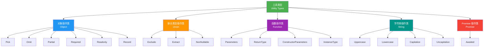

# 第九章：内置工具类型实现（Utility Types）

> 🎯 **本章目标**：深入理解 TypeScript 内置工具类型的实现原理，学会从零手写 Pick、Omit、Partial、Exclude、ReturnType、Awaited 等常用工具类型，并掌握 type-challenges 中常见的自定义工具类型（如 DeepReadonly、Merge、PickByType 等）的实现思路。

## 目录

- [9.1 工具类型概览（Utility Types Overview）](#91-工具类型概览utility-types-overview)
- [9.2 对象操作类工具类型（Object Utility Types）](#92-对象操作类工具类型object-utility-types)
- [9.3 联合类型操作工具类型（Union Utility Types）](#93-联合类型操作工具类型union-utility-types)
- [9.4 函数操作工具类型（Function Utility Types）](#94-函数操作工具类型function-utility-types)
- [9.5 字符串操作工具类型（String Utility Types）](#95-字符串操作工具类型string-utility-types)
- [9.6 Promise 操作工具类型（Promise Utility Types）](#96-promise-操作工具类型promise-utility-types)
- [9.7 type-challenges 中的自定义工具类型（Custom Utility Types）](#97-type-challenges-中的自定义工具类型custom-utility-types)
- [9.8 工具类型总览表（Quick Reference）](#98-工具类型总览表quick-reference)
- [9.9 相关挑战（Related Challenges）](#99-相关挑战related-challenges)
- [本章小结](#本章小结)
- [导航](#导航)

---

## 9.1 工具类型概览（Utility Types Overview）

### 为什么要手写工具类型？

TypeScript 内置了许多工具类型（Utility Types），如 `Pick`、`Omit`、`Partial` 等。你可能会问：既然已经内置了，为什么还要自己实现一遍？

- **理解原理**：手写实现能帮助你真正理解这些工具类型背后的机制
- **举一反三**：掌握了实现原理，你就能编写自己的自定义工具类型
- **解题基础**：type-challenges 中大量题目是这些工具类型的变体或组合

### 知识前提

本章内容建立在前面章节的基础之上：

| 前置知识 | 对应章节 |
|---------|---------|
| 泛型（Generics） | 第 3 章 |
| 条件类型（Conditional Types） | 第 4 章 |
| 映射类型（Mapped Types） | 第 5 章 |
| 模板字面量类型（Template Literal Types） | 第 6 章 |
| infer 关键字 | 第 7 章 |
| 递归类型（Recursive Types） | 第 8 章 |

### 工具类型分类



---

## 9.2 对象操作类工具类型（Object Utility Types）

对象操作类工具类型通过映射类型（Mapped Types）和 `keyof` 对对象类型的属性进行选取、过滤和修饰。

### 9.2.1 `Pick<T, K>` —— 选取属性

#### 实现

```typescript
type MyPick<T, K extends keyof T> = {
  [P in K]: T[P]
};
```

#### 原理解析

1. `K extends keyof T`：约束 `K` 必须是 `T` 的键的子集，防止选取不存在的属性
2. `[P in K]`：遍历 `K` 中的每个键
3. `T[P]`：通过索引访问类型获取对应的值类型

> 💡 这是 type-challenges 的第一道题（#4），也是映射类型最经典的应用。

#### 使用示例

```typescript
interface User {
  name: string;
  age: number;
  email: string;
  address: string;
}

// 只选取 name 和 email
type UserBasic = MyPick<User, 'name' | 'email'>;
// { name: string; email: string }

// ❌ 编译错误：'phone' 不存在于 User 中
type Invalid = MyPick<User, 'phone'>;
```

---

### 9.2.2 `Omit<T, K>` —— 排除属性

#### 实现

```typescript
type MyOmit<T, K extends keyof any> = Pick<T, Exclude<keyof T, K>>;
```

也可以不依赖内置类型，完全从零实现：

```typescript
type MyOmit<T, K extends keyof any> = {
  [P in keyof T as P extends K ? never : P]: T[P]
};
```

#### 原理解析

**方式一（组合法）**：
1. `Exclude<keyof T, K>`：从 `T` 的所有键中排除 `K` 中的键
2. `Pick<T, ...>`：用 `Pick` 选取剩余的键

**方式二（键重映射法）**：
1. `[P in keyof T as ...]`：使用 `as` 子句进行键重映射（Key Remapping）
2. `P extends K ? never : P`：如果当前键 `P` 在 `K` 中，则映射为 `never`（即移除该键）

> 💡 键重映射（`as` 子句）是 TypeScript 4.1 引入的特性，当映射结果为 `never` 时该键会被过滤。

#### 使用示例

```typescript
interface User {
  name: string;
  age: number;
  email: string;
  password: string;
}

// 排除敏感字段
type SafeUser = MyOmit<User, 'password'>;
// { name: string; age: number; email: string }

type PublicUser = MyOmit<User, 'password' | 'email'>;
// { name: string; age: number }
```

---

### 9.2.3 `Partial<T>` —— 所有属性可选

#### 实现

```typescript
type MyPartial<T> = {
  [P in keyof T]?: T[P]
};
```

#### 原理解析

1. `[P in keyof T]`：遍历 `T` 的所有键
2. `?`：在键后面加上 `?` 修饰符，使每个属性变为可选
3. `T[P]`：属性值类型保持不变

#### 使用示例

```typescript
interface Config {
  host: string;
  port: number;
  debug: boolean;
}

// 所有属性变为可选，适合用作函数参数的部分更新
type PartialConfig = MyPartial<Config>;
// { host?: string; port?: number; debug?: boolean }

function updateConfig(config: Config, update: MyPartial<Config>): Config {
  return { ...config, ...update };
}

updateConfig(
  { host: 'localhost', port: 3000, debug: false },
  { debug: true } // ✅ 只传部分字段
);
```

---

### 9.2.4 `Required<T>` —— 所有属性必选

#### 实现

```typescript
type MyRequired<T> = {
  [P in keyof T]-?: T[P]
};
```

#### 原理解析

1. `[P in keyof T]`：遍历 `T` 的所有键
2. `-?`：使用减号移除 `?` 修饰符，将可选属性变为必选
3. 与 `Partial` 刚好相反：`?` 添加可选，`-?` 移除可选

> 💡 映射修饰符中，`+` 表示添加、`-` 表示移除。`+?` 等价于 `?`，`+readonly` 等价于 `readonly`。

#### 使用示例

```typescript
interface PartialUser {
  name?: string;
  age?: number;
  email?: string;
}

// 所有可选属性变为必选
type FullUser = MyRequired<PartialUser>;
// { name: string; age: number; email: string }

// ❌ 编译错误：缺少 age 和 email
const user: FullUser = { name: 'Alice' };
```

---

### 9.2.5 `Readonly<T>` —— 所有属性只读

#### 实现

```typescript
type MyReadonly<T> = {
  readonly [P in keyof T]: T[P]
};
```

#### 原理解析

1. `[P in keyof T]`：遍历 `T` 的所有键
2. `readonly`：在属性前加上 `readonly` 修饰符
3. 被标记为 `readonly` 的属性在赋值后不能再次修改

#### 使用示例

```typescript
interface Todo {
  title: string;
  completed: boolean;
}

const todo: MyReadonly<Todo> = {
  title: 'Learn TypeScript',
  completed: false,
};

// ❌ 编译错误：无法分配到 "title" ，因为它是只读属性
todo.title = 'New Title';
```

---

### 9.2.6 `Record<K, V>` —— 构造键值对象

#### 实现

```typescript
type MyRecord<K extends keyof any, V> = {
  [P in K]: V
};
```

#### 原理解析

1. `K extends keyof any`：约束 `K` 为合法的键类型（`string | number | symbol`）
2. `[P in K]`：遍历 `K` 中的每个键
3. `V`：所有属性的值类型统一为 `V`

> 💡 `keyof any` 的结果是 `string | number | symbol`，即 JavaScript 中所有合法的属性键类型。也可以写成 `K extends PropertyKey`，`PropertyKey` 是 TypeScript 内置的类型别名。

#### 使用示例

```typescript
// 用字面量联合类型作为键
type Roles = 'admin' | 'user' | 'guest';

type RolePermissions = MyRecord<Roles, boolean>;
// { admin: boolean; user: boolean; guest: boolean }

// 用 string 作为键，构造字典类型
type StringMap = MyRecord<string, unknown>;
// { [x: string]: unknown }

// 实际使用
const permissions: RolePermissions = {
  admin: true,
  user: true,
  guest: false,
};
```

---

## 9.3 联合类型操作工具类型（Union Utility Types）

联合类型操作工具类型利用分布式条件类型（Distributive Conditional Types）对联合类型的每个成员进行过滤和变换。

### 9.3.1 `Exclude<T, U>` —— 从联合类型中排除

#### 实现

```typescript
type MyExclude<T, U> = T extends U ? never : T;
```

#### 原理解析

1. 当 `T` 是联合类型时，条件类型会自动分布（Distribute）到联合类型的每个成员
2. 对于每个成员，如果它可以赋值给 `U`，就返回 `never`（即排除）
3. 否则保留原类型
4. 最终所有 `never` 会从联合类型中消失

分布过程示例：

```typescript
type Result = MyExclude<'a' | 'b' | 'c', 'a' | 'c'>;

// 分布展开：
// = ('a' extends 'a' | 'c' ? never : 'a')   → never
// | ('b' extends 'a' | 'c' ? never : 'b')   → 'b'
// | ('c' extends 'a' | 'c' ? never : 'c')   → never
// = never | 'b' | never
// = 'b'
```

#### 使用示例

```typescript
type AllEvents = 'click' | 'scroll' | 'mousemove' | 'keydown';

// 排除鼠标相关事件
type KeyboardEvents = MyExclude<AllEvents, 'click' | 'scroll' | 'mousemove'>;
// 'keydown'

// 排除特定类型
type StringOrNumber = MyExclude<string | number | boolean, boolean>;
// string | number
```

---

### 9.3.2 `Extract<T, U>` —— 从联合类型中提取

#### 实现

```typescript
type MyExtract<T, U> = T extends U ? T : never;
```

#### 原理解析

1. 与 `Exclude` 逻辑完全相反
2. 当联合类型的某个成员可以赋值给 `U` 时，保留它
3. 否则返回 `never`（即排除）

> 💡 `Exclude` 和 `Extract` 是一对互补操作：`Exclude` 排除匹配项，`Extract` 保留匹配项。

#### 使用示例

```typescript
type AllTypes = string | number | boolean | null | undefined;

// 提取可以赋值给 string | number 的类型
type Primitives = MyExtract<AllTypes, string | number>;
// string | number

// 提取函数类型
type Mixed = string | (() => void) | number | (() => string);
type Functions = MyExtract<Mixed, Function>;
// (() => void) | (() => string)
```

---

### 9.3.3 `NonNullable<T>` —— 排除 null 和 undefined

#### 实现

```typescript
type MyNonNullable<T> = T extends null | undefined ? never : T;
```

#### 原理解析

1. 本质上是 `Exclude<T, null | undefined>` 的特化版本
2. 利用分布式条件类型，将联合类型中的 `null` 和 `undefined` 排除

#### 使用示例

```typescript
type MaybeString = string | null | undefined;

type DefinitelyString = MyNonNullable<MaybeString>;
// string

type Mixed = string | number | null | undefined | boolean;
type Clean = MyNonNullable<Mixed>;
// string | number | boolean
```

---

## 9.4 函数操作工具类型（Function Utility Types）

函数操作工具类型通过 `infer` 关键字在条件类型中推断函数签名的各个部分。

### 9.4.1 `Parameters<T>` —— 获取函数参数类型元组

#### 实现

```typescript
type MyParameters<T extends (...args: any) => any> =
  T extends (...args: infer P) => any ? P : never;
```

#### 原理解析

1. `T extends (...args: any) => any`：约束 `T` 必须是函数类型
2. `(...args: infer P) => any`：用 `infer P` 推断参数列表的类型
3. 推断出的 `P` 是一个元组类型（Tuple Type），包含所有参数的类型

#### 使用示例

```typescript
function greet(name: string, age: number): string {
  return `Hello, ${name}! You are ${age} years old.`;
}

type GreetParams = MyParameters<typeof greet>;
// [name: string, age: number]

// 提取单个参数类型
type FirstParam = GreetParams[0]; // string
type SecondParam = GreetParams[1]; // number

// 无参函数
type NoParams = MyParameters<() => void>; // []
```

---

### 9.4.2 `ReturnType<T>` —— 获取函数返回值类型

#### 实现

```typescript
type MyReturnType<T extends (...args: any) => any> =
  T extends (...args: any) => infer R ? R : never;
```

#### 原理解析

1. `T extends (...args: any) => any`：约束 `T` 必须是函数类型
2. `(...args: any) => infer R`：用 `infer R` 推断返回值的类型
3. 与 `Parameters` 结构类似，只是 `infer` 的位置不同

#### 使用示例

```typescript
function fetchUser() {
  return { name: 'Alice', age: 30 };
}

type User = MyReturnType<typeof fetchUser>;
// { name: string; age: number }

// 异步函数返回 Promise
async function fetchData() {
  return { data: [1, 2, 3] };
}

type FetchResult = MyReturnType<typeof fetchData>;
// Promise<{ data: number[] }>
```

---

### 9.4.3 `ConstructorParameters<T>` —— 获取构造函数参数类型

#### 实现

```typescript
type MyConstructorParameters<T extends abstract new (...args: any) => any> =
  T extends abstract new (...args: infer P) => any ? P : never;
```

#### 原理解析

1. `abstract new (...args: any) => any`：匹配构造函数签名（包括抽象类）
2. `new` 关键字表示这是一个构造函数类型（而非普通函数）
3. `abstract` 使其同时兼容抽象类和普通类
4. `infer P` 推断构造函数的参数元组

#### 使用示例

```typescript
class User {
  constructor(public name: string, public age: number) {}
}

type UserConstructorParams = MyConstructorParameters<typeof User>;
// [name: string, age: number]

// 内置类型
type DateParams = MyConstructorParameters<DateConstructor>;
// [value: string | number | Date]

type ErrorParams = MyConstructorParameters<ErrorConstructor>;
// [message?: string]
```

---

### 9.4.4 `InstanceType<T>` —— 获取实例类型

#### 实现

```typescript
type MyInstanceType<T extends abstract new (...args: any) => any> =
  T extends abstract new (...args: any) => infer R ? R : never;
```

#### 原理解析

1. 与 `ConstructorParameters` 的约束相同，匹配构造函数签名
2. `infer R` 的位置在返回值处，推断构造函数创建的实例类型
3. 对于 `typeof MyClass`，`InstanceType` 返回的就是 `MyClass`

> 💡 `ConstructorParameters` 和 `InstanceType` 的关系，就像 `Parameters` 和 `ReturnType` 的关系——前者推断参数，后者推断返回值。

#### 使用示例

```typescript
class User {
  name: string;
  age: number;
  constructor(name: string, age: number) {
    this.name = name;
    this.age = age;
  }
}

type UserInstance = MyInstanceType<typeof User>;
// User

// 工厂函数模式
function createInstance<T extends new (...args: any) => any>(
  Constructor: T,
  ...args: ConstructorParameters<T>
): InstanceType<T> {
  return new Constructor(...args);
}

const user = createInstance(User, 'Alice', 30); // 类型为 User
```

---

## 9.5 字符串操作工具类型（String Utility Types）

TypeScript 4.1 引入了四个内置的字符串操作工具类型。它们属于**编译器内部实现**（Intrinsic），无法用纯类型代码实现，但我们可以理解它们的行为和用途。

### 9.5.1 `Uppercase<S>` —— 大写

#### 实现（编译器内部）

```typescript
// 编译器内部实现，无法用用户代码实现
type Uppercase<S extends string> = intrinsic;
```

#### 行为说明

将字符串字面量类型中的所有字母转换为大写形式。

#### 使用示例

```typescript
type Greeting = 'hello world';

type Shouting = Uppercase<Greeting>;
// 'HELLO WORLD'

type HttpMethod = Uppercase<'get' | 'post' | 'put' | 'delete'>;
// 'GET' | 'POST' | 'PUT' | 'DELETE'
```

---

### 9.5.2 `Lowercase<S>` —— 小写

#### 实现（编译器内部）

```typescript
type Lowercase<S extends string> = intrinsic;
```

#### 行为说明

将字符串字面量类型中的所有字母转换为小写形式。

#### 使用示例

```typescript
type Method = 'GET' | 'POST';

type LowerMethod = Lowercase<Method>;
// 'get' | 'post'
```

---

### 9.5.3 `Capitalize<S>` —— 首字母大写

#### 实现（编译器内部）

```typescript
type Capitalize<S extends string> = intrinsic;
```

虽然编译器内部实现，但我们可以用模板字面量类型**模拟**这个行为：

```typescript
type MyCapitalize<S extends string> =
  S extends `${infer First}${infer Rest}`
    ? `${Uppercase<First>}${Rest}`
    : S;
```

#### 原理解析（模拟版）

1. `${infer First}${infer Rest}`：将字符串拆分为第一个字符和剩余部分
2. `Uppercase<First>`：将第一个字符转为大写
3. 拼接大写首字母和剩余部分

#### 使用示例

```typescript
type Hello = Capitalize<'hello'>;
// 'Hello'

type Events = Capitalize<'click' | 'scroll' | 'focus'>;
// 'Click' | 'Scroll' | 'Focus'

// 常见应用：生成事件处理器类型名称
type EventHandler<E extends string> = `on${Capitalize<E>}`;
type ClickHandler = EventHandler<'click'>; // 'onClick'
```

---

### 9.5.4 `Uncapitalize<S>` —— 首字母小写

#### 实现（编译器内部）

```typescript
type Uncapitalize<S extends string> = intrinsic;
```

同样可以模拟：

```typescript
type MyUncapitalize<S extends string> =
  S extends `${infer First}${infer Rest}`
    ? `${Lowercase<First>}${Rest}`
    : S;
```

#### 使用示例

```typescript
type PascalCase = 'UserProfile';

type CamelCase = Uncapitalize<PascalCase>;
// 'userProfile'

type Components = 'Button' | 'Input' | 'Modal';
type Props = Uncapitalize<Components>;
// 'button' | 'input' | 'modal'
```

---

## 9.6 Promise 操作工具类型（Promise Utility Types）

### 9.6.1 `Awaited<T>` —— 递归解包 Promise

#### 实现

```typescript
type MyAwaited<T> =
  T extends null | undefined
    ? T
    : T extends object & { then(onfulfilled: infer F, ...args: infer _): any }
      ? F extends (value: infer V, ...args: infer _) => any
        ? MyAwaited<V>
        : never
      : T;
```

更简洁的版本（覆盖大部分场景）：

```typescript
type MyAwaitedSimple<T> =
  T extends Promise<infer U>
    ? MyAwaitedSimple<U>
    : T;
```

#### 原理解析

**简洁版本**：
1. 如果 `T` 是 `Promise<U>`，则递归解包 `U`
2. 如果 `T` 不是 `Promise`，直接返回 `T`
3. 递归处理嵌套 Promise：`Promise<Promise<string>>` → `Promise<string>` → `string`

**完整版本**（TypeScript 官方实现）：
1. 先处理 `null | undefined` 的特殊情况
2. 检查是否有 `then` 方法（兼容 PromiseLike / thenable 对象）
3. 从 `then` 的第一个回调参数中推断值类型
4. 递归解包直到不再是 thenable

#### 使用示例

```typescript
type A = MyAwaitedSimple<Promise<string>>;
// string

type B = MyAwaitedSimple<Promise<Promise<number>>>;
// number（递归解包）

type C = MyAwaitedSimple<Promise<Promise<Promise<boolean>>>>;
// boolean（多层递归）

type D = MyAwaitedSimple<string>;
// string（非 Promise 直接返回）

// 实际应用：获取异步函数的最终返回值类型
async function fetchUser() {
  return { name: 'Alice', age: 30 };
}

type User = MyAwaitedSimple<ReturnType<typeof fetchUser>>;
// { name: string; age: number }
```

---

## 9.7 type-challenges 中的自定义工具类型（Custom Utility Types）

以下工具类型虽不是 TypeScript 内置的，但在 type-challenges 中频繁出现，掌握它们的实现对解题至关重要。

### 9.7.1 `Merge<F, S>` —— 合并两个类型

将两个对象类型合并为一个，后者的属性覆盖前者的同名属性。

#### 实现

```typescript
type Merge<F, S> = {
  [K in keyof F | keyof S]: K extends keyof S
    ? S[K]
    : K extends keyof F
      ? F[K]
      : never
};
```

#### 原理解析

1. `keyof F | keyof S`：取两个类型所有键的联合
2. 优先使用 `S` 的属性类型（后者覆盖前者）
3. 如果键只在 `F` 中存在，使用 `F` 的属性类型

#### 使用示例

```typescript
interface Defaults {
  theme: string;
  language: string;
  debug: boolean;
}

interface UserConfig {
  theme: 'dark' | 'light';
  fontSize: number;
}

type FinalConfig = Merge<Defaults, UserConfig>;
// {
//   theme: 'dark' | 'light';  ← 被 UserConfig 覆盖
//   language: string;          ← 来自 Defaults
//   debug: boolean;            ← 来自 Defaults
//   fontSize: number;          ← 来自 UserConfig
// }
```

---

### 9.7.2 `Diff<O, O1>` —— 获取差异属性

取两个对象类型中不共有的属性。

#### 实现

```typescript
type Diff<O, O1> = {
  [K in Exclude<keyof O, keyof O1> | Exclude<keyof O1, keyof O>]:
    K extends keyof O
      ? O[K]
      : K extends keyof O1
        ? O1[K]
        : never
};
```

#### 原理解析

1. `Exclude<keyof O, keyof O1>`：只在 `O` 中存在的键
2. `Exclude<keyof O1, keyof O>`：只在 `O1` 中存在的键
3. 两者取联合，得到"非共有"的键
4. 然后根据键的来源取对应的值类型

#### 使用示例

```typescript
interface Foo {
  name: string;
  age: number;
}

interface Bar {
  name: string;
  gender: string;
}

type Result = Diff<Foo, Bar>;
// { age: number; gender: string }
// name 是共有属性，被排除了
```

---

### 9.7.3 `PickByType<T, U>` —— 按值类型选取属性

选取对象中值类型可赋值给 `U` 的所有属性。

#### 实现

```typescript
type PickByType<T, U> = {
  [K in keyof T as T[K] extends U ? K : never]: T[K]
};
```

#### 原理解析

1. `[K in keyof T as ...]`：遍历所有键并使用键重映射
2. `T[K] extends U ? K : never`：如果属性值类型匹配 `U` 则保留键，否则过滤
3. 映射为 `never` 的键会被自动移除

#### 使用示例

```typescript
interface Model {
  name: string;
  count: number;
  isReady: boolean;
  description: string;
}

type StringProps = PickByType<Model, string>;
// { name: string; description: string }

type NumberProps = PickByType<Model, number>;
// { count: number }
```

---

### 9.7.4 `OmitByType<T, U>` —— 按值类型排除属性

排除对象中值类型可赋值给 `U` 的所有属性，与 `PickByType` 互补。

#### 实现

```typescript
type OmitByType<T, U> = {
  [K in keyof T as T[K] extends U ? never : K]: T[K]
};
```

#### 原理解析

与 `PickByType` 逻辑相反——匹配 `U` 时返回 `never`（排除），不匹配时保留。

#### 使用示例

```typescript
interface Model {
  name: string;
  count: number;
  isReady: boolean;
  description: string;
}

type WithoutStrings = OmitByType<Model, string>;
// { count: number; isReady: boolean }
```

---

### 9.7.5 `PartialByKeys<T, K>` —— 指定属性变可选

只将指定的部分属性变为可选，其余保持不变。

#### 实现

```typescript
type PartialByKeys<T, K extends keyof T = keyof T> = Merge<
  { [P in K]?: T[P] },
  { [P in Exclude<keyof T, K>]: T[P] }
>;
```

这里使用了前面定义的 `Merge`。也可以用交叉类型 + 简化的方式：

```typescript
type PartialByKeys<T, K extends keyof T = keyof T> = {
  [P in keyof T as P extends K ? never : P]: T[P]
} & {
  [P in K]?: T[P]
} extends infer R ? { [P in keyof R]: R[P] } : never;
```

#### 原理解析

1. 将指定键 `K` 的属性设为可选（`?`）
2. 将其余键的属性保持必选
3. 通过 `Merge` 或 `extends infer R` 将交叉类型展平为单一对象类型
4. 默认值 `K = keyof T` 表示不传 `K` 时等价于 `Partial<T>`

> 💡 交叉类型 `{ a: string } & { b?: number }` 在 IDE 中显示不够友好，使用 `extends infer R ? { [P in keyof R]: R[P] } : never` 这个技巧可以将结果展平为一个对象。

#### 使用示例

```typescript
interface User {
  name: string;
  age: number;
  email: string;
}

type Result = PartialByKeys<User, 'age' | 'email'>;
// { name: string; age?: number; email?: string }
```

---

### 9.7.6 `RequiredByKeys<T, K>` —— 指定属性变必选

只将指定的部分属性变为必选，其余保持不变。

#### 实现

```typescript
type RequiredByKeys<T, K extends keyof T = keyof T> = Merge<
  { [P in K]-?: T[P] },
  { [P in Exclude<keyof T, K>]: T[P] }
>;
```

#### 原理解析

1. 与 `PartialByKeys` 思路完全对称
2. 对指定键使用 `-?` 移除可选修饰符
3. 其余键保持原样

#### 使用示例

```typescript
interface PartialUser {
  name?: string;
  age?: number;
  email?: string;
}

type Result = RequiredByKeys<PartialUser, 'name'>;
// { name: string; age?: number; email?: string }
```

---

### 9.7.7 `DeepReadonly<T>` —— 深层只读

递归地将对象的所有属性（包括嵌套对象的属性）标记为只读。

#### 实现

```typescript
type DeepReadonly<T> = {
  readonly [K in keyof T]: T[K] extends object
    ? T[K] extends Function
      ? T[K]
      : DeepReadonly<T[K]>
    : T[K]
};
```

#### 原理解析

1. `readonly [K in keyof T]`：对每个属性添加 `readonly`
2. `T[K] extends object`：判断属性值是否为对象类型
3. `T[K] extends Function`：排除函数类型（函数不需要递归处理）
4. 对嵌套对象递归调用 `DeepReadonly`
5. 原始类型直接返回

#### 使用示例

```typescript
interface Config {
  database: {
    host: string;
    port: number;
    credentials: {
      username: string;
      password: string;
    };
  };
  debug: boolean;
}

type ReadonlyConfig = DeepReadonly<Config>;

declare const config: ReadonlyConfig;

// ❌ 编译错误：深层属性也是只读的
config.database.credentials.username = 'admin';
```

---

### 9.7.8 `DeepPartial<T>` —— 深层可选

递归地将对象的所有属性（包括嵌套对象的属性）变为可选。

#### 实现

```typescript
type DeepPartial<T> = {
  [K in keyof T]?: T[K] extends object
    ? T[K] extends Function
      ? T[K]
      : DeepPartial<T[K]>
    : T[K]
};
```

#### 原理解析

1. 与 `DeepReadonly` 结构几乎相同
2. 区别在于使用 `?` 代替 `readonly`
3. 对嵌套对象递归调用 `DeepPartial`

#### 使用示例

```typescript
interface Config {
  database: {
    host: string;
    port: number;
  };
  debug: boolean;
}

type PartialConfig = DeepPartial<Config>;

// ✅ 可以只传递部分嵌套属性
const update: PartialConfig = {
  database: {
    port: 5432,
    // host 不传也没问题
  },
  // debug 不传也没问题
};
```

---

## 9.8 工具类型总览表（Quick Reference）

### 内置工具类型

| 工具类型 | 作用 | 核心技术 |
|---------|------|---------|
| `Pick<T, K>` | 选取指定属性 | 映射类型 + `keyof` |
| `Omit<T, K>` | 排除指定属性 | `Pick` + `Exclude` / 键重映射 |
| `Partial<T>` | 所有属性变可选 | 映射类型 + `?` 修饰符 |
| `Required<T>` | 所有属性变必选 | 映射类型 + `-?` 修饰符 |
| `Readonly<T>` | 所有属性变只读 | 映射类型 + `readonly` 修饰符 |
| `Record<K, V>` | 构造键值对象 | 映射类型 + `keyof any` |
| `Exclude<T, U>` | 从联合类型中排除 | 分布式条件类型 + `never` |
| `Extract<T, U>` | 从联合类型中提取 | 分布式条件类型 |
| `NonNullable<T>` | 排除 null/undefined | `Exclude` 的特化 |
| `Parameters<T>` | 获取函数参数元组 | `infer` + 函数签名匹配 |
| `ReturnType<T>` | 获取函数返回类型 | `infer` + 函数签名匹配 |
| `ConstructorParameters<T>` | 获取构造函数参数 | `infer` + `new` 签名匹配 |
| `InstanceType<T>` | 获取实例类型 | `infer` + `new` 签名匹配 |
| `Uppercase<S>` | 字符串全部大写 | 编译器内部（intrinsic） |
| `Lowercase<S>` | 字符串全部小写 | 编译器内部（intrinsic） |
| `Capitalize<S>` | 首字母大写 | 编译器内部（intrinsic） |
| `Uncapitalize<S>` | 首字母小写 | 编译器内部（intrinsic） |
| `Awaited<T>` | 递归解包 Promise | 递归条件类型 + `infer` |

### 自定义工具类型（type-challenges）

| 工具类型 | 作用 | 核心技术 |
|---------|------|---------|
| `Merge<F, S>` | 合并对象，后者覆盖前者 | 映射类型 + 条件类型 |
| `Diff<O, O1>` | 取两对象的差异属性 | `Exclude` + 映射类型 |
| `PickByType<T, U>` | 按值类型选取属性 | 键重映射 + 条件类型 |
| `OmitByType<T, U>` | 按值类型排除属性 | 键重映射 + 条件类型 |
| `PartialByKeys<T, K>` | 指定属性变可选 | 映射类型 + `Merge` |
| `RequiredByKeys<T, K>` | 指定属性变必选 | 映射类型 + `Merge` |
| `DeepReadonly<T>` | 深层只读 | 递归 + 映射类型 |
| `DeepPartial<T>` | 深层可选 | 递归 + 映射类型 |

---

## 9.9 相关挑战（Related Challenges）

以下挑战与本章内容直接相关，建议在学习完对应工具类型后尝试：

| 挑战 | 难度 | 关键知识点 |
|------|------|------------|
| [Pick](../questions/00004-easy-pick) (#4) | 🟢 easy | 映射类型 + `keyof` 约束 |
| [Readonly](../questions/00007-easy-readonly) (#7) | 🟢 easy | 映射类型 + `readonly` 修饰符 |
| [Exclude](../questions/00043-easy-exclude) (#43) | 🟢 easy | 分布式条件类型 + `never` |
| [Awaited](../questions/00189-easy-awaited) (#189) | 🟢 easy | 递归条件类型 + `infer` |
| [Parameters](../questions/03312-easy-parameters) (#3312) | 🟢 easy | `infer` + 函数签名匹配 |
| [Return Type](../questions/00002-medium-return-type) (#2) | 🟡 medium | `infer` + 函数返回值推断 |
| [Omit](../questions/00003-medium-omit) (#3) | 🟡 medium | `Pick` + `Exclude` / 键重映射 |
| [Readonly 2](../questions/00008-medium-readonly-2) (#8) | 🟡 medium | 部分属性只读 + 交叉类型 |
| [Deep Readonly](../questions/00009-medium-deep-readonly) (#9) | 🟡 medium | 递归 + 映射类型 |
| [Merge](../questions/00599-medium-merge) (#599) | 🟡 medium | 对象合并 + 键联合 |
| [Diff](../questions/00645-medium-diff) (#645) | 🟡 medium | `Exclude` + 对称差集 |
| [PickByType](../questions/02595-medium-pickbytype) (#2595) | 🟡 medium | 键重映射 + 值类型过滤 |
| [PartialByKeys](../questions/02757-medium-partialbykeys) (#2757) | 🟡 medium | 部分可选 + 类型展平 |
| [RequiredByKeys](../questions/02759-medium-requiredbykeys) (#2759) | 🟡 medium | 部分必选 + `-?` 修饰符 |
| [OmitByType](../questions/02852-medium-omitbytype) (#2852) | 🟡 medium | 键重映射 + 值类型排除 |

---

## 本章小结

| 概念 | 说明 |
|------|------|
| **映射类型** | `Pick`、`Omit`、`Partial`、`Required`、`Readonly`、`Record` 的核心机制 |
| **映射修饰符** | `?`（可选）、`-?`（必选）、`readonly`（只读）、`-readonly`（可写） |
| **键重映射** | `as` 子句 + `never` 过滤，用于 `Omit`、`PickByType`、`OmitByType` |
| **分布式条件类型** | `Exclude`、`Extract`、`NonNullable` 的核心机制——联合类型自动分布 |
| **`infer` 推断** | `Parameters`、`ReturnType`、`ConstructorParameters`、`InstanceType` 的核心——在函数签名中推断 |
| **递归类型** | `Awaited`、`DeepReadonly`、`DeepPartial` 的核心——递归解包或递归遍历 |
| **类型展平技巧** | `extends infer R ? { [P in keyof R]: R[P] } : never` 将交叉类型展平为单一对象 |
| **互补关系** | `Pick` ↔ `Omit`、`Exclude` ↔ `Extract`、`Partial` ↔ `Required`、`PickByType` ↔ `OmitByType` |

---

## 导航

[← 上一章：递归类型](./08-recursive-types.md) | [下一章：数组与元组操作 →](./10-array-tuple.md) | [← 返回目录](./README.md)
