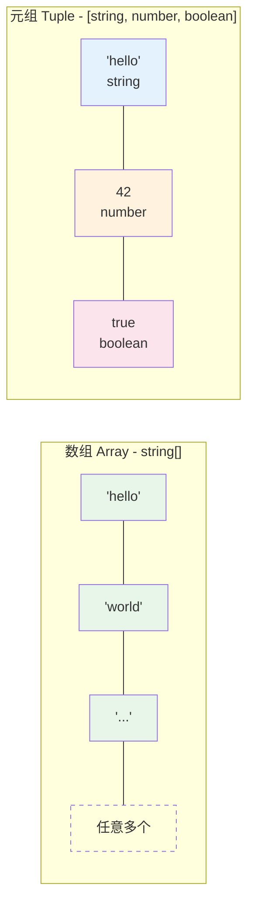
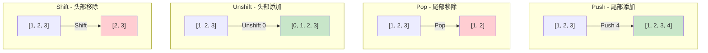
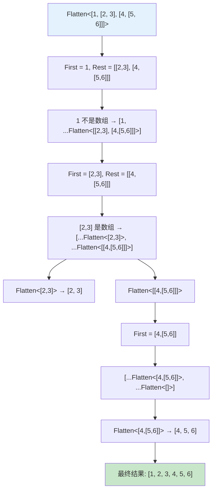

# 第10章：数组与元组类型体操

> 元组（Tuple）是 TypeScript 类型体操中最重要的数据结构之一。通过元组，我们可以实现计数、遍历、递归等各种高级类型操作。

## 目录

- [数组类型 vs 元组类型](#数组类型-vs-元组类型)
- [元组长度](#元组长度)
- [元组操作大全](#元组操作大全)
- [元组与联合类型转换](#元组与联合类型转换)
- [元组遍历与过滤](#元组遍历与过滤)
- [元组拼接与变换](#元组拼接与变换)
- [用元组模拟数字运算](#用元组模拟数字运算)
- [相关挑战](#相关挑战)

---

## 数组类型 vs 元组类型

在 TypeScript 中，数组（Array）和元组（Tuple）虽然语法相似，但有着本质区别：

| 特性 | 数组（Array） | 元组（Tuple） |
|------|--------------|--------------|
| 长度 | 任意长度 | 固定长度 |
| 元素类型 | 所有元素类型相同 | 每个位置可以有不同类型 |
| `length` 类型 | `number` | 数字字面量类型（如 `3`） |

### 数组类型（Array Type）

数组表示任意长度、元素类型相同的集合：

```typescript
// 两种等价写法
type StringArray = string[]
type NumberArray = Array<number>

// 数组的 length 是 number 类型
type ArrLen = string[]['length'] // number
```

### 元组类型（Tuple Type）

元组表示固定长度、每个位置有特定类型的有序集合：

```typescript
// 基本元组
type Pair = [string, number]  // 长度为 2，第一个是 string，第二个是 number

// 元组的 length 是具体的数字字面量
type TupleLen = [string, number]['length'] // 2

// 只读元组（Readonly Tuple）
type ReadonlyPair = readonly [string, number]
```

### 对比图解



> **关键区别**：在类型体操中，我们主要使用元组，因为元组的 `length` 是精确的数字字面量类型，这使得我们能够进行精确的类型运算。

---

## 元组长度

通过 `T['length']` 可以获取元组的精确长度，这是一个数字字面量类型（Numeric Literal Type）：

```typescript
type Length<T extends readonly any[]> = T['length']

// 使用示例
type L1 = Length<[1, 2, 3]>       // 3
type L2 = Length<['a', 'b']>      // 2
type L3 = Length<[]>              // 0
type L4 = Length<string[]>        // number（数组的长度不确定）
```

### 判断元组是否为空

```typescript
type IsEmpty<T extends readonly any[]> = T['length'] extends 0 ? true : false

type E1 = IsEmpty<[]>        // true
type E2 = IsEmpty<[1]>       // false
```

### 判断长度是否相等

```typescript
type SameLength<A extends readonly any[], B extends readonly any[]> =
  A['length'] extends B['length'] ? true : false

type S1 = SameLength<[1, 2], [3, 4]>     // true
type S2 = SameLength<[1, 2], [3, 4, 5]>  // false
```

---

## 元组操作大全

元组操作是类型体操的基础，类似于 JavaScript 中数组的常见方法。核心技巧是使用**展开运算符**（Spread Operator `...`）和 **`infer` 推断**。

### Push - 尾部添加

```typescript
type Push<T extends any[], U> = [...T, U]

type P1 = Push<[1, 2], 3>       // [1, 2, 3]
type P2 = Push<[], 'hello'>     // ['hello']
```

### Pop - 尾部移除

```typescript
type Pop<T extends any[]> = T extends [...infer R, any] ? R : never

type Po1 = Pop<[1, 2, 3]>   // [1, 2]
type Po2 = Pop<[1]>         // []
type Po3 = Pop<[]>          // never
```

### Shift - 头部移除

```typescript
type Shift<T extends any[]> = T extends [any, ...infer R] ? R : never

type Sh1 = Shift<[1, 2, 3]>   // [2, 3]
type Sh2 = Shift<[1]>         // []
```

### Unshift - 头部添加

```typescript
type Unshift<T extends any[], U> = [U, ...T]

type U1 = Unshift<[2, 3], 1>     // [1, 2, 3]
type U2 = Unshift<[], 'first'>   // ['first']
```

### Concat - 拼接两个元组

```typescript
type Concat<T extends any[], U extends any[]> = [...T, ...U]

type C1 = Concat<[1, 2], [3, 4]>   // [1, 2, 3, 4]
type C2 = Concat<[], [1]>          // [1]
```

### 操作图解



### First 与 Last - 获取首尾元素

```typescript
// 获取第一个元素
type First<T extends any[]> = T extends [infer F, ...any[]] ? F : never

// 获取最后一个元素
type Last<T extends any[]> = T extends [...any[], infer L] ? L : never

type F1 = First<[1, 2, 3]>  // 1
type L1 = Last<[1, 2, 3]>   // 3
```

---

## 元组与联合类型转换

### Tuple to Union（元组转联合类型）

使用索引访问 `T[number]` 可以将元组转换为联合类型：

```typescript
type TupleToUnion<T extends any[]> = T[number]

type TU1 = TupleToUnion<[1, 2, 3]>             // 1 | 2 | 3
type TU2 = TupleToUnion<['a', 'b', 'c']>       // 'a' | 'b' | 'c'
type TU3 = TupleToUnion<[string, number]>       // string | number
```

**原理**：`T[number]` 表示用 `number` 类型索引访问元组，等价于访问所有可能的位置，结果就是所有元素类型的联合。

### Tuple to Object（元组转对象）

将元组中的值同时作为键和值来构建对象类型：

```typescript
type TupleToObject<T extends readonly PropertyKey[]> = {
  [K in T[number]]: K
}

type TO1 = TupleToObject<['name', 'age', 'id']>
// { name: 'name'; age: 'age'; id: 'id' }

// PropertyKey = string | number | symbol
// 元组元素必须是合法的对象键类型
```

### Union to Tuple（联合转元组）

> ⚠️ **警告**：联合类型转元组是一个高级技巧，且结果顺序不确定，实际项目中应谨慎使用。

```typescript
// 利用函数交叉类型和 infer 逐步提取联合成员
type UnionToIntersection<U> =
  (U extends any ? (x: U) => void : never) extends (x: infer I) => void
    ? I
    : never

type LastOfUnion<U> =
  UnionToIntersection<U extends any ? () => U : never> extends () => infer Last
    ? Last
    : never

type UnionToTuple<U, Last = LastOfUnion<U>> =
  [U] extends [never]
    ? []
    : [...UnionToTuple<Exclude<U, Last>>, Last]
```

---

## 元组遍历与过滤

### Includes - 检查元素是否存在

递归遍历元组，逐个比较元素：

```typescript
// 辅助类型：精确相等判断
type IsEqual<A, B> =
  (<T>() => T extends A ? 1 : 2) extends (<T>() => T extends B ? 1 : 2)
    ? true
    : false

type Includes<T extends readonly any[], U> =
  T extends [infer First, ...infer Rest]
    ? IsEqual<First, U> extends true
      ? true
      : Includes<Rest, U>
    : false

type I1 = Includes<[1, 2, 3], 2>       // true
type I2 = Includes<[1, 2, 3], 4>       // false
type I3 = Includes<[true, false], true> // true
```

### Filter - 按条件过滤元组

```typescript
type Filter<T extends any[], U> =
  T extends [infer First, ...infer Rest]
    ? First extends U
      ? [First, ...Filter<Rest, U>]
      : Filter<Rest, U>
    : []

type Fi1 = Filter<[1, 'a', 2, 'b', 3], number>  // [1, 2, 3]
type Fi2 = Filter<[1, 'a', 2, 'b', 3], string>  // ['a', 'b']
```

### Flatten - 展平嵌套元组

将多层嵌套的元组展平为一层：

```typescript
type Flatten<T extends any[]> =
  T extends [infer First, ...infer Rest]
    ? First extends any[]
      ? [...Flatten<First>, ...Flatten<Rest>]
      : [First, ...Flatten<Rest>]
    : []

type Fl1 = Flatten<[1, [2, 3], [4, [5, 6]]]>  // [1, 2, 3, 4, 5, 6]
type Fl2 = Flatten<[[1, 2], [3, [4]]]>         // [1, 2, 3, 4]
```

### Flatten 递归展开过程图解



---

## 元组拼接与变换

### Reverse - 反转元组

```typescript
type Reverse<T extends any[]> =
  T extends [infer First, ...infer Rest]
    ? [...Reverse<Rest>, First]
    : []

type R1 = Reverse<[1, 2, 3]>     // [3, 2, 1]
type R2 = Reverse<['a', 'b']>    // ['b', 'a']
```

### Zip - 合并两个元组

将两个元组按位置配对：

```typescript
type Zip<A extends any[], B extends any[]> =
  A extends [infer AF, ...infer AR]
    ? B extends [infer BF, ...infer BR]
      ? [[AF, BF], ...Zip<AR, BR>]
      : []
    : []

type Z1 = Zip<[1, 2, 3], ['a', 'b', 'c']>
// [[1, 'a'], [2, 'b'], [3, 'c']]

type Z2 = Zip<[1, 2], ['a', 'b', 'c']>
// [[1, 'a'], [2, 'b']]  — 以较短的元组为准
```

### Chunk - 分块

将元组按指定大小分成多个子元组：

```typescript
type Chunk<
  T extends any[],
  Size extends number,
  Current extends any[] = []
> =
  T extends [infer First, ...infer Rest]
    ? Current['length'] extends Size
      ? [Current, ...Chunk<T, Size>]
      : Chunk<Rest, Size, [...Current, First]>
    : Current['length'] extends 0
      ? []
      : [Current]

type Ch1 = Chunk<[1, 2, 3, 4, 5], 2>
// [[1, 2], [3, 4], [5]]

type Ch2 = Chunk<[1, 2, 3, 4], 2>
// [[1, 2], [3, 4]]
```

### Unique - 去重

```typescript
type Unique<T extends any[], Result extends any[] = []> =
  T extends [infer First, ...infer Rest]
    ? Includes<Result, First> extends true
      ? Unique<Rest, Result>
      : Unique<Rest, [...Result, First]>
    : Result

type Uq1 = Unique<[1, 2, 1, 3, 2, 4]>     // [1, 2, 3, 4]
type Uq2 = Unique<['a', 'b', 'a']>         // ['a', 'b']
```

### IndexOf - 查找元素索引

```typescript
type IndexOf<T extends any[], U, Index extends any[] = []> =
  T extends [infer First, ...infer Rest]
    ? IsEqual<First, U> extends true
      ? Index['length']
      : IndexOf<Rest, U, [...Index, any]>
    : -1

type Idx1 = IndexOf<[1, 2, 3], 2>   // 1
type Idx2 = IndexOf<[1, 2, 3], 4>   // -1
```

---

## 用元组模拟数字运算

TypeScript 类型系统没有直接的算术运算，但我们可以利用元组的 `length` 属性来模拟加减法。

### 构造指定长度的元组

```typescript
type ConstructTuple<
  N extends number,
  Result extends any[] = []
> =
  Result['length'] extends N
    ? Result
    : ConstructTuple<N, [...Result, any]>

type CT3 = ConstructTuple<3>   // [any, any, any]
type CT0 = ConstructTuple<0>   // []
```

### 加法（Addition）

```typescript
type Add<A extends number, B extends number> =
  [...ConstructTuple<A>, ...ConstructTuple<B>]['length'] & number

type Sum1 = Add<3, 4>     // 7
type Sum2 = Add<0, 5>     // 5
type Sum3 = Add<10, 20>   // 30
```

### 减法（Subtraction）

```typescript
type Subtract<A extends number, B extends number> =
  ConstructTuple<A> extends [...ConstructTuple<B>, ...infer Rest]
    ? Rest['length']
    : never  // A < B 时返回 never

type Sub1 = Subtract<5, 3>   // 2
type Sub2 = Subtract<10, 0>  // 10
type Sub3 = Subtract<3, 5>   // never
```

### 大于/小于比较

```typescript
type GreaterThan<A extends number, B extends number> =
  A extends B
    ? false
    : ConstructTuple<A> extends [...ConstructTuple<B>, ...infer Rest]
      ? Rest['length'] extends 0
        ? false
        : true
      : false

type GT1 = GreaterThan<5, 3>   // true
type GT2 = GreaterThan<3, 5>   // false
type GT3 = GreaterThan<3, 3>   // false
```

### 完整示例：Range 类型

生成一个从 `Start` 到 `End` 的数字元组：

```typescript
type Range<
  Start extends number,
  End extends number,
  Result extends number[] = [],
  Current extends any[] = ConstructTuple<Start>
> =
  Current['length'] extends End
    ? [...Result, Current['length']]
    : Range<Start, End, [...Result, Current['length'] & number], [...Current, any]>

type R = Range<2, 6>   // [2, 3, 4, 5, 6]
```

> ⚠️ **注意**：由于 TypeScript 的递归深度限制（约 1000 层），用元组模拟的数字运算只适用于较小的数值。对于大数运算需要使用更复杂的技巧（如字符串模拟）。

---

## 实用技巧总结

### 1. 递归模式

元组操作的核心递归模式：

```typescript
// 基本递归框架
type Process<T extends any[]> =
  T extends [infer First, ...infer Rest]  // 分解：取出第一个元素
    ? /* 处理 First，递归 Process<Rest> */
    : /* 基础情况（通常是空元组 []） */
```

### 2. 累加器模式（Accumulator Pattern）

当需要构建结果时，使用额外的类型参数作为累加器：

```typescript
type Process<T extends any[], Result extends any[] = []> =
  T extends [infer First, ...infer Rest]
    ? Process<Rest, [...Result, /* 处理后的 First */]>
    : Result
```

### 3. 计数器模式（Counter Pattern）

用元组的长度来计数：

```typescript
type Count<T extends any[], Target, Counter extends any[] = []> =
  T extends [infer First, ...infer Rest]
    ? First extends Target
      ? Count<Rest, Target, [...Counter, any]>
      : Count<Rest, Target, Counter>
    : Counter['length']
```

---

## 相关挑战

以下是 type-challenges 中与数组和元组相关的挑战题目：

| 难度 | 挑战 | 编号 | 核心知识点 |
|------|------|------|-----------|
| 🟢 简单 | [Tuple to Object](https://github.com/type-challenges/type-challenges/blob/main/questions/00011-easy-tuple-to-object/README.zh-CN.md) | #11 | `T[number]`、映射类型 |
| 🟢 简单 | [Length of Tuple](https://github.com/type-challenges/type-challenges/blob/main/questions/00018-easy-tuple-length/README.zh-CN.md) | #18 | `T['length']` |
| 🟢 简单 | [First of Array](https://github.com/type-challenges/type-challenges/blob/main/questions/00014-easy-first/README.zh-CN.md) | #14 | `infer` 推断首元素 |
| 🟢 简单 | [Concat](https://github.com/type-challenges/type-challenges/blob/main/questions/00533-easy-concat/README.zh-CN.md) | #533 | 展开运算符 `...` |
| 🟢 简单 | [Includes](https://github.com/type-challenges/type-challenges/blob/main/questions/00898-easy-includes/README.zh-CN.md) | #898 | 递归遍历、精确比较 |
| 🟢 简单 | [Push](https://github.com/type-challenges/type-challenges/blob/main/questions/03057-easy-push/README.zh-CN.md) | #3057 | `[...T, U]` |
| 🟢 简单 | [Unshift](https://github.com/type-challenges/type-challenges/blob/main/questions/03060-easy-unshift/README.zh-CN.md) | #3060 | `[U, ...T]` |
| 🟡 中等 | [Last of Array](https://github.com/type-challenges/type-challenges/blob/main/questions/00015-medium-last/README.zh-CN.md) | #15 | `[...any[], infer L]` |
| 🟡 中等 | [Pop](https://github.com/type-challenges/type-challenges/blob/main/questions/00016-medium-pop/README.zh-CN.md) | #16 | `[...infer R, any]` |
| 🟡 中等 | [Flatten](https://github.com/type-challenges/type-challenges/blob/main/questions/00459-medium-flatten/README.zh-CN.md) | #459 | 递归展平 |
| 🟡 中等 | [Reverse](https://github.com/type-challenges/type-challenges/blob/main/questions/03192-medium-reverse/README.zh-CN.md) | #3192 | 递归反转 |
| 🟡 中等 | [Zip](https://github.com/type-challenges/type-challenges/blob/main/questions/04471-medium-zip/README.zh-CN.md) | #4471 | 双元组递归 |
| 🟡 中等 | [Chunk](https://github.com/type-challenges/type-challenges/blob/main/questions/04499-medium-chunk/README.zh-CN.md) | #4499 | 累加器模式 |
| 🟡 中等 | [Unique](https://github.com/type-challenges/type-challenges/blob/main/questions/05360-medium-unique/README.zh-CN.md) | #5360 | Includes + 累加器 |
| 🟡 中等 | [IndexOf](https://github.com/type-challenges/type-challenges/blob/main/questions/05153-medium-indexof/README.zh-CN.md) | #5153 | 计数器模式 |

**建议练习顺序**：先完成简单题（#11 → #18 → #14 → #533 → #3057 → #3060 → #898），再挑战中等题（#15 → #16 → #459 → #3192 → #4471 → #4499 → #5360 → #5153）。

---

## 导航

[← 上一章：内置工具类型实现](./09-utility-types.md) | [返回目录](./README.md) | [下一章：字符串类型体操 →](./11-string-types.md)
