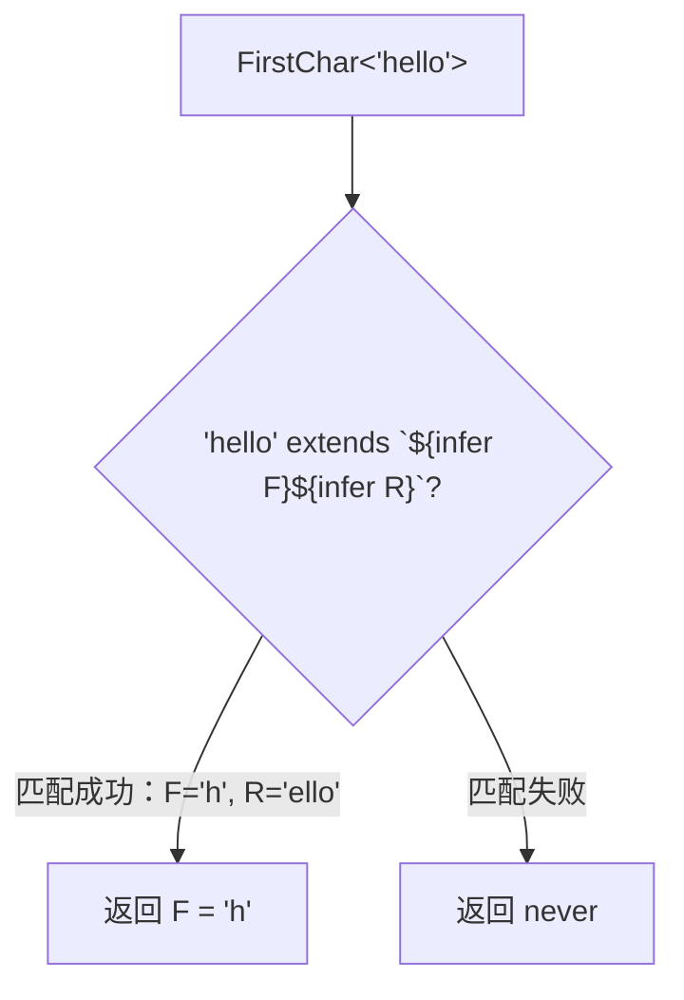
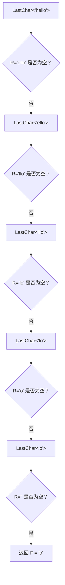
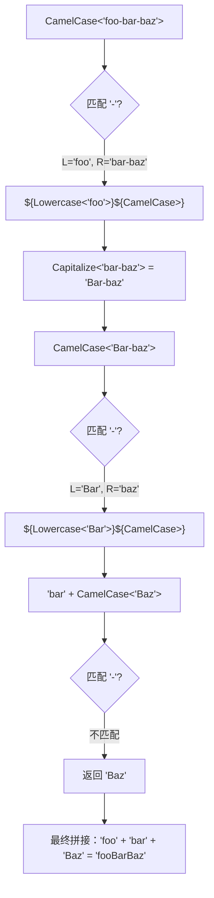

# 第十一章：字符串类型操作

> TypeScript 的模板字面量类型（Template Literal Types）赋予了类型系统强大的字符串处理能力。本章将系统讲解如何在类型层面对字符串进行解析、转换、匹配和组合。

## 目录

- [字符串字面量类型](#字符串字面量类型)
- [模板字面量类型回顾](#模板字面量类型回顾)
- [字符串解析](#字符串解析)
- [字符串长度](#字符串长度)
- [大小写转换实战](#大小写转换实战)
- [字符串修剪](#字符串修剪)
- [字符串替换](#字符串替换)
- [字符串与联合类型](#字符串与联合类型)
- [字符串匹配与检查](#字符串匹配与检查)
- [相关挑战](#相关挑战)

---

## 字符串字面量类型

在 TypeScript 中，字符串不仅有宽泛的 `string` 类型，还有更精确的**字符串字面量类型（String Literal Types）**：

```typescript
// 宽泛的 string 类型——可以是任意字符串
type A = string

// 字符串字面量类型——只能是特定的值
type B = 'hello'
type C = 'world'

// 字面量联合类型——只能是几个特定值之一
type Direction = 'up' | 'down' | 'left' | 'right'
```

字符串字面量类型是模板字面量类型的基础。只有当我们使用具体的字面量类型时，TypeScript 才能在类型层面进行字符串的拆分、拼接和匹配。

```typescript
// string 太宽泛，无法进行类型层面的字符串操作
type Test1 = string extends `hello${infer R}` ? R : never // never

// 字面量类型则可以精确匹配
type Test2 = 'hello world' extends `hello${infer R}` ? R : never // ' world'
```

---

## 模板字面量类型回顾

TypeScript 4.1 引入了**模板字面量类型（Template Literal Types）**，语法与 JavaScript 的模板字符串一致，使用反引号和 `${}` 占位符：

```typescript
type Greeting<Name extends string> = `Hello, ${Name}!`

type R1 = Greeting<'TypeScript'> // 'Hello, TypeScript!'
type R2 = Greeting<'World'>      // 'Hello, World!'
```

### 与联合类型的组合

模板字面量类型与联合类型（Union Types）结合时，会产生**分配效应（Distributive Effect）**，自动生成所有可能的组合：

```typescript
type Size = 'small' | 'medium' | 'large'
type Color = 'red' | 'blue'

type SizeColor = `${Size}-${Color}`
// 'small-red' | 'small-blue' | 'medium-red' | 'medium-blue' | 'large-red' | 'large-blue'
```

### 内置字符串工具类型

TypeScript 提供了四个内置的字符串操作类型：

```typescript
type T1 = Uppercase<'hello'>     // 'HELLO'
type T2 = Lowercase<'HELLO'>     // 'hello'
type T3 = Capitalize<'hello'>    // 'Hello'
type T4 = Uncapitalize<'Hello'>  // 'hello'
```

这些内置类型是编译器级别实现的，无法用普通 TypeScript 类型代码复现。

---

## 字符串解析

字符串解析是字符串类型操作的核心技巧，它利用模板字面量类型配合 `infer` 关键字，从字符串中提取子串。

### 提取首字符

```typescript
type FirstChar<S extends string> = S extends `${infer F}${infer R}` ? F : never

type T1 = FirstChar<'hello'>  // 'h'
type T2 = FirstChar<''>       // never
type T3 = FirstChar<'a'>      // 'a'
```

> **原理**：`${infer F}${infer R}` 中，`F` 贪婪度最低，仅匹配一个字符；`R` 匹配剩余所有字符。

### 提取分隔符两侧

```typescript
type SplitByDot<S extends string> = S extends `${infer L}.${infer R}` ? [L, R] : never

type T1 = SplitByDot<'a.b'>     // ['a', 'b']
type T2 = SplitByDot<'a.b.c'>   // ['a', 'b.c'] — 左侧 infer 取最短匹配
type T3 = SplitByDot<'hello'>   // never
```

### 提取最后一个字符

```typescript
type LastChar<S extends string> = S extends `${infer F}${infer R}`
  ? R extends '' ? F : LastChar<R>
  : never

type T1 = LastChar<'hello'> // 'o'
type T2 = LastChar<'a'>     // 'a'
```

### 递归解析过程图解

以 `FirstChar<'hello'>` 为例，解析过程如下：



以 `LastChar<'hello'>` 为例，递归过程如下：



---

## 字符串长度

TypeScript 的字符串字面量类型没有直接的 `.length` 属性可供在类型层面访问。解决办法是**先将字符串转为字符元组，再获取元组长度**：

```typescript
// 第一步：将字符串拆分为字符数组
type StringToArray<S extends string> = S extends `${infer F}${infer R}`
  ? [F, ...StringToArray<R>]
  : []

// 第二步：获取数组长度
type LengthOfString<S extends string> = StringToArray<S>['length']

// 测试
type L1 = LengthOfString<''>      // 0
type L2 = LengthOfString<'hello'> // 5
type L3 = LengthOfString<'hi'>    // 2
```

这是一个经典的**两步走**策略——在类型系统中，很多操作不能一步到位，需要借助中间类型进行转换。

---

## 大小写转换实战

### Capitalize：首字母大写

TypeScript 内置了 `Capitalize`，但我们可以用内置的 `Uppercase` 自行实现：

```typescript
type MyCapitalize<S extends string> = S extends `${infer F}${infer R}`
  ? `${Uppercase<F>}${R}`
  : S

type T1 = MyCapitalize<'hello'> // 'Hello'
type T2 = MyCapitalize<''>      // ''
```

### CamelCase：转驼峰命名

将 `kebab-case`（短横线命名）转换为 `camelCase`（驼峰命名）：

```typescript
type CamelCase<S extends string> = S extends `${infer L}-${infer R}`
  ? `${Lowercase<L>}${CamelCase<Capitalize<R>>}`
  : S

type T1 = CamelCase<'foo-bar-baz'>  // 'fooBarBaz'
type T2 = CamelCase<'hello-world'>  // 'helloWorld'
type T3 = CamelCase<'hello'>        // 'hello'
```

#### CamelCase 转换流程



### KebabCase：转短横线命名

将 `camelCase` 转换为 `kebab-case`：

```typescript
type KebabCase<S extends string> = S extends `${infer F}${infer R}`
  ? R extends Uncapitalize<R>
    ? `${Lowercase<F>}${KebabCase<R>}`
    : `${Lowercase<F>}-${KebabCase<R>}`
  : S

type T1 = KebabCase<'FooBarBaz'>   // 'foo-bar-baz'
type T2 = KebabCase<'helloWorld'>   // 'hello-world'
type T3 = KebabCase<'ABC'>          // 'a-b-c'
```

> **核心思路**：逐字符遍历，遇到大写字母就在其前面插入 `-`，同时将该字母转为小写。判断 `R extends Uncapitalize<R>` 用于检测下一个字符是否为小写。

### SnakeCase：转下划线命名

原理与 KebabCase 类似，只是分隔符换成 `_`：

```typescript
type SnakeCase<S extends string> = S extends `${infer F}${infer R}`
  ? R extends Uncapitalize<R>
    ? `${Lowercase<F>}${SnakeCase<R>}`
    : `${Lowercase<F>}_${SnakeCase<R>}`
  : S

type T1 = SnakeCase<'FooBarBaz'>  // 'foo_bar_baz'
type T2 = SnakeCase<'helloWorld'> // 'hello_world'
```

---

## 字符串修剪

### TrimLeft：去除左侧空白

```typescript
type Space = ' ' | '\n' | '\t'

type TrimLeft<S extends string> = S extends `${Space}${infer R}` ? TrimLeft<R> : S

type T1 = TrimLeft<'  hello'>   // 'hello'
type T2 = TrimLeft<'\n hello'>  // 'hello'
type T3 = TrimLeft<'hello  '>   // 'hello  '
```

### TrimRight：去除右侧空白

```typescript
type TrimRight<S extends string> = S extends `${infer L}${Space}` ? TrimRight<L> : S

type T1 = TrimRight<'hello  '>  // 'hello'
type T2 = TrimRight<'  hello'>  // '  hello'
```

### Trim：去除两侧空白

```typescript
type Trim<S extends string> = TrimLeft<TrimRight<S>>

type T1 = Trim<'  hello  '>  // 'hello'
type T2 = Trim<'\n hello \t'> // 'hello'
```

---

## 字符串替换

### Replace：替换第一个匹配项

```typescript
type Replace<
  S extends string,
  From extends string,
  To extends string
> = From extends ''
  ? S
  : S extends `${infer L}${From}${infer R}`
    ? `${L}${To}${R}`
    : S

type T1 = Replace<'hello world', 'world', 'TS'>   // 'hello TS'
type T2 = Replace<'foobarbar', 'bar', 'X'>          // 'fooXbar'
type T3 = Replace<'hello', '', 'X'>                  // 'hello'
```

### ReplaceAll：替换所有匹配项

```typescript
type ReplaceAll<
  S extends string,
  From extends string,
  To extends string
> = From extends ''
  ? S
  : S extends `${infer L}${From}${infer R}`
    ? `${L}${To}${ReplaceAll<R, From, To>}`
    : S

type T1 = ReplaceAll<'foobarbar', 'bar', 'X'>  // 'fooXX'
type T2 = ReplaceAll<'aaa', 'a', 'b'>           // 'bbb'
```

> **注意**：`Replace` 仅替换第一次出现的匹配，而 `ReplaceAll` 对剩余部分 `R` 递归调用自身，从而替换所有出现的匹配。

### DropChar：删除指定字符

```typescript
type DropChar<S extends string, C extends string> = S extends `${infer L}${C}${infer R}`
  ? DropChar<`${L}${R}`, C>
  : S

type T1 = DropChar<'hello world', ' '>   // 'helloworld'
type T2 = DropChar<'a-b-c', '-'>          // 'abc'
```

---

## 字符串与联合类型

### StringToUnion：字符串转字符联合类型

将字符串的每个字符拆分成联合类型：

```typescript
type StringToUnion<S extends string> = S extends `${infer F}${infer R}`
  ? F | StringToUnion<R>
  : never

type T1 = StringToUnion<'hello'> // 'h' | 'e' | 'l' | 'o'
type T2 = StringToUnion<'abc'>   // 'a' | 'b' | 'c'
type T3 = StringToUnion<''>      // never
```

> **注意**：联合类型会自动去重，所以 `'hello'` 中两个 `'l'` 只保留一个。

### Join：用分隔符连接字符串数组

```typescript
type Join<
  T extends string[],
  Sep extends string
> = T extends []
  ? ''
  : T extends [infer F extends string]
    ? F
    : T extends [infer F extends string, ...infer R extends string[]]
      ? `${F}${Sep}${Join<R, Sep>}`
      : string

type T1 = Join<['a', 'b', 'c'], '-'>    // 'a-b-c'
type T2 = Join<['hello'], '.'>           // 'hello'
type T3 = Join<[], ','>                  // ''
type T4 = Join<['x', 'y'], ''>           // 'xy'
```

---

## 字符串匹配与检查

### StartsWith：检查字符串前缀

```typescript
type StartsWith<S extends string, Prefix extends string> = S extends `${Prefix}${infer _}`
  ? true
  : false

type T1 = StartsWith<'hello world', 'hello'>  // true
type T2 = StartsWith<'hello world', 'world'>  // false
type T3 = StartsWith<'hello', ''>              // true
```

### EndsWith：检查字符串后缀

```typescript
type EndsWith<S extends string, Suffix extends string> = S extends `${infer _}${Suffix}`
  ? true
  : false

type T1 = EndsWith<'hello world', 'world'>  // true
type T2 = EndsWith<'hello world', 'hello'>  // false
```

### CheckRepeatedChars：检测重复字符

```typescript
type CheckRepeatedChars<S extends string> = S extends `${infer F}${infer R}`
  ? R extends `${string}${F}${string}`
    ? true
    : CheckRepeatedChars<R>
  : false

type T1 = CheckRepeatedChars<'hello'>  // true  (l 重复)
type T2 = CheckRepeatedChars<'abc'>    // false
type T3 = CheckRepeatedChars<'abca'>   // true  (a 重复)
```

> **原理**：逐个取出字符 `F`，检查剩余字符串 `R` 中是否还包含 `F`。利用 `${string}${F}${string}` 模式匹配——`string` 类型可以匹配任意字符串（包括空串）。

### IsPalindrome：回文检测（进阶）

判断一个字符串是否是回文（正读反读都一样）：

```typescript
type IsPalindrome<S extends string> = S extends ''
  ? true
  : S extends `${infer F}${infer M}${infer L}`
    ? F extends L
      ? IsPalindrome<M>
      : false
    : true  // 单个字符是回文

type T1 = IsPalindrome<'aba'>    // true
type T2 = IsPalindrome<'abba'>   // true
type T3 = IsPalindrome<'abc'>    // false
type T4 = IsPalindrome<'a'>      // true
type T5 = IsPalindrome<''>       // true
```

> **注意**：上面的简单实现在较长字符串时可能有匹配歧义。更稳健的实现需要先将字符串转为数组再判断。

#### 稳健版 IsPalindrome

```typescript
type StringToArray<S extends string> = S extends `${infer F}${infer R}`
  ? [F, ...StringToArray<R>]
  : []

type IsPalindromeArray<T extends string[]> = T extends []
  ? true
  : T extends [infer _]
    ? true
    : T extends [infer F, ...infer M extends string[], infer L]
      ? F extends L
        ? IsPalindromeArray<M>
        : false
      : false

type IsPalindrome<S extends string> = IsPalindromeArray<StringToArray<S>>
```

---

## 字符串操作分类总览

```mermaid
graph TB
    A["字符串类型操作"] --> B["解析/拆分"]
    A --> C["转换"]
    A --> D["修剪/替换"]
    A --> E["匹配/检查"]
    A --> F["组合"]

    B --> B1["FirstChar — 提取首字符"]
    B --> B2["LastChar — 提取尾字符"]
    B --> B3["Split — 按分隔符拆分"]
    B --> B4["StringToArray — 转字符数组"]

    C --> C1["CamelCase — 转驼峰"]
    C --> C2["KebabCase — 转短横线"]
    C --> C3["SnakeCase — 转下划线"]
    C --> C4["Capitalize — 首字母大写"]

    D --> D1["Trim / TrimLeft / TrimRight"]
    D --> D2["Replace — 单次替换"]
    D --> D3["ReplaceAll — 全部替换"]
    D --> D4["DropChar — 删除字符"]

    E --> E1["StartsWith — 前缀检查"]
    E --> E2["EndsWith — 后缀检查"]
    E --> E3["CheckRepeatedChars — 重复检测"]
    E --> E4["IsPalindrome — 回文检测"]

    F --> F1["Join — 数组连接"]
    F --> F2["StringToUnion — 转联合类型"]
    F --> F3["模板字面量拼接"]
```



---

## 小结

本章涵盖了 TypeScript 类型系统中字符串操作的核心技巧：

| 技术要点 | 核心模式 |
|---------|---------|
| 字符串解析 | `` S extends `${infer F}${infer R}` `` |
| 分隔符匹配 | `` S extends `${infer L}${Sep}${infer R}` `` |
| 字符串长度 | 先转数组 `StringToArray`，再取 `['length']` |
| 大小写转换 | 利用内置 `Uppercase` / `Lowercase` + 递归 |
| 修剪空白 | 递归匹配 `Space` 字符并移除 |
| 替换操作 | 匹配 + 拼接 + 递归（ReplaceAll） |
| 字符串检查 | 模板字面量模式匹配 + `${string}` 通配 |

**核心思想**：TypeScript 类型层面的字符串操作本质上就是**模式匹配 + 递归**。掌握 `infer` 在模板字面量类型中的使用，就掌握了字符串类型操作的钥匙。

---

## 相关挑战

以下是 type-challenges 仓库中与本章内容相关的挑战题目，推荐按顺序练习：

| 挑战 | 难度 | 说明 |
|------|------|------|
| [Capitalize #110](https://github.com/type-challenges/type-challenges/blob/main/questions/00110-medium-capitalize/README.md) | 🟡 中等 | 实现首字母大写 |
| [TrimLeft #106](https://github.com/type-challenges/type-challenges/blob/main/questions/00106-medium-trimleft/README.md) | 🟡 中等 | 去除左侧空白 |
| [Trim #108](https://github.com/type-challenges/type-challenges/blob/main/questions/00108-medium-trim/README.md) | 🟡 中等 | 去除两侧空白 |
| [Replace #116](https://github.com/type-challenges/type-challenges/blob/main/questions/00116-medium-replace/README.md) | 🟡 中等 | 替换第一个匹配 |
| [ReplaceAll #119](https://github.com/type-challenges/type-challenges/blob/main/questions/00119-medium-replaceall/README.md) | 🟡 中等 | 替换所有匹配 |
| [CamelCase #114](https://github.com/type-challenges/type-challenges/blob/main/questions/00114-hard-camelcase/README.md) | 🔴 困难 | 转驼峰命名 |
| [KebabCase #612](https://github.com/type-challenges/type-challenges/blob/main/questions/00612-medium-kebabcase/README.md) | 🟡 中等 | 转短横线命名 |
| [StringToUnion #531](https://github.com/type-challenges/type-challenges/blob/main/questions/00531-medium-string-to-union/README.md) | 🟡 中等 | 字符串转联合类型 |
| [LengthOfString #298](https://github.com/type-challenges/type-challenges/blob/main/questions/00298-medium-length-of-string/README.md) | 🟡 中等 | 获取字符串长度 |
| [StartsWith #2688](https://github.com/type-challenges/type-challenges/blob/main/questions/02688-medium-startswith/README.md) | 🟡 中等 | 前缀检查 |
| [EndsWith #2693](https://github.com/type-challenges/type-challenges/blob/main/questions/02693-medium-endswith/README.md) | 🟡 中等 | 后缀检查 |
| [BEM #3326](https://github.com/type-challenges/type-challenges/blob/main/questions/03326-medium-bem-style-string/README.md) | 🟡 中等 | BEM 风格字符串 |
| [DropChar #2070](https://github.com/type-challenges/type-challenges/blob/main/questions/02070-medium-drop-char/README.md) | 🟡 中等 | 删除指定字符 |
| [Join #5310](https://github.com/type-challenges/type-challenges/blob/main/questions/05310-medium-join/README.md) | 🟡 中等 | 连接字符串数组 |
| [Split #2822](https://github.com/type-challenges/type-challenges/blob/main/questions/02822-hard-split/README.md) | 🔴 困难 | 拆分字符串 |

---

## 导航

[← 上一章：数组与元组操作](./10-array-tuple.md) | [下一章：类型判断与守卫 →](./12-type-guards.md) | [← 返回目录](./README.md)
