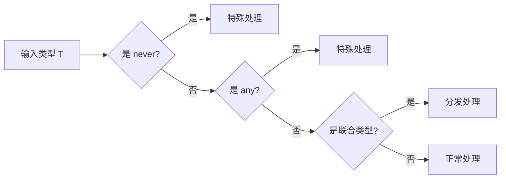
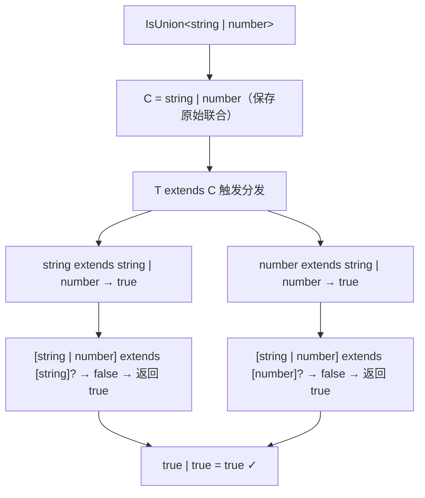
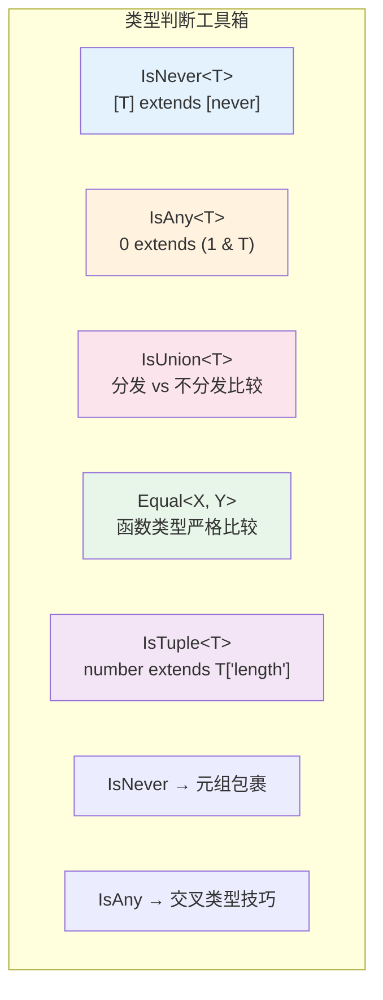

# 第12章：类型判断与守卫

> 学习如何在类型层面进行"类型检测"——判断一个类型是 `never`、`any`、`union` 还是其他特殊类型。

## 12.1 为什么需要类型判断？

在类型体操中，我们经常需要根据输入类型的"种类"做不同处理。例如：

- 输入是 `never` 时返回特殊结果
- 输入是 `any` 时需要特殊处理
- 判断某个类型是否为联合类型



## 12.2 IsNever - 判断是否为 never

`never` 是空类型，表示"不可能的值"。判断 `never` 有一个陷阱：**`never` 作为联合类型的"零元素"，在分布式条件类型中不会触发分发**。

```typescript
// ❌ 错误写法 - never 不会触发分发，整个表达式直接返回 never
type IsNever_Wrong<T> = T extends never ? true : false
type Test = IsNever_Wrong<never> // never（而非 true！）

// ✅ 正确写法 - 用元组包裹阻止分发
type IsNever<T> = [T] extends [never] ? true : false
type Test1 = IsNever<never>    // true ✓
type Test2 = IsNever<string>   // false ✓
type Test3 = IsNever<undefined> // false ✓
```

### 原理解释

| 写法 | `T = never` 时的行为 | 原因 |
|------|---------------------|------|
| `T extends never ? ...` | 返回 `never` | `never` 是空联合，分发后无元素可处理 |
| `[T] extends [never] ? ...` | 返回 `true` | 元组包裹阻止分发，`[never] extends [never]` 为 true |

## 12.3 IsAny - 判断是否为 any

`any` 是 TypeScript 中最特殊的类型——它既是所有类型的超类型，又是所有类型的子类型（除了 `never`）。

```typescript
// 利用 any 的特殊性质：0 extends (1 & T) 仅在 T 为 any 时为 true
type IsAny<T> = 0 extends (1 & T) ? true : false

type Test1 = IsAny<any>      // true ✓
type Test2 = IsAny<unknown>  // false ✓
type Test3 = IsAny<never>    // false ✓
type Test4 = IsAny<string>   // false ✓
```

### 原理

- `1 & T`：当 `T` 是 `any` 时，`1 & any` = `any`
- `0 extends any` 为 `true`
- 当 `T` 是其他类型时，`1 & string` = `string`，`0 extends string` 为 `false`

## 12.4 IsUnion - 判断是否为联合类型

这是一个经典的类型体操技巧，利用分布式条件类型的特性：

```typescript
type IsUnion<T, C = T> = [T] extends [never]
  ? false
  : T extends C
    ? [C] extends [T]
      ? false
      : true
    : never

type Test1 = IsUnion<string>           // false
type Test2 = IsUnion<string | number>  // true
type Test3 = IsUnion<never>            // false
```

### 原理分步解析

以 `T = string | number` 为例：



当 `T = string`（非联合类型）时：
- `string extends string` → true
- `[string] extends [string]` → true → 返回 `false` ✓

## 12.5 IsEqual - 判断两个类型是否相等

这是 `@type-challenges/utils` 库中最核心的工具类型：

```typescript
type Equal<X, Y> =
  (<T>() => T extends X ? 1 : 2) extends
  (<T>() => T extends Y ? 1 : 2) ? true : false
```

### 为什么不能用简单的 extends？

```typescript
// ❌ 这些简单方案都有缺陷
type Equal_v1<X, Y> = X extends Y ? (Y extends X ? true : false) : false
// Equal_v1<any, string> = true（错误！any extends string 为 true）

// ✅ 利用函数类型的严格比较
type Equal<X, Y> =
  (<T>() => T extends X ? 1 : 2) extends
  (<T>() => T extends Y ? 1 : 2) ? true : false
// Equal<any, string> = false ✓
```

## 12.6 IsTuple - 判断是否为元组

```typescript
type IsTuple<T> = [T] extends [never]
  ? false
  : T extends readonly any[]
    ? number extends T['length']
      ? false  // 数组的 length 是 number，不是具体数字
      : true   // 元组的 length 是具体数字字面量
    : false

type Test1 = IsTuple<[1, 2]>         // true
type Test2 = IsTuple<number[]>       // false
type Test3 = IsTuple<readonly [1]>   // true
```

### 关键区别

| 类型 | `T['length']` | `number extends T['length']` |
|------|--------------|------------------------------|
| `[1, 2, 3]` | `3` | `false`（number 不能赋给 3） |
| `number[]` | `number` | `true`（number 可以赋给 number） |

## 12.7 其他实用类型判断

### IsString / IsNumber 等基本类型判断

```typescript
type IsString<T> = [T] extends [string] ? true : false
type IsNumber<T> = [T] extends [number] ? true : false
```

### IsInteger - 判断整数

```typescript
type IsInteger<T extends number> =
  `${T}` extends `${infer _}.${infer _}` ? false : true

type Test1 = IsInteger<1>     // true
type Test2 = IsInteger<1.5>   // false
```

### IsNegativeNumber - 判断负数

```typescript
type IsNegativeNumber<T extends number> =
  `${T}` extends `-${infer _}` ? true : false

type Test1 = IsNegativeNumber<-5>  // true
type Test2 = IsNegativeNumber<5>   // false
```

## 12.8 类型判断总结



| 工具类型 | 核心技巧 | 关键挑战 |
|---------|---------|---------|
| `IsNever<T>` | `[T] extends [never]` 阻止分发 | #1042 |
| `IsAny<T>` | `0 extends (1 & T)` 交叉技巧 | #223 |
| `IsUnion<T>` | 分发前后比较 | #1097 |
| `Equal<X, Y>` | 函数类型严格比较 | #19749 |
| `IsTuple<T>` | `number extends T['length']` | #4484 |

## 12.9 相关挑战

| 挑战 | 难度 | 提示 |
|------|------|------|
| [#1042 IsNever](https://tsch.js.org/1042) | 🟡 中等 | 用 `[T] extends [never]` |
| [#1097 IsUnion](https://tsch.js.org/1097) | 🟡 中等 | 利用分布式条件类型 |
| [#223 IsAny](https://tsch.js.org/223) | 🔴 困难 | `0 extends (1 & T)` |
| [#4484 IsTuple](https://tsch.js.org/4484) | 🟡 中等 | 检查 `T['length']` 是否为具体数字 |
| [#19749 IsEqual](https://tsch.js.org/19749) | 🟡 中等 | 函数类型的严格比较 |
| [#949 AnyOf](https://tsch.js.org/949) | 🟡 中等 | 递归检查数组元素 |
| [#10969 Integer](https://tsch.js.org/10969) | 🟡 中等 | 字符串模式匹配小数点 |
| [#25747 IsNegativeNumber](https://tsch.js.org/25747) | 🔴 困难 | 字符串模式匹配负号 |

---

[← 上一章：字符串类型体操](./11-string-types.md) | [返回目录](./README.md) | [下一章：高级类型模式 →](./13-advanced-patterns.md)
