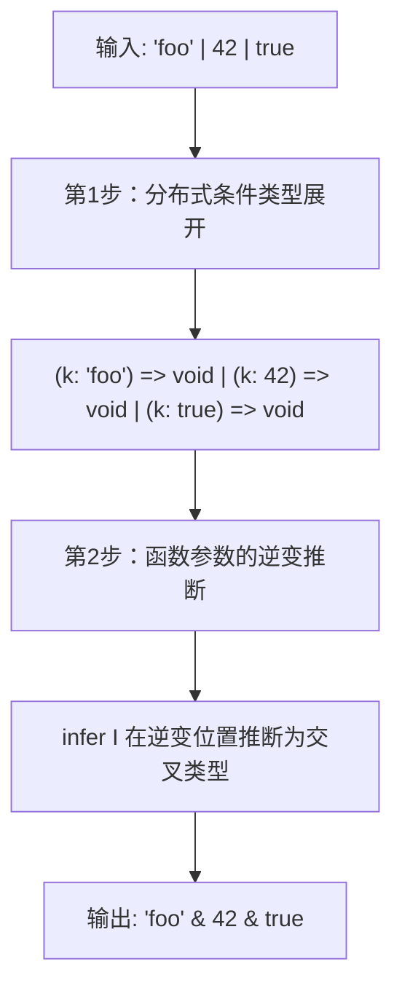
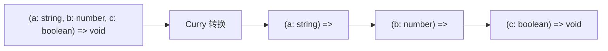
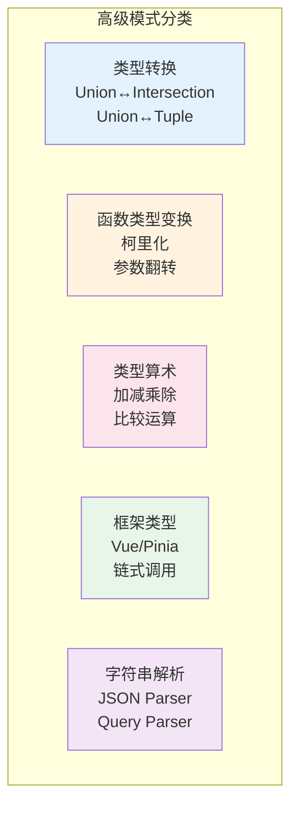

# 第13章：高级类型模式

> 探索 TypeScript 类型系统中最精妙的高级技巧——联合转交叉、柯里化、类型算术等。

## 13.1 联合类型转交叉类型 (Union to Intersection)

这是 TypeScript 类型体操中最经典的高级技巧之一。

```typescript
type UnionToIntersection<U> =
  (U extends any ? (k: U) => void : never) extends
  (k: infer I) => void ? I : never
```

### 原理分步解析



**为什么有效？**

1. `U extends any ? (k: U) => void : never` — 将联合类型的每个成员包装为函数参数
2. 利用函数参数的**逆变**特性：当多个函数类型的联合要满足同一个 `infer I` 时，`I` 被推断为交叉类型

```typescript
// 逆变位置推断示例
type Foo = ((x: string) => void) | ((x: number) => void)
// 要满足 (x: infer I) => void
// I 必须同时是 string 和 number → I = string & number = never

// 实际使用
type Result = UnionToIntersection<{ a: 1 } | { b: 2 }>
// { a: 1 } & { b: 2 } = { a: 1; b: 2 }
```

## 13.2 联合类型转元组 (Union to Tuple)

更高级的技巧，结合了联合转交叉和函数重载：

```typescript
// 辅助：获取联合类型的最后一个元素
type LastOfUnion<U> =
  UnionToIntersection<U extends any ? () => U : never> extends () => infer R
    ? R
    : never

// 联合转元组
type UnionToTuple<U, Last = LastOfUnion<U>> =
  [U] extends [never]
    ? []
    : [...UnionToTuple<Exclude<U, Last>>, Last]

type Result = UnionToTuple<'a' | 'b' | 'c'> // ['a', 'b', 'c']
```

> ⚠️ **注意**：联合类型是无序的，所以转换结果的顺序不保证。

## 13.3 柯里化 (Currying)

将多参数函数转换为链式单参数函数的类型：

```typescript
// 简化版柯里化
type Curry<F> = F extends (...args: infer Args) => infer R
  ? Args extends [infer First, ...infer Rest]
    ? (arg: First) => Curry<(...args: Rest) => R>
    : R
  : never

// 使用示例
type CurriedFn = Curry<(a: string, b: number, c: boolean) => void>
// (arg: string) => (arg: number) => (arg: boolean) => void
```



## 13.4 类型算术

TypeScript 类型系统是图灵完备的，可以进行数学运算：

### 加法

```typescript
type BuildTuple<N extends number, T extends any[] = []> =
  T['length'] extends N ? T : BuildTuple<N, [...T, any]>

type Add<A extends number, B extends number> =
  [...BuildTuple<A>, ...BuildTuple<B>]['length'] & number

type Sum = Add<3, 4> // 7
```

### 减法

```typescript
type Subtract<A extends number, B extends number> =
  BuildTuple<A> extends [...BuildTuple<B>, ...infer R]
    ? R['length'] & number
    : never

type Diff = Subtract<10, 3> // 7
```

### 大小比较

```typescript
type GreaterThan<A extends number, B extends number,
  Count extends any[] = []> =
  Count['length'] extends A
    ? false
    : Count['length'] extends B
      ? true
      : GreaterThan<A, B, [...Count, any]>

type Test = GreaterThan<5, 3> // true
```

### 斐波那契数列

```typescript
type Fibonacci<N extends number,
  Index extends any[] = [any],
  Prev extends any[] = [],
  Curr extends any[] = [any]> =
  Index['length'] extends N
    ? Curr['length'] & number
    : Fibonacci<N, [...Index, any], Curr, [...Prev, ...Curr]>

type Fib8 = Fibonacci<8> // 21
```

## 13.5 Chainable Options（链式调用类型）

实现一个支持链式调用的配置对象类型：

```typescript
type Chainable<Options = {}> = {
  option<K extends string, V>(
    key: K extends keyof Options ? never : K,
    value: V
  ): Chainable<Options & { [P in K]: V }>
  get(): Options
}

// 使用
declare const config: Chainable
const result = config
  .option('name', 'type-challenges')
  .option('difficulty', 'medium')
  .get()
// { name: string; difficulty: string }
```

## 13.6 Vue 风格类型（Simple Vue）

type-challenges 中最具应用价值的挑战之一——实现 Vue 的 `this` 类型推导：

```typescript
type SimpleVue<D, C, M> = {
  data(this: void): D
  computed: {
    [K in keyof C]: C[K] extends (...args: any) => infer R ? R : never
  } & ThisType<D & {
    [K in keyof C]: C[K] extends (...args: any) => infer R ? R : never
  } & M>
  methods: M & ThisType<D & {
    [K in keyof C]: C[K] extends (...args: any) => infer R ? R : never
  } & M>
}
```

**核心技巧**：使用 `ThisType<T>` 来设置 `this` 的类型。

## 13.7 分布式联合类型 (Distribute Unions)

将联合类型分布到对象的各个属性中：

```typescript
// 输入
type Input = { a: 1 | 2; b: 'x' | 'y' }
// 期望输出所有组合
type Output = 
  | { a: 1; b: 'x' }
  | { a: 1; b: 'y' }
  | { a: 2; b: 'x' }
  | { a: 2; b: 'y' }
```

## 13.8 高级模式总结



| 模式 | 核心技巧 | 难度 | 关键挑战 |
|------|---------|------|---------|
| Union → Intersection | 函数参数逆变 + infer | ⭐⭐⭐⭐ | #55 |
| Union → Tuple | 递归 + LastOfUnion | ⭐⭐⭐⭐⭐ | #730 |
| 柯里化 | 递归函数类型变换 | ⭐⭐⭐⭐ | #17, #462 |
| 类型算术 | 元组长度模拟 | ⭐⭐⭐⭐ | #476, #517 |
| 链式调用 | 泛型累积 | ⭐⭐⭐ | #12 |
| Vue 类型 | ThisType + infer | ⭐⭐⭐⭐ | #6, #213 |

## 13.9 相关挑战

| 挑战 | 难度 | 提示 |
|------|------|------|
| [#55 Union to Intersection](https://tsch.js.org/55) | 🔴 困难 | 函数参数逆变 |
| [#730 Union to Tuple](https://tsch.js.org/730) | 🔴 困难 | 递归 + LastOfUnion |
| [#17 Currying 1](https://tsch.js.org/17) | 🔴 困难 | 递归函数签名变换 |
| [#462 Currying 2](https://tsch.js.org/462) | 🟣 地狱 | 高级柯里化 |
| [#12 Chainable Options](https://tsch.js.org/12) | 🟡 中等 | 泛型累积 |
| [#6 Simple Vue](https://tsch.js.org/6) | 🔴 困难 | ThisType |
| [#476 Sum](https://tsch.js.org/476) | 🟣 地狱 | 元组长度模拟加法 |
| [#517 Multiply](https://tsch.js.org/517) | 🟣 地狱 | 重复加法 |
| [#296 Permutation](https://tsch.js.org/296) | 🟡 中等 | 分布式递归 |
| [#869 DistributeUnions](https://tsch.js.org/869) | 🟣 地狱 | 笛卡尔积 |

---

[← 上一章：类型判断与守卫](./12-type-guards.md) | [返回目录](./README.md) | [下一章：挑战攻略与解题指南 →](./14-challenge-guide.md)
