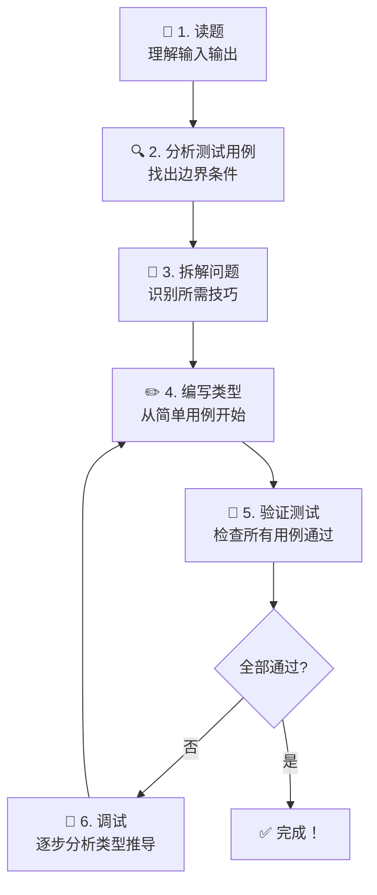
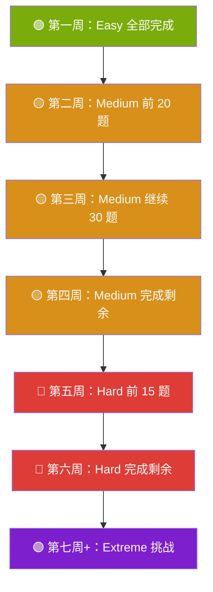

# 第14章：挑战攻略与解题指南

> 系统性的解题方法论，帮助你高效地完成 type-challenges 中的各类挑战。

## 14.1 解题方法论

### 通用解题步骤



### 关键思维模式

| 思维模式 | 说明 | 适用场景 |
|---------|------|---------|
| **模式匹配** | 用 `extends` + `infer` 提取类型的部分 | 函数参数、返回值、数组元素、字符串部分 |
| **递归分治** | 每次处理一个元素，递归处理剩余部分 | 数组遍历、字符串解析、深层对象 |
| **映射变换** | 用 `{ [K in keyof T]: ... }` 遍历对象 | 修改属性、过滤属性、重命名键 |
| **分发利用** | 利用联合类型在条件类型中的自动分发 | 过滤（Exclude）、变换（映射联合的每个成员） |
| **累积构造** | 用额外泛型参数累积中间结果 | 元组构建、计数、字符串拼接 |

## 14.2 按难度分级的解题技巧

### ⭐ 热身 & 简单（Warm-up & Easy）

所需知识：基础类型、简单泛型、`keyof`、`extends`、映射类型

```typescript
// 典型模式：直接映射
type MyReadonly<T> = { readonly [K in keyof T]: T[K] }

// 典型模式：数组展开
type Push<T extends any[], U> = [...T, U]
type Concat<T extends any[], U extends any[]> = [...T, ...U]

// 典型模式：索引访问
type First<T extends any[]> = T extends [infer F, ...any[]] ? F : never
type Length<T extends readonly any[]> = T['length']
```

**建议**：这一级别的题目是基础，确保每道题都能独立完成。

### ⭐⭐ 中等（Medium）

所需知识：条件类型、`infer`、递归、模板字面量、分布式条件类型

```typescript
// 典型模式：递归处理
type Flatten<T> = T extends [infer F, ...infer R]
  ? F extends any[] ? [...Flatten<F>, ...Flatten<R>] : [F, ...Flatten<R>]
  : []

// 典型模式：字符串模板匹配
type Replace<S extends string, From extends string, To extends string> =
  From extends '' ? S :
  S extends `${infer L}${From}${infer R}` ? `${L}${To}${R}` : S

// 典型模式：键过滤（映射 + 条件）
type PickByType<T, U> = {
  [K in keyof T as T[K] extends U ? K : never]: T[K]
}
```

**建议**：重点掌握 `infer` 和递归，这是解决大部分中等题的关键。

### ⭐⭐⭐ 困难（Hard）

所需知识：逆变/协变、联合转交叉、高级递归、`ThisType`

```typescript
// 典型模式：逆变推断
type UnionToIntersection<U> =
  (U extends any ? (k: U) => void : never) extends (k: infer I) => void ? I : never

// 典型模式：多阶段处理
type CamelCase<S extends string> = S extends `${infer L}_${infer R}`
  ? `${Lowercase<L>}${CamelCase<Capitalize<R>>}`
  : Lowercase<S>

// 典型模式：深层递归
type DeepPick<T, Path extends string> =
  Path extends `${infer K}.${infer Rest}`
    ? K extends keyof T ? { [P in K]: DeepPick<T[K], Rest> } : never
    : Path extends keyof T ? { [P in Path]: T[Path] } : never
```

**建议**：理解协变/逆变是突破困难级别的关键。

### ⭐⭐⭐⭐ 地狱（Extreme）

所需知识：所有技巧的组合、创造性思维

```typescript
// 这些挑战通常需要多个高级技巧的组合
// 例如 JSON Parser：字符串解析 + 递归 + 联合类型 + 条件类型嵌套
// 例如 Sort：元组操作 + 数字比较 + 递归
```

**建议**：先确保困难级别能够独立完成，再挑战地狱级别。

## 14.3 常见陷阱与调试技巧

### 陷阱一：never 的分发行为

```typescript
// never 作为泛型参数时不会触发分发
type Test<T> = T extends string ? 'yes' : 'no'
type Result = Test<never> // never（不是 'yes' 也不是 'no'！）

// 解决：用元组包裹
type Test2<T> = [T] extends [string] ? 'yes' : 'no'
type Result2 = Test2<never> // 'yes'
```

### 陷阱二：any 的特殊行为

```typescript
// any 同时满足 extends 的两个分支
type Test<T> = T extends string ? 'string' : 'other'
type Result = Test<any> // 'string' | 'other'（两个分支都返回！）
```

### 陷阱三：对象类型 extends 检查

```typescript
// 函数也是对象
type Test = (() => void) extends object ? true : false // true

// 处理 DeepReadonly 时需要排除函数
type DeepReadonly<T> = T extends Function
  ? T  // 函数直接返回
  : { readonly [K in keyof T]: DeepReadonly<T[K]> }
```

### 调试技巧

```typescript
// 技巧1：使用中间类型检查推导结果
type Debug<T> = { [K in keyof T]: T[K] }  // 展开类型方便查看
type Step1 = Debug<SomeComplexType>  // 悬停查看结果

// 技巧2：逐步构建，先解决简单用例
// 技巧3：在 TypeScript Playground 中使用 // ^? 注释查看类型
type Test = MyType<Input>
//   ^? 悬停这里查看推导结果
```

## 14.4 推荐学习路径



### Easy 推荐顺序

1. Hello World (#13) → 2. Pick (#4) → 3. Readonly (#7) → 4. Tuple to Object (#11) → 5. First of Array (#14) → 6. Length of Tuple (#18) → 7. Exclude (#43) → 8. If (#268) → 9. Concat (#533) → 10. Push (#3057) → 11. Unshift (#3060) → 12. Includes (#898) → 13. Parameters (#3312) → 14. Awaited (#189)

### Medium 推荐前10题

1. ReturnType (#2) → 2. Omit (#3) → 3. Readonly 2 (#8) → 4. Deep Readonly (#9) → 5. Tuple to Union (#10) → 6. Last of Array (#15) → 7. Pop (#16) → 8. Trim Left (#106) → 9. Capitalize (#110) → 10. Replace (#116)

## 14.5 资源推荐

### 📖 文档与教程

| 资源 | 链接 | 说明 |
|------|------|------|
| TypeScript 官方文档 | [typescriptlang.org](https://www.typescriptlang.org/docs/) | 必读 |
| TypeScript Handbook 中文版 | [ts.nodejs.cn](https://ts.nodejs.cn/) | 中文官方文档 |
| Type Challenges 在线 | [tsch.js.org](https://tsch.js.org) | 在线挑战平台 |
| TypeScript Playground | [playground](https://www.typescriptlang.org/play) | 在线调试 |

### 🔑 核心概念速查表

| 概念 | 语法 | 用途 |
|------|------|------|
| 泛型 | `<T>` | 参数化类型 |
| 约束 | `T extends U` | 限制泛型范围 |
| 条件类型 | `T extends U ? X : Y` | 类型分支 |
| 映射类型 | `{ [K in keyof T]: V }` | 遍历对象属性 |
| 索引访问 | `T[K]` | 获取属性类型 |
| 模板字面量 | `` `${T}` `` | 字符串类型操作 |
| infer | `infer R` | 类型模式匹配 |
| 键重映射 | `as NewKey` | 过滤/重命名键 |
| 展开 | `[...T, U]` | 元组操作 |
| 递归 | 类型引用自身 | 深层/重复处理 |

## 14.6 总结

TypeScript 的类型系统远比表面看起来强大。通过 type-challenges 的练习，你不仅能掌握高级类型技巧，更能培养**类型思维**——在编写代码时自然地考虑类型安全。

> 💡 **记住**：类型体操的目标不是写出最复杂的类型，而是写出**最准确、最安全**的类型，让代码更加健壮。

祝你在类型挑战的旅程中收获满满！🎉

---

[← 上一章：高级类型模式](./13-advanced-patterns.md) | [返回目录](./README.md)
