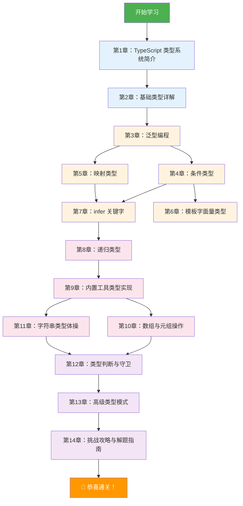
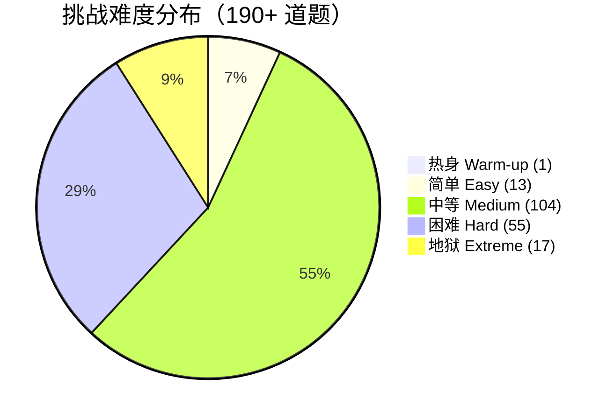

# 📘 TypeScript 类型体操教程

> 基于 [type-challenges](https://github.com/type-challenges/type-challenges) 仓库的系统化学习指南

## 🎯 这是什么？

**Type Challenges**（类型挑战）是一个帮助你深入理解 TypeScript 类型系统的开源项目。通过一系列从简单到极难的类型编程挑战，让你在实践中掌握 TypeScript 的高级类型技巧。

本教程将仓库中的 **190+ 道类型挑战** 所涉及的知识点进行系统化梳理，帮助你从零开始，逐步掌握 TypeScript 类型编程的精髓。

## 🗺️ 学习路线图



## 📚 目录

| 章节 | 标题 | 难度 | 内容概要 |
|------|------|------|----------|
| 01 | [TypeScript 类型系统简介](./01-introduction.md) | ⭐ 入门 | 什么是类型系统、为什么要学类型体操、项目结构 |
| 02 | [基础类型详解](./02-basic-types.md) | ⭐ 入门 | 原始类型、联合类型、交叉类型、字面量类型 |
| 03 | [泛型编程](./03-generics.md) | ⭐⭐ 初级 | 泛型基础、约束、默认值、多类型参数 |
| 04 | [条件类型](./04-conditional-types.md) | ⭐⭐ 初级 | extends 关键字、分布式条件类型、类型过滤 |
| 05 | [映射类型](./05-mapped-types.md) | ⭐⭐ 初级 | keyof、in、映射修饰符、键重映射 |
| 06 | [模板字面量类型](./06-template-literal-types.md) | ⭐⭐⭐ 中级 | 模板字符串类型、字符串解析、字符串变换 |
| 07 | [infer 关键字详解](./07-infer.md) | ⭐⭐⭐ 中级 | 类型推断、模式匹配、多位置推断 |
| 08 | [递归类型](./08-recursive-types.md) | ⭐⭐⭐ 中级 | 递归条件类型、深层遍历、递归限制 |
| 09 | [内置工具类型实现](./09-utility-types.md) | ⭐⭐⭐ 中级 | Pick/Omit/Partial/Required 等工具类型的手动实现 |
| 10 | [数组与元组操作](./10-array-tuple.md) | ⭐⭐⭐⭐ 进阶 | Push/Pop/Shift/Concat/Flatten 等元组操作 |
| 11 | [字符串类型体操](./11-string-types.md) | ⭐⭐⭐⭐ 进阶 | 字符串操作、大小写转换、模式替换 |
| 12 | [类型判断与守卫](./12-type-guards.md) | ⭐⭐⭐⭐ 进阶 | IsNever/IsAny/IsUnion 等类型判断 |
| 13 | [高级类型模式](./13-advanced-patterns.md) | ⭐⭐⭐⭐⭐ 高级 | 联合转交叉、柯里化、类型算术 |
| 14 | [挑战攻略与解题指南](./14-challenge-guide.md) | 📖 指南 | 解题思路、技巧总结、资源推荐 |

## 🏗️ 挑战难度分布



## 🚀 如何开始

### 1. 环境准备

确保你已安装以下工具：

```bash
# 安装 Node.js（推荐 v18+）
node --version

# 安装 pnpm（本项目使用的包管理器）
npm install -g pnpm

# 安装依赖
pnpm install
```

### 2. 挑战方式

**方式一：在线挑战（推荐新手）**

访问 [TypeScript Playground](https://tsch.js.org) 在线解题，无需任何安装。

**方式二：本地挑战**

```bash
# 1. 克隆仓库
git clone https://github.com/type-challenges/type-challenges.git

# 2. 在你喜欢的 IDE 中打开（推荐 VS Code）
code type-challenges

# 3. 找到挑战目录，修改 template.ts 文件
# 例如：questions/00004-easy-pick/template.ts
```

### 3. 验证答案

每个挑战目录下有一个 `test-cases.ts` 文件，当你的实现正确时，该文件不应有任何 TypeScript 错误。

```
questions/00004-easy-pick/
├── README.zh-CN.md    # 📖 题目描述（中文）
├── template.ts        # ✏️ 在这里写你的答案
├── test-cases.ts      # ✅ 测试用例（自动验证）
└── info.yml           # 📋 题目元数据
```

## 📖 推荐阅读顺序

如果你是 TypeScript 初学者，建议按顺序阅读：

1. 📗 先阅读 **第1-3章** 打好基础
2. 📙 再学习 **第4-8章** 掌握核心技巧
3. 📕 然后进入 **第9-12章** 实战练习
4. 📘 最后挑战 **第13-14章** 进阶高手

如果你已有 TypeScript 基础，可以直接跳到感兴趣的章节。

## 💡 学习建议

- **动手实践**：每个概念都要自己敲代码验证
- **先思考再看答案**：遇到挑战先独立思考 10 分钟
- **理解原理**：不要死记硬背，理解"为什么"比"怎么做"更重要
- **循序渐进**：不要急于挑战困难题目，基础扎实才能走得更远

---

> 📌 **本教程持续更新中**，如有任何问题或建议，欢迎提交 Issue！
